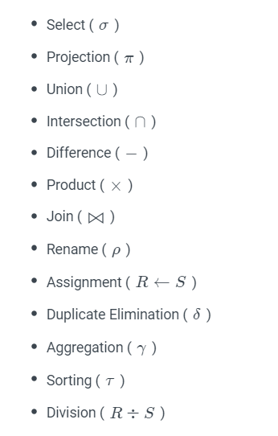
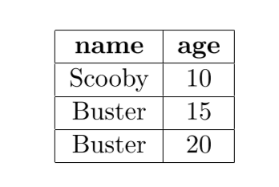
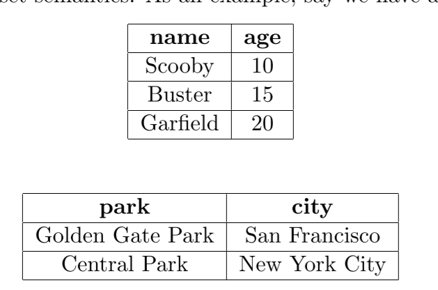
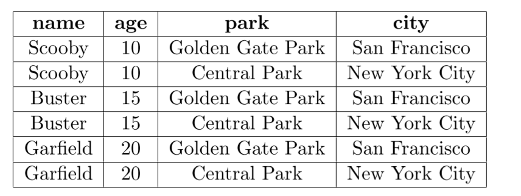
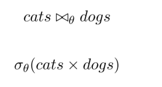

SQL是面向结果而不关心过程的, 关系代数则是用来表达数据库来执行查询时可以使用的不同的计划

## Relational Algebra Introduction

接受一个relation为输入, 并输出一个relation



## Projection / 投影 / π

> selects only the columns specified
>
> 这个运算符就相当于关系代数版本的`SQL SELECT`

$π_{name}(dogs)$, 表示只取`dogs`中的`name`一列, 类似于`SELECT name FROM dogs;`比如这是输入的`dogs`:



这个操作会返回: 


而且还会合并相同的行(尽管他们被舍弃的列的值大概率是不同的). 

要取的列在运算符的下标中被指定. 大部分其它运算符的参数也都是在下标中指定的. 表名是在`()`中指定的, 所以没有对应SQL里`FROM`的运算符.

可以指定多个列, 如$π_{name,age}(dogs)$

## Selection / 选择 / σ

> 根据条件过滤行. 相当于SQL的`WHERE`

$σ_{age=12}(π_{name,age}(dogs))$, 相当于

```sql
SELECT name, age FROM dogs WHERE age = 12;
```


另一种表达形式$π_{name,age}(σ_{age=12}(dogs))$​. 两者的区别

* 前者首先选出了想要的列, 然后过滤掉不需要的行
* 后者先过滤掉了不需要的行, 然后再选出想要的列.

条件之间可以用复合谓词连接, `∧`相当于AND, `∨`相当于OR,  如$π_{name,age}(σ_{age=12∧name='Timmy'} (dogs))$相当于`SELECT name, age FROM dogs WHERE age = 12 AND name = "Timmy"`

## Union / 并 / ∪

就是简单的把两个格式相同的集合合并成一个, 与SQL的UNION一样

现在有`dogs`和`cats`两个集合


$π_{name}(dogs) ∪ π_{name}(cats)$的结果即是: (会去重)


```sql
SELECT name FROM dogs UNION SELECT name FROM cats
```

## Set Difference / 差运算 / -

类似SQL的`EXCEPT`, 返回所有在第一个表但不在第二个表里的行

$π_{name}(dogs) − π_{name}(cats)$, 还是上节的表, `Garfield`是都出现的, 要舍弃, 得到结果:


## Intersection / 交 / ∩

在两个表中同时出现的行

$π_{name}(dogs) ∩ π_{name}(cats)$:


## Corss Product / 笛卡尔积 / ×

也就是在两个表之间作全连接. $dogs × park$相当于:

```sql
SELECT * FROM dogs, parks;
```

两个表: 



得到的结果有3 × 2 = 6行: 



---

## Join / 连接 / ⋈

需要在下标中指定连接条件, 如果不指定就会称为自然连接(相同的列上的值要相等)

$cats⋈_{cats.name=dogs.name }dogs$

> 两个关系模式进行自然连接以后，总的属性的个数是减少了，具体减少的个数等于同名属性的个数

Join可以被笛卡尔积+选择操作代替, 如以下两个是等价的: 



## Rename / 重命名 / ρ

在连接时把`dogs`的`name`列重命名为`dname`:

$cats ⋈_{name=dname, ρ_{name−>dname}}(dogs)$

## Group By / Aggregation / γ

$γ_{age,SUM(weight),COUNT(∗)>5}(dogs)$相当于:

```sql
SELECT age , SUM( weight ) FROM dogs GROUPBY age HAVINGCOUNT(∗) > 5 ;
```

