# 单线程查询执行模型

DBMS把SQL语句转化为查询计划, 把算子组织成一颗查询树, 数据从叶子节点传递到根节点, 根节点输出查询最终的结果. 

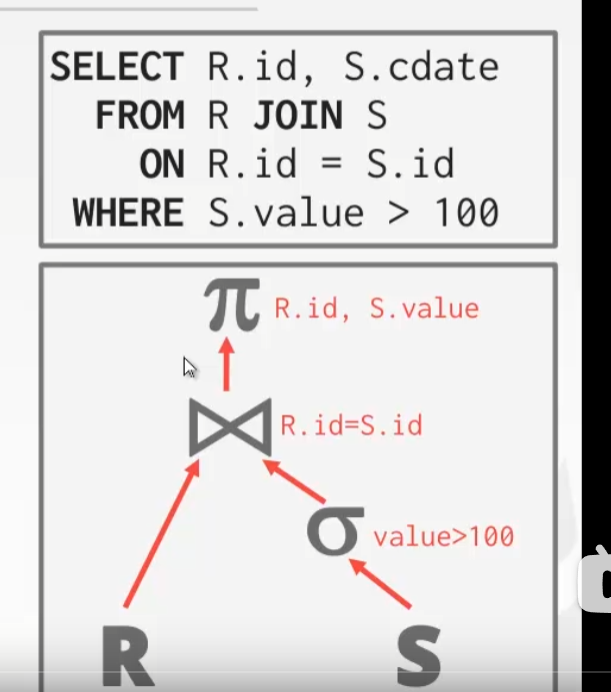

## Processing Models

数据库的执行模型决定了数据库如何执行一个查询计划.

* Iterator Model. 火山模型
* Materialization Model 物化模型
* Vectorized / Batch Model

### 火山模型 / 迭代模型 / Iterator Model

把每个算子看作一个迭代器, 要求每个算子实现`Next()`方法. 每次调用`next()`就返回一行(或者null), 数据自上而下地被`next()`嵌套调用.

算子内部则是通过一个循环, 循环调用其子操作符的next函数.

> 如下每个算子都实现了next方法
>
> * 最上层的投影算子: 每拿到一个子算子的`next()`的结果就输出其对应的列
>
> * 中层的join算子: 首先循环调用左子节点的`Next()`方法, 并把得到的数据插入哈希表. 之后循环调用右子节点的`Next()`方法, 用拿到的数据与哈希表中数据作匹配.
> * 下层的选择算子: 循环调用子节点的`Next()`, 判断是否符合条件, 符合则向上输出
> * 最下层: 直接循环输出tuple
>
> 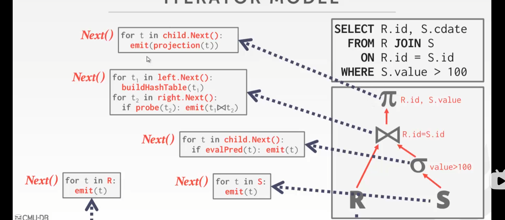

---

> 屁屁踢上称为tuple pipelining, 尽可能的在一次I/O中对Tuple进行很多的操作( fully use each tuple in memory before the next tuple or page is accessed). 主要适用于早期计算机I/O性能非常低，内存特别小的场景.
>
> 一些算子需要阻塞等待孩子节点的结果, 如Joins, SUbqueries, Order By
>
> * 优点: 输出控制适合控制
> * 缺点: 性能上, 调用虚函数会影响性能 -> 虚函数无法inline优化, 每一次虚函数调用都需要查虚函数表, 会带来很多分支指令, 对CPU分支预测不友好

例子中的执行过程:

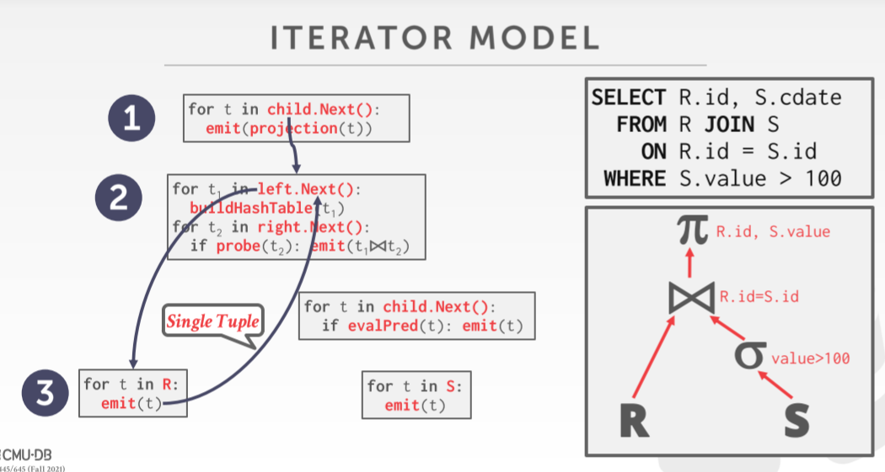

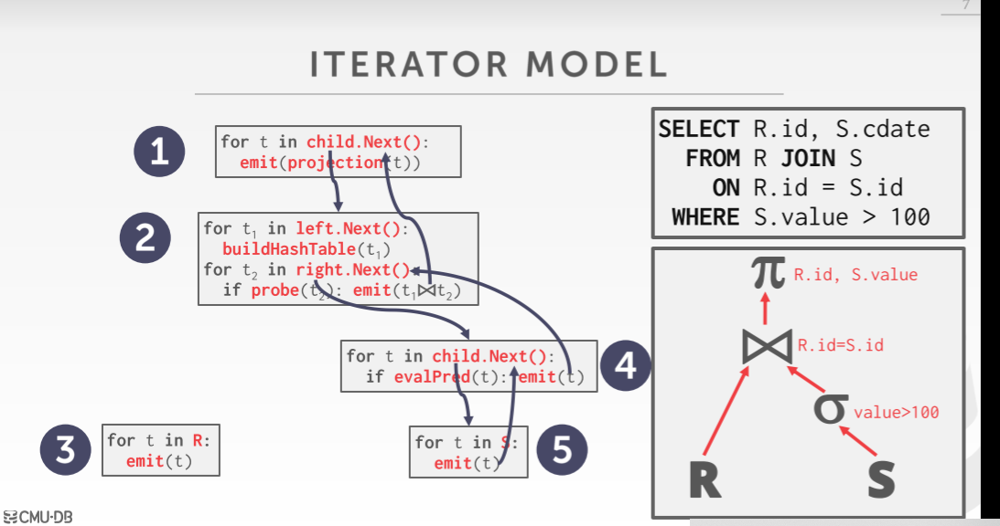

这种方法下输出控制很容易, 比如limit

### 物化模型 / Materation Model

每个运算符一次处理其输入，然后一次发出其输出, 并直接输出所有的结果, 而非一个tuple一个tuple的流式的过程. 

每个运算符都要实现一个Output函数:

* 一次处理来自其孩子节点的所有输入
* 返回这个算子应该返回的所有tuple. 

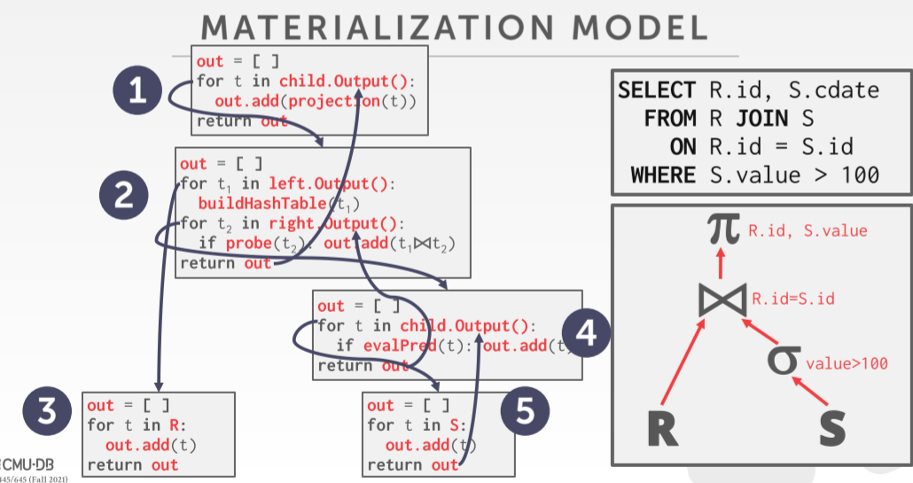

这种方式更适合OLTP的场景, queries一般只会请求很少的一部分tuple, 相关的函数调用会很少.

OLAP下DBMS可能只能把中间结果缓存到磁盘上, 就不好

> 为了避免扫描太多的图元，DBMS可以向下传播关于需要多少图元的信息给后续的运算符（例如LIMIT）

### 向量模型 / 批处理模型 / Vectorized Model

> 前两种方法折中的方案

每个算子实现`Next()`方法, 但是每次吐出来一批数据(emit a batch of tuples instead of a single tuple). 算子内部也是一批数据一批数据地处理.

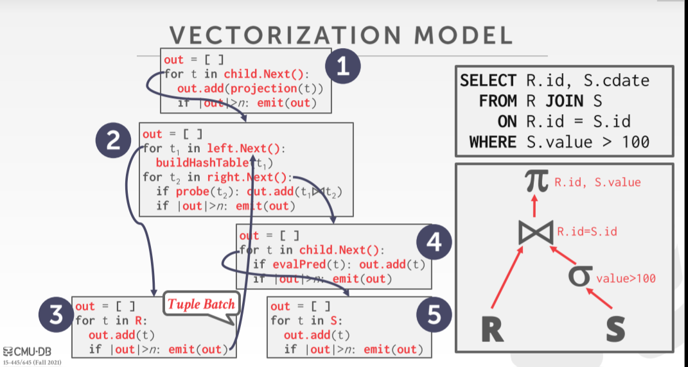

这种可以利用SIMD指令集层面的并行能力一次处理一个Batch数据.

[SIMD简介 - 知乎 (zhihu.com)](https://zhuanlan.zhihu.com/p/55327037). 即"单指令多数据流", 采用一个控制器来控制多个处理器，同时对一组数据（又称“数据向量”）中的每一个分别执行相同的操作从而实现空间上的并行性的技术。简单来说就是一个指令能够同时处理多个数据。

### 查询树的处理方向

* 可以从上到下调用, 每个算子调用其子算子, 然后从其子算子拉取数据
* 也可以从下往上处理, 叶子节点开始调用, 把数据推送到父节点. 可以进一步利用cache缓存

## Access Models

即访问表中数据的方法. 分为三种:

* Sequential Scan
* Index Scan
* Multi-Index Scan (借助多个索引)

### 顺序扫描

即一页一页的扫描, 对于每一页首先检查是否在buffer pool中, 若没有则去磁盘中拿. 之后顺序遍历每个tuple. DBMS需要维护一个指针来记录上次读到的Page

```Java
for page in table.pages: 
	for t in page.tuples: 
		if evalPred(t):  // Do Something!
```

优化手段:

→ Prefetching 预取

→ Buffer Pool Bypass 大量数据顺序扫描时不让它进buffer pool, 用完就扔掉,  避免"顺序泛滥"问题。

→ Parallelization 多个算子并行执行, 分别读表的不同部分

→ Heap Clustering Tuple是按照聚类索引的顺序存放在Page中的, 当按照聚类索引的属性进行访问的时候可以直接根据顺序跳转.

→ Zone Maps 又叫pre-computed aggregates, 提前计算Page中数据集的相关属性统计信息(如最值, 平均值, 和, 数据数量), 扫描Page前根据Zone Map检查Page是否包含相关的数据. 不存在就直接不读取该Page了(比如SELECT大于600的数据时可以跳过MAX<600的页)

> 这里是细化到每个Page的统计信息

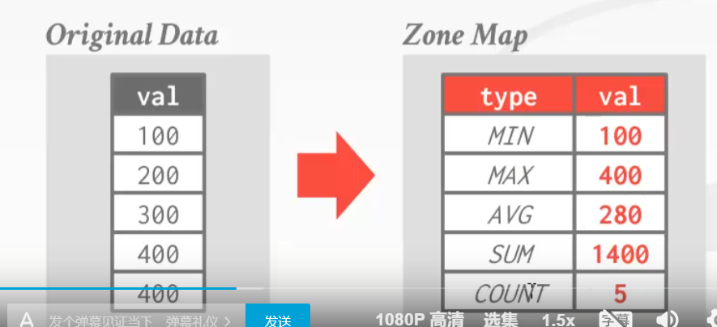

→ Late Materialization 延迟物化, 下若某列数据在查询树上方并不需要，那我们只需要将offset或者将clumn id传过去就行了，直到最终tuple确定时再根据地址信息填充相关属性的值，减少I/O开销.

### 索引扫描

> 索引是数据库性能问题最需要考虑的地方

数据的分布情况决定了索引效果.

判断走哪条索引: 走哪条索引剩下的数据最少, 就走哪个索引(剩余判断的代价小). 比如下面两个例子就应该分别走dept和age索引

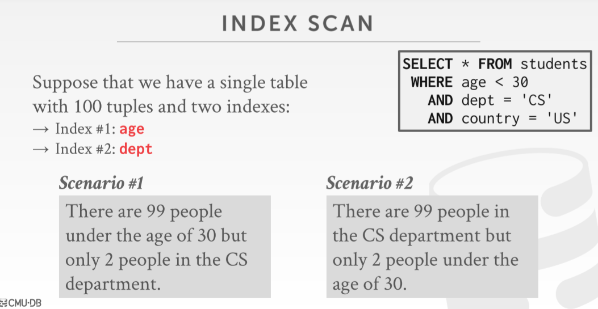

若当前索引对于需要检索的数据而言不是聚簇索引，可以先根据当前索引记录下所有的Page ID，然后先对Page ID进行排序，然后再根据Page ID从小到大进行访问，这样catch利用率可以达到最高. 

### 多索引扫描

分别走两个索引, 之后对两个结果集取交集

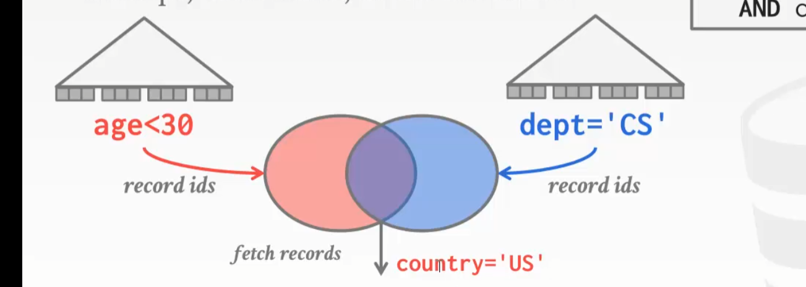

## Modification Queries / 对表的修改

INSERT, UPDATE, DELETE是需要修改索引结构的, 

* UPDATE/DELETE: 子算子传递要更新/删除的tuple的ID. 当前算子前去修改数据
  * 必须记录自己修改/删除过哪些数据, 防止重复修改

> 万圣节问题是一种异常现象，即更新操作改变了一个元组的物理位置，导致扫描操作员多次访问该元组。这可能发生在聚类表或索引扫描

* INSERT: 两种方案
  * 在算子中创建tuple
  * 让子算子创建, 在本操作符中插入

## 表达式估值 / Expression Evaluation

如何处理SQL中的查询表达式

一般会采用树形结构来处理

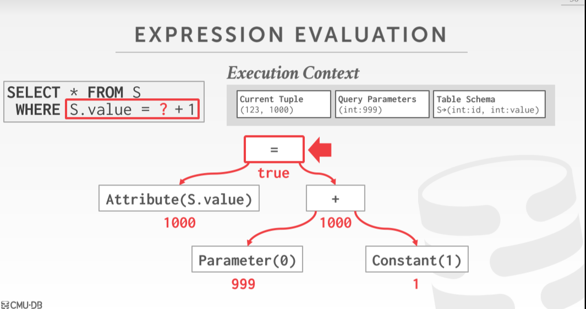

优化: 若当某部分频繁调用或者值总是确定的，可以使用类似2JIT（即使编译技术）优化执行性能，这样每次不用重复编译（对于Java解释型语言），也不用重复运行下面的逻辑（C++编译型）

* JIT: Java把代码变成字节码后送入JVM执行, JIT如果发现某些热点代码被频繁执行就把它编译成二进制
* AOT: 执行之前直接把字节码变成二进制...

# 查询树的并发执行

并发执行查询树能降低延迟, 增加吞吐量, 提高系统应用的响应型和可用性.

>  这里的并发指的是SQL之间可以并发执行, 并非一条SQL内部各个部分可以并发执行

## Process Model / 并行处理模型

DBMS把任务分解给worker, 每个worker执行一定的任务并返回结果

**Worker/进程，Worker/进程池，Worker/线程池**.

### Worker/进程

对于每个Worker, 调度器fork一个单独的进程来处理, OS来负责调度, 进程之间通过共享内存来实现资源共享.

* 一个进程的崩溃不会导致整个系统的宕机.
* 进程多了会消耗资源

使用这种模型的实例: 早期的db2, oracle, postgreSQL

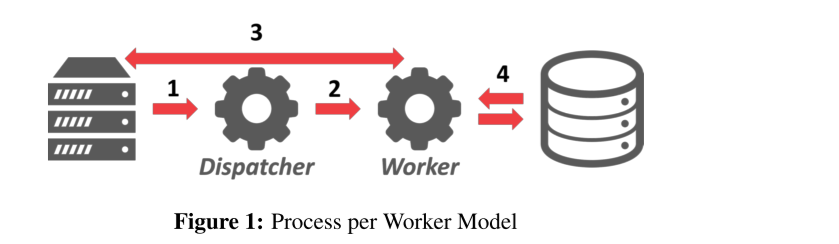

> DBMS通过调度器把任务分发给Worker, Worker去处理数据

### Worker/进程池

后来db2和postgreSQL就切换成了这种池化的思想

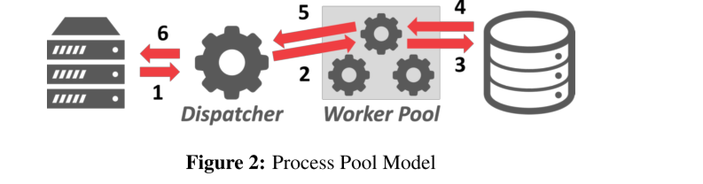

### Worker/线程

每个worker一个线程. 现在的dbms都是用的这种模型了

* DBMS自己对线程进行调度
* 线程崩溃可能导致整个系统崩溃
* 线程之间的切换代价比进程之间小的多, 而且线程之间天然共享内存, 不需要考虑进程间通信的事情

## 对查询计划的调度

对于给定的查询计划, DBMS需要决定:

* 如何把执行计划切分成任务
* 用几个CPU核
* 在哪个核上执行
* 把结果存在哪里

### 查询之间的并发处理

可以增加吞吐量, 降低延迟.

如何并发查询是只读的, 几乎没有任何并发问题(读就是了)

如果涉及到updating the database的语句, 就需要数据库的并发控制(后面几节)来解决了

### 查询内部的并发处理

可以降低很大的OLAP查询的执行时间. 提高单个查询的性能.

思想类似生产者/消费者

每个算子都要实现对应的并发版本.  并发版本的HashJoin: 每个线程分别处理两个对应相同`key`桶的join工作

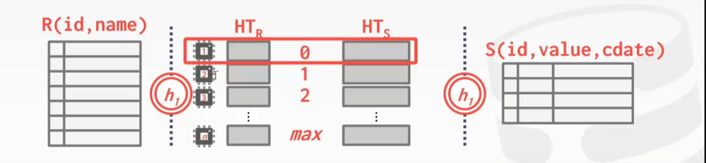

多线程算子的实现思想:  又分为单个算子内部并行与算子之间并行执行

#### Intra-Operator Parallelism(Horizontal)

> Operator内的并行执行

水平切分: 把数据切成多个片, 每个部分让一个线程来处理. 每个线程相当于做相同的工作. 再插入一个`exchange`算子来做数据的聚集工作. `exchange`算子上层的算子会在`exchange`算子执行结束后再开始执行

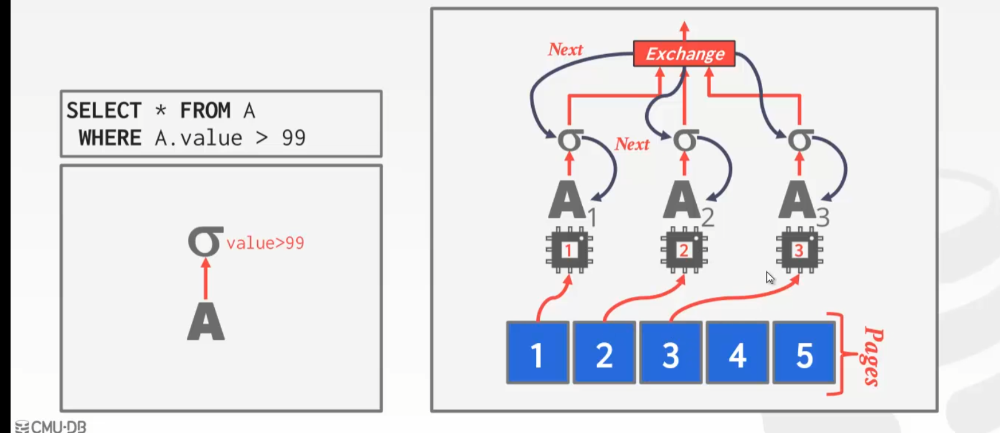

> 过滤数据, 可以让A1A2A3分别读三页数据, 之后通过Exchange算子来聚集
>
> 这里套用的是火山模型, 上层调用Next()后下面在不同分片上并发执行.

一般由三种`exchange`算子:

* Gather: 把worker的输出聚集起来
* Distribute: 把一个输入流切分成多个, 用于作为并行执行的worker的输入
* Repartition: (partition 分配) 把多个worker的输入汇聚, 之后切分成多个输入流

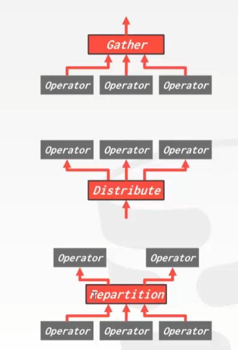

例子: A和B首先并行筛选, 之后A并发地建立哈希表, 用exchange聚合, B可以直接并发地去A哈希表中匹配数据. 在join完成后再用一个exchange汇聚起来.

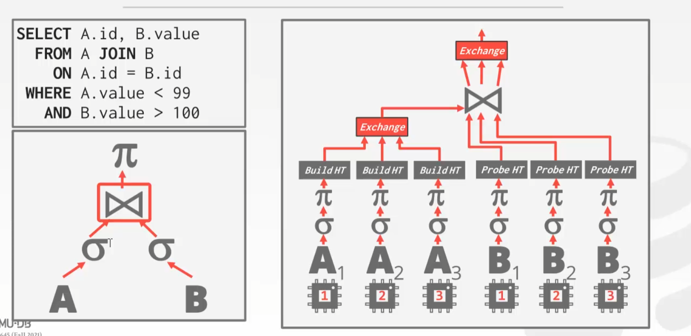

此时不同算子之间的处理是阻塞的.

#### Intre-Operator Parallelism(Vertical)

算子之间并行执行, 每个算子由一个线程处理, 结果输入给下一个线程, 线程之间可以一定程度的重叠执行. 类似那种数据流式传输.

比如这里可以一遍join一遍输出

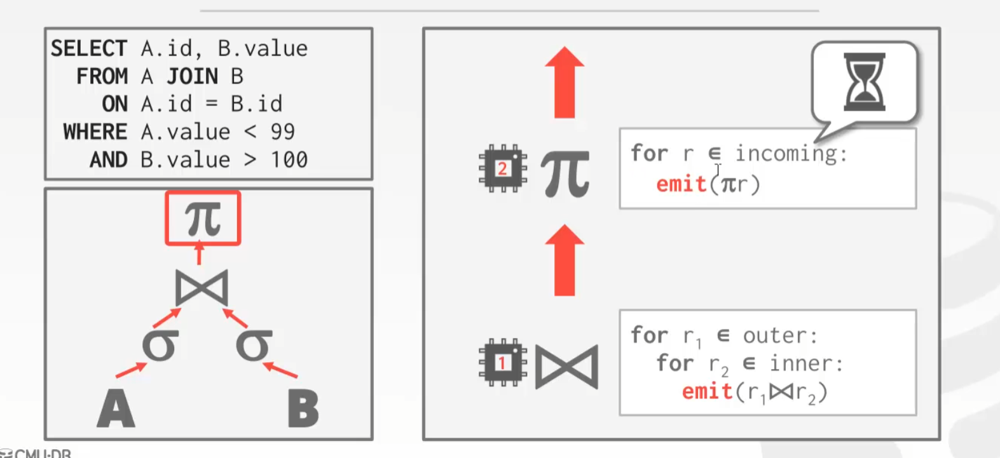

#### Bushy

就是之前的两种结合, 不同数据片上的多个子Query之间的并行.

如四表连接, 线程1做A join B, 线程2做C join D, 结果分别输出给线程3, 4; 它们再分别并行连接最后聚合结果.

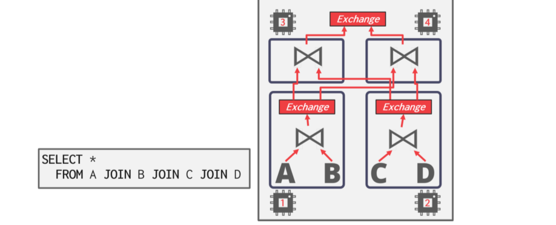

### IO Parallelism

传统DBMS的瓶颈是磁盘, 在单个多个查询并行执行可能导致磁盘随机IO, 降低性能. 解决方案是想办法在存储设备上分割数据库,之后并行IO来读取.

### Multi-Disk Parallelism / 多盘并发

在OS/硬件层面配置为在多个存储设备上存储DBMS的文件, 可以组RAID, 磁盘阵列

RAID0是Striping, 把数据分割开存到不同的盘里, 提升并行写的性能, 但是数据容错率低(一个盘坏了就全挂了)

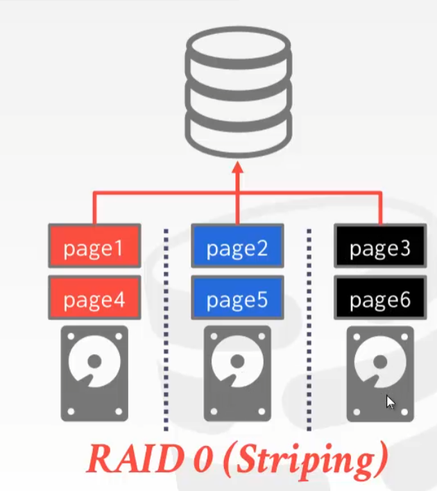
RAID1是在不同盘之间作冗余存储, 增加了容错机制, 而且提升了并行读的性能.

RAID单位储存成本高, 但是提供了很高的数据安全性和可用性.

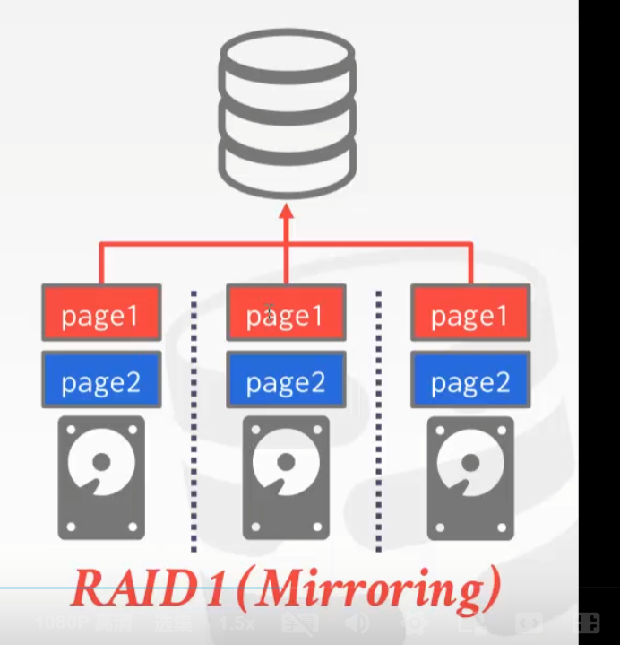

RAID5: 文件按照RAID0来存, 再来一个盘存其它盘的异或来做恢复机制

### Database Partitioning

分库, 把数据库分割成不相干的子集, 分配到不相干的磁盘上.

恢复的统一log file要不同的库之间共享

分表, 把表在底层分成多个表, 

垂直分表: 把一个表从中间切开, 分成多个表, 存在不同的盘上, 就可以把IO分发到两个不同的盘里.

> 可优化的点 -> 不常用的大属性(又长又冷), 可以拿出来放在另一个表中, 与热数据分离

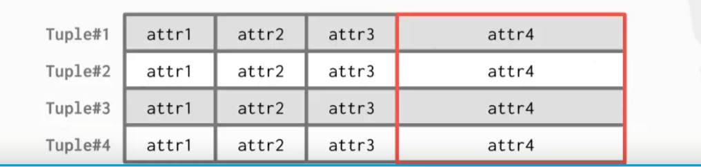

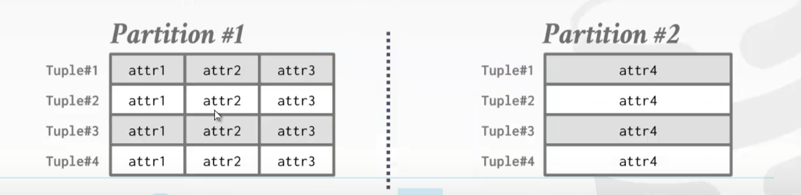

水平分表: 就是把数据存到不同的路径中 based on some partition key(根据某一列的哈希值/范围等等来分), DBMS负责在查询中统一. 

> 分库分表可以让数据库自己配置, 也可以用一些分库分表中间件(功能上类似网关)来做

