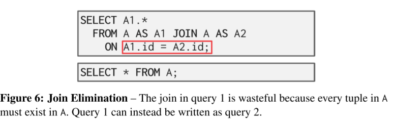

DBMS解析SQL语句得到逻辑计划, 之后优化逻辑计划, 为每个算子选择效率最高的物理执行方式, 即物理查询计划

逻辑计划优化和物理计划优化统称为查询优化.

优化方法分为两类:

* 基于规则的启发式方法
  * 根据一些简单的启发规则去掉查询中stupid / inefficient things
  * 不需要真正的查询数据, 可能需要一些数据catalog元信息
* 基于查询代价预估的方法
  * 构建代价模型, 计算等效执行计划的代价并选择最小的

> SQL优化是NP-hard的

## 基于规则的启发式方法

### 查询执行流程

* SQL Rewriter: 预处理SQL, 
* Parser: 把SQL变成抽象语法树
* Binder: 把表名/字段名转成数据库内部的ID
* tree Rewriter: 根据schema重写查询树
* Optimizer: 做优化

### 关系代数等价

两个关系代数输出的结果集相同, 则称两个关系代数等价.

比如同样的SQL对应等价的关系代数表达式:

这是对逻辑计划进行优化的基础条件, 也因此可以不考虑数据情况直接在某些情况下对数据进行优化, 重写一些效率低的SQL

### 逻辑优化

* Split conjunctive predicates. 指的是把复杂的谓词分裂开一点一点执行
* predicate pushdown. 把过滤的谓词下推, 尽可能早得过滤掉不相关的数据. 比如上图
* 对谓词重新排序, 首先应用最具有选择性的那个.
* 把笛卡尔积变成join
* projection pushdown: 把投影操作/SELECT提前, 提前只保留需要的数据. 例子: 

* 去除不可能或不必要的判断条件. 
* 合并重复的谓词: 
* 去掉不必要的连接操作, 比如自己与自己JOIN: 

> JOIN操作的顺序是决定查询性能的一个关键因素。对所有可能的连接顺序进行穷举是低效的，连接顺序的优化需要一个成本模型。这里仅仅是说去掉不必要的的JOIN

### 嵌套子查询

* rewrite, 把子查询和主查询重写成一个查询

* 提前执行子查询并存下结果

这里的子查询只对应了一个值. 可以先把那个值查出来然后塞进查询计划, 避免每次执行都要去查询相关的值.

## 基于查询代价的方法

> 太难了, 跳过

### Cost-Based Query Planning

估算查询计划的代价. 常见的估算方式:

* 物理开销: 多少CPU转, IO, 缓存未命中, RAM开销, 预取的开销...DEpends heavily on hardware. 常出现在数据库一体机上(
* 逻辑开销: 估算每个算子在相应数据范围下的花费. 需要知道算子要处理的数据范围
* 算法开销: 根据算子算法的时间复杂度来估算

> Postgres内部的优化器用一个魔法数字把CPU和IO costs结合起来

### 处理统计信息

每次对相关信息进行统计太累了, DBMS会统计关于每张表的部分信息并定期更新, 一般放在catalog中, 

>  MySQL: `ANALYZE TABLE`

DBMS保存的信息:

* $N_R$: R中的tuple数量
* $V(A, R)$:  R中的列A有多少不同的取值
* 选择基数 / Selection Cardinality: $SC(A, R) = N_R / V(A, R) $​, 平均每个值对应的tuple数量. 这里假设了各个数据是均匀分布的.

> 然而现实生活中数据分布一般是不均匀的, 而且对于where子句中更复杂的判断条件，如>、<，仅仅只有整个字段的选择率是不够的, 需要字段在不同区间或者多个字段联合后的选择基数。

