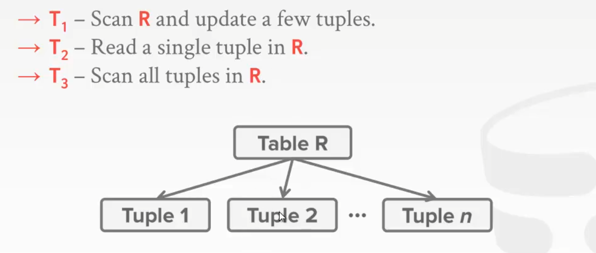
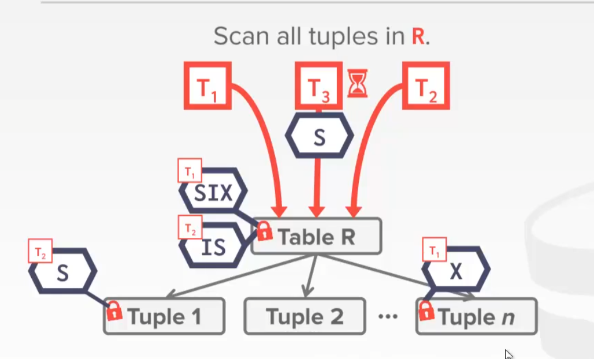

## 背景

并发控制横跨了DBMS的执行和存储的部分


并发控制就是用来实现事务的隔离性的

数据库并行带来的问题:

* 脏读. 读到了**其它事务未提交的数据**, **针对update操作**
* 不可重复读. 两次读的结果不一致. 读到的数据是别人已经提交的
* 幻读. 前后根据条件读取数据时读取数据情况不一致, **针对insert和delete操作**
* 丢失更新
  * 第一类更新: 并发事务**都读取同一记录，并相继基于旧值对这一记录做出修改**，那么就会出现前一个事务所做的修改被后面事务的修改覆盖，即出现**提交覆盖**的问题
  * 第二类更新: 并发事务相继对同一记录做出修改，其中一个事务提交之后之后另一个事务发生回滚，这样就会出现已提交的修改因为回滚而丢失的问题，即**回滚覆盖**问题。

## Transactions / 事务

> a sequence of multiple actions that should be executed as a signle, logical, atomic unit. 

一般来说**事务是在数据库上操作的最小单位**. 

事务的特点: acid:

* 原子性: 事务中的语句要么都执行(commit), 要么都不执行(abort).
* 一致性. 这里指的是数据库一致性. 在执行事务的前后数据库中的状态都满足某种约束. 比如转账之前两人账户总金额应该是一样的
* 隔离性. 多个事务交错执行需要避免相互影响, 即并行结果和串行执行的结果一直
* 持久性. 事务commit后对数据的修改应该是永久的

比如转账的一个事务:

* 检查钱够不够
* 被转帐者-100
* 转账者+100


一个事务用`BEGIN`开始, 到`COMMIT`结束, 如果想终止这个事务要用`ABORT`(有的是`ROLLBACK`). `ABORT`可以是用户发出的也可能是DBMS发出的(比如检测到死锁)

如何实现事务的ACID?

> 一种Native执行方法是顺序执行每个事务，每当开始执行事务前拷贝整份数据库到临时文件，事务只操作临时文件，当事务完整的在临时文件上执行完后再将临时文件写回原本数据库。若执行失败，删除临时文件。
>
> 问题: 串行执行太慢了, 系统并发量为1
>
> 需要让事务并发起来, 而且还要保证正确性与公平性.

## 事务的原子性

实现手段: 日志/临时页

---

回滚日志(undo log): 所有操作执行前先确保日志已经记录，这样当故障恢复后，DBMS都可以根据日志回滚或者继续未完成的事务. 

一般来说undo log在磁盘和内存中都有备份

日志除了回滚之外还可以提高性能(先把日志操作写日志, 在方便时再把相关操作真正的写入磁盘), 同时日志还可以做比如监控之类的日志本来的作用.

> 绝大部分用的都是日志

---

shadow paging: 在事务执行前，DBMS 会复制相关的页，然后让事务修改这些复制的数据。当事务被Commit 后，这些页才对外部可见。类似之前的navie的方案但只复制需要的页

## 事务的一致性

指的是数据一致性. 还有一种事务一致性是由业务来保证的

简单而言，ACID就是说事务能够通过AID来保证这个C的过程。C是目的，AID都是手段。

## 事务的隔离性

即让事务交错执行，多个事务之间互不影响，每个时刻仿佛只有一个事务在执行.

两大并发控制流派:

* 悲观: 不要让问题发生
* 乐观: 假设冲突很少发生, 当发生之后在回滚

---

### 可串行化

[Transaction management：可串行性（serializability） - 知乎 (zhihu.com)](https://zhuanlan.zhihu.com/p/57579023) 这篇文章的总结感觉很详细...

* `Serializable`: 串行化, 即最后的执行效果与某种顺序串行执行得到的结果是一样的. 


判断目前的调度是否是可串行化的: 判断是否存在相互**冲突**的两个操作. 所谓的"冲突操作":

- 两个操作来自不同的事务
- 对同一个对象操作
- 两个操作中至少有一个是 write 操作

所谓的"冲突"另一种说法是"依赖关系", 是用来体现**事务之间的顺序的**. 

> 因此冲突分为读写冲突(RW), 写读冲突(WR), 写写冲突(WW)
>
> * 读写冲突: 如例子中T1读了A, 这时T2更新了A. 假设反过来, T2先更新T1再读, 就会导致T1锁读到的内容发生改变. 
> 
> 
>
> * 写读冲突: T1让A+=2, T2让A+=2 ,这时候如果T1回滚直接回滚到10, 相当于把T2也回滚了. 这个也叫做**"脏读"**。 T1不需要回滚， 只要T1首先写了A之后T2读到了T1写的内容都是发生了脏读
>
> 
>
> * 写写冲突: T1T2都是无脑写, 可能会覆盖了没有commit的数据
>
> 

### conflict serializable / 冲突可串行化

简单来说, 如果两个调度**以相同的方式排列每一对冲突的操作,** 则称两个调度是冲突等价的. 如果一个调度与一个串行计划冲突等价, 则称其为冲突可串行化的. 而冲突可串行化 -> 可串行化.

> CMU 15-445中对相关内容的解释: 
>
> 如果调度中一对连续操作是冲突的，则意味着如果它们的执行顺序交换，则至少会改变其中一个事务的最终执行结果。
>
> 如果**两个连续操作不冲突，则可以在调度中交换顺序。**
>
> 一个调度S在保证冲突操作的次序不变的情况下，通过交换两个事务不冲突操作的次序得到另一个调度S’，如果S’是串行的，称调度S为冲突可串行化的调度。

**冲突可串行化的调度直接执行的结果是相当于以某种手段串行化执行锁得到的结果的**

比如这里有一种调度


判断手段: 利用有向图进行判断. 构造一个前驱图(有向图)，结点是每一个事务$T_i$。**如果$T_i$的一个操作与$T_j$的一个操作发生冲突，且$T_i$在$T_j$前执行，则绘制一条边，由$T_i$指向$T_j$，表征$T_i$在$T_j$前执行。**如果**此有向图没有环**，则是冲突可串行化的。这里需要注意的是，两个冲突操作间可以隔着几个其他的操作。


> 有环就说明像图中一样永远不可以通过滑动非依赖的指令的手段来达到串行的结果

多个事务的例子:


> 这样执行的结果是可以等效为首先执行T2, 之后执行T1, 最后执行T3

实际的执行例子:  


---

### View serializability / 视图可串行化

有些调度不满足冲突可串行化但其结果依然是等同于可串行化的, 如:


但是判断调度是否视图可串行化的问题已经被证明属于np-完全问题, 只能通过一些条件来进行放行, 如:

* 只读事务不参与调度直接执行就是了


## 两阶段锁

之前说数据库里的锁分为locks和latch, 这里说的是locks, 指的是事务层面的锁, latch保护的是数据库底层实现时具体的数据结构. 它们两个是不同层级的东西.

数据库中有一个统一的锁管理器lock manager, 负责管理所有lock.

事务首先请求获取锁, lock manager决定是释放还是阻塞. 事务在用完之后释放锁, lock manager更新其记录的lock-table. **事务在释放其持有的锁之前不能得到新的锁**

> 二阶段锁是一种悲观的想法.

### 锁的类型

分为s-lock(共享锁)和x-lock(排它锁), 其实就相当于读锁和写锁.

- S-LOCK：共享锁：如果事务 Ti 获取了数据项Q的共享锁，则 Ti 可读但不能写Q。如果一个事务持有一个共享锁，那么另一个事务也可以获得相同的共享锁。
- X-LOCK：互斥锁：如果事务Ti获取了数据项Q的互斥锁，则Ti可读又可写Q。一次只能有一个事务持有独占锁。


但加锁并不能改变原来的调度是不可串行化的.  

具体加锁的方式:

```SQL
SELECT ... LOCK IN SHARE MODE; // S锁
SELECT ... FOR UPDATE; // X锁 
```


### 两阶段锁具体过程

两阶段封锁协议(2PL, two-Phase Locking protocal)是一种常见的加锁策略, 它由两个阶段组成:

* growing / 生长: 在这个阶段只能加锁. lock manager 决定同意或者拒绝
* Shrinking / 收缩: 只能解锁不能加锁. 即**一旦开始释放锁, 之后就只能释放锁**(这句话是二阶段锁的核心).


证明过程使用反证法:


---

但是二阶段锁可能会导致**级联终止**（cascading abort）的问题: 即下图中若T1最后没有提交而是ABORT, 会出现脏读问题(读到没有commit的数据), T2也需要终止. 

> DBMS 需要在 T1 中止后将一些对T1有依赖的事务也中止，这些事务曾经读取过 T1 写入的数据。而这些中止可能进而使得其它正在进行的事务级联地中止。


解决这个问题: **"严格二阶段锁". 解锁的过程永远放在最后COMMIT时**. 也就是强制要求每个事务在结束之前，其写过的数据不能被其它事务读取或者重写。这样T2就会一直等着T1结束了...而且回滚时可以直接把数据恢复到开始时的样子, 因为中间并没有其它事务对数据进行修改


这时候看所有的调度方法:


### Lock Management

需要由Lock Management来管理加锁与解锁的过程, 决定何时授予锁.

Lock Manager维护一个哈希表, 被锁定的资源作为key, value中有`Granted Set`(当前持有锁的事务, S锁可以有多个X锁只能有一个), 锁的类型(S or X), 一个等待队列(请求锁而被阻塞的队列). 


当加锁的请求到达时, Lock Manager检查是否有事务在对应的Granted Set中以及Wait Quene中是否有事务请求冲突的锁, 如果是则把当前事务加入Waiting Queue, 否则Lock Manager授予它锁并把它加入Granted Set中.

CS186还提到了关于锁的升级 -> 拥有共享锁的事务可以请求升级到独占锁, Lock Manager会在队列的前面添加这个请求.

### 死锁的检测与预防

死锁问题2PL是无法解决的: 如下T1和T2会永远互相等待: 


* 死锁检测: DBMS内部维护一张waits-for图，用于跟踪每个事务正在等待哪个事务释放相应的锁。
  * 在以下情况下为从$T_i$到$T_j$之间添加一条边 :
    * $T_j$在资源X上有锁
    * $T_i$想要得到资源X的锁, 但再次之前$T_j$必须释放它的锁
    * thus $T_i$需要waits for $T_j$

  * 定期地检查这个图是否有环，如果有环就会让其中一个事务重试或中止。MySQL


> 高频率修改这张图会导致开销过高, 因此更新检查时间需要权衡
>
> 选择回滚的事务时依据的选择手段:
>
> * Age 已经执行了多久了
> * Progress 已经执行了多少条SQL语句了
> * 已经加了多少锁了. 可能加锁越多的事务卡住别的事务就越多
> * 事务曾经重启的次数
>
> 以及可以考虑是完全回滚还是回滚到足够消除环形依赖的状态。

---

* 死锁预防: 根据**当前的时间戳给每个事务设定优先级**, 比如可以规定开始时间越早的事务优先级越高. 
  * wait-die: If $T_i$ has higher priority, $T_i$ waits for $T_j$; else $T_i$ aborts(老的等待, 小的自杀)
  * wound-wait: If $T_i$ has higher priority, $T_j$ aborts; else $T_i$ waits(小的等待, 老的抢夺)
  * 事务重启后依然使用上次的时间戳, 而非重启后的时间的时间戳, 防止饥饿

> 问题: 中止了太多事务

### 多粒度锁

假如所有的锁都是行锁, 那么处理大量数据时获取/解开锁的成本会巨大. 如果锁的粒度太大又会导致并发性能下降(比如只改一行值但锁住了整张表). 需要根据数据规模调整锁的粒度.

> CS186中把数据库看作这样的树状结构, 顶层为整个DB,  接下来是Table, Table分为Page, Page分为Record.
>
> 给节点加锁相当于隐式地给其所有的子节点加锁


但存在问题: 事务T希望封锁整个数据库，因此它需要给根结点加锁。但是如果T在树的某部分持有锁，那么T给根结点加锁就不应该成功。但判定根结点是否可以加锁的方法则是搜索整棵树, 这样代价太高, 而且违反了增大锁的粒度的初衷.

解决 -> 引入**意向锁**, 如果一个结点加上了意向锁，则意味着将要在树的较低层进行显式加锁(也就是说，以更小的粒度加锁)。有三种意向锁:

- Intention-Shared (IS)：说明在较低级别将会使用共享锁
- Intention-Exclusive (IX)：说明在较低级将会使用互斥锁. IX和IX是不直接冲突的, 因为事务可能把X锁加到不同的子节点上.
- Shared+Intention-Exclusive (SIX)：S and IX at the same time. 以该节点为根的子树已经**显式得到了共享锁**，并且**将要**在树的更低层次显示加上互斥锁。(整个表有共享锁, 然后底下有些行将来会被排它锁锁住了)

> 如果我们想阻止任何其他事务修改较低级别的资源，但又想允许他们读取较低级别的资源，SIX就很有用。
>
> SIX不能与S共存, 因为另一个S锁会阻止我们修改子节点中的内容
>
> IS与SIX是兼容的, 因为X是在底下的, 底下的S与X是不一定不兼容的


加锁协议:

* 每个事务都从层级结构的root节点开始

* 在对一个节点加S或IS锁之前, 需要对父节点加IS或IX锁
* 在对一个节点加X, IX锁之前需要对父节点加IX或SIX锁
* 需要对整个表+S然后对其中一些tuple加X时加SIX
* 必须按照自下而上的顺序释放锁

---

例子: 

现在有三个事务:



T1需要全表扫描后更新符合条件的, 需要对整个table加SIX锁, 对内部的需要更新的表加X. 因为已经对整个表加SIX所以不需要对Tuple加S锁了


T2需要对tuple加S锁, 因此需要在父节点加IS锁, 之后对查询的tuple加S锁


T3要做的是全表扫描, 直接在表上加S锁即可. 但S与SIX不兼容, 因此它会阻塞



优化: Lock Escalation(锁升级). 当加了太多的底层的锁之后可以直接换成一个更高层的锁.

> 锁是根据情况自动加的, 而不是用户显式的加的. 但是MySQL等是可以手动加的
>
> ```SQL
> LOCK TABLE <table> <mode>;
> ```
>
> 手动加行锁:
>
> ```SQL
> SELECT * FROM <table>
> WHERE <qualification> FOR UPDATE;
> ```
>
> 正常`SELECT`加的是共享锁, 用`SELECT .. FOR UPDATE`则是显式地加排它锁. 这种在比如数据库备份时很有用(不想在备份时数据发生变更)

