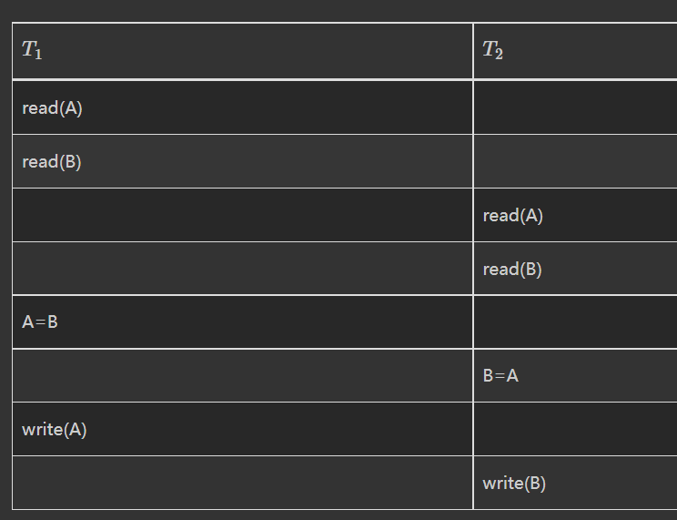
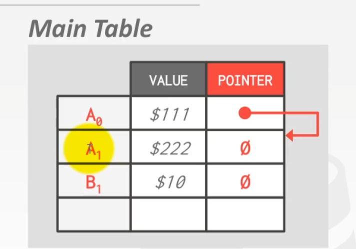
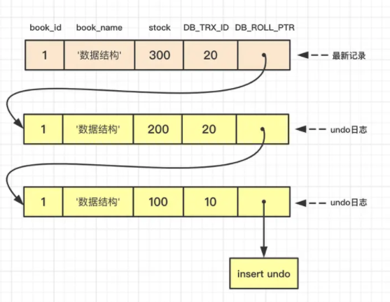
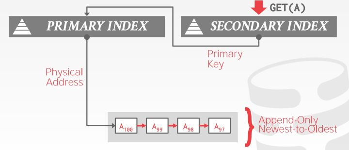
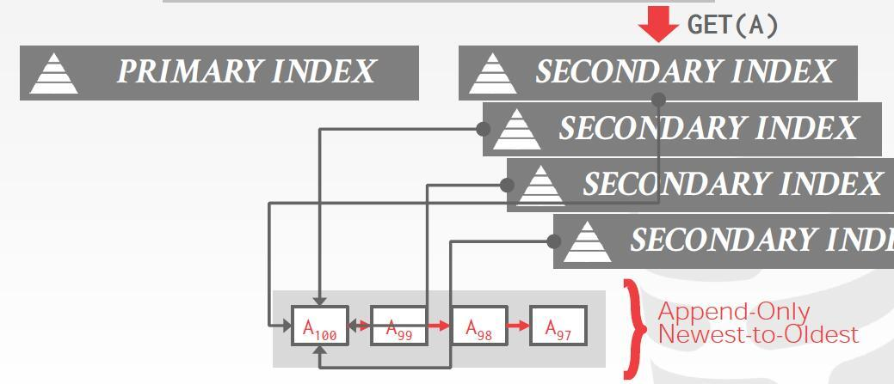
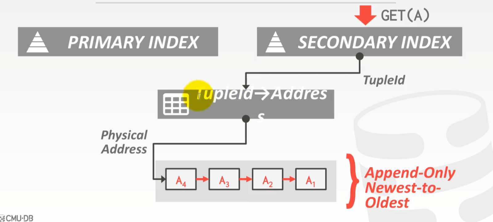

# 隔离等级

[浅谈MySQL并发控制：隔离级别、锁与MVCC - 掘金 (juejin.cn)](https://juejin.cn/post/6844904096378404872)

事务之间相互暴露带来的问题:

> * 脏读. 读到了其它事务未提交的数据
> * 不可重复读. 两次读的结果不一致. 读到的数据是别人已经提交的. , **针对update操作**
> * 幻读. 前后根据条件读取数据时读取数据情况不一致, **针对insert和delete操作**
> * 丢失更新
>   * 第一类更新: 并发事务都读取同一记录，并相继基于旧值对这一记录做出修改，那么就会出现前一个事务所做的修改被后面事务的修改覆盖，即出现**提交覆盖**的问题
>   * 第二类更新: 并发事务相继对同一记录做出修改，其中一个事务提交之后之后另一个事务发生回滚，这样就会出现已提交的修改因为回滚而丢失的问题，即**回滚覆盖**问题。

按照危害排序: 丢失更新 > 脏读 > 不可重复读 > 幻读

那么如果可以忍受一些严重程度轻的问题而不强求是可串行化的, 就可以获得一些性能上的提升. 因此有了事务的四种隔离级别.

隔离级别: 控制事务互相暴露的程度. SQL规范中定义的四种隔离级别: 

* serializable: 可串行化. 
  * 严格二阶段锁, 且使用防止幻读的手段.
  * 比如[浅谈MySQL并发控制：隔离级别、锁与MVCC - 掘金 (juejin.cn)](https://juejin.cn/post/6844904096378404872)中提到的读写都加X锁且粒度为表锁, 相当于严格串行了.

* repeatable reads / 可重复读: 允许幻读. 
  * 实现: 严格二阶段锁. 
  * MySQL通过间隙锁(会对查询范围空间的数据加锁)的手段把幻读也解决了

* read committed / 已提交: **只可以读取已经提交的事务**, 允许幻读与不可重复读. 
  * 实现 -> 二阶段锁中**S锁**是实时放开的(即不需要像严格二阶段锁一样最后再放开, 但X锁依然是需要最后再放开). 大部分数据库的默认隔离级别都是这个

* read uncommitted /读未提交: **允许读取未提交的事务**, 因此都可能发生. 
  * 实现例子 -> 读不加S锁, 写要加X锁并且像严格二阶段锁一样最后再放开


设置事务的隔离级别:

```SQL
SET TRANSACTION ISOLATION LEVEL
  <isolation-level>;
```

设置事务的acess modes, 分为`READ ONLY`和`READ WRITE`, 只读事务会有不同的处理策略.

```SQL
SET TRANSACTION <access-mode>;
```

> MySQL的默认隔离等级是RR, 好像RC比较好
>
> [MySQL 默认隔离级别是RR，为什么阿里等大厂会改成RC？ - 知乎 (zhihu.com)](https://zhuanlan.zhihu.com/p/430969940)

# 快照隔离

> ​    允许每个写操作产生一个新的版本数据，读操作可以选择读取过去的版本数据，其好处在于事务管理器不用再拒绝那些”过时的读“（arrive too late）。

每一个事务拥有属于一份自己的快照，writers 不会阻塞 reader，reader 也不会阻塞 writer。

read-only 事务可以直接根据时间戳读取快照而不需要获取锁。

如今的主流数据库几乎全都默认使用 快照隔离 隔离级别

## Multi-Version Concurrency Control（MVCC)

> `MySQL` 是通过`MVCC`（多版本并发控制）来实现读-写并发控制，又是通过两阶段锁来实现写-写并发控制的。我的理解是读是无锁的"快照读", 写是
>
> `MVCC`是一种无锁方案，用以解决事务**读-写**并发的问题，能够极大提升**读-写**并发操作的性能。

每个事务包含两个时间戳, $StartTS(T_i)$和$CommitTS(T_i)$, 分别代表事务的开始时间与commit时间. 每一个事务commit后会创建一个属于它自己的版本, 其version为当前事务的$CommitTS(T_i)$

读取和写入的行为与当前隔离等级有关.

### 数据的读取

* read uncommitted: 直接读取版本链上最新的记录即可

* read committed和Repeatable Read: 事务读取数据时会读取满足$Version <= StartTS(T_i)$​的最新的Version的版本, 也就是在当前事务开始之前的数据的最新版本.
* serizlizable: 使用加锁的方式来访问记录, 没有这种担忧

### 数据的写入

在写入时有两种策略可以选择:

* First Committer Wins: $T_i$在Commit之前检查数据的Version, 若已经大于$StartTS(T_i)$, 说明当前已经有其它事务在当前事务执行期间commit了, 于是当前事务回滚

* First Update Wins: $T_i$更新数据前需要申请写锁. 

  * 如果得到锁, 首先按照`First Committer wins`的策略进行检查, 如果有其它事务已经更新了数据就回滚.

  *  得不到锁 -> 锁被另一个事务$T_j$持有, 当前$T_i$​等待.

    * $T_j$abort了, $T_i$获得锁并检查, 若成功则执行更新操作
    * 若$T_j$是commit的, 那么$T_i$​回滚

     

## 快照隔离的串行化问题

[SIGMOD'08 | Serializable Snapshot Isolation - 知乎 (zhihu.com)](https://zhuanlan.zhihu.com/p/103553619)

单纯实现MVCC的隔离等级称为"快照隔离"的隔离级别. 因为存在**写倾斜**的情况. 例子:



$T_1$和$T_2$​都能成功commit, 但最后的值会相当于A和B交换. 但串行执行的结果应该是A == B. 

显然$T_1$和$T_2$之间是有环的, 分别有两个读写冲突. MVCC检测不出来的原因在于A和B分别写入了不同的数据

## 多版本数据的存储

"版本链". 索引的B+树节点指向链表的头节点

实现手段:

* append-only: 把同一个逻辑的tuple的所有的版本都存在同一张物理表中. 每次更新. 每次新数据可以插入链表的首或者尾



* Time Travel: Main Table只存最新的值, 有一张专门的Time-Travel Table来存放历史记录


* Delta Storage 则是每次仅将变化的部分/属性存入单独的 Delta Storage 表中。MySQL的undo日志就是类似这样的Delta Storage Segment, 通过基类索引中的隐藏列回滚指针`DB_ROLL_PTR`指过去


假设现在有这样的事务:

```SQL
BEGIN;

UPDATE book SET stock = 200 WHERE id = 1;

UPDATE book SET stock = 300 WHERE id = 1;
```

这里的`DB_TRX_ID`就是Version字段. 



## 垃圾回收

回收的宗旨:

* 没有事务能看到这个版本
* 版本是由已经aborted的事务创建的

### Tuple-level GC

* 后台清理: 一个定时执行的后台线程扫描全表并检查没有的版本. 
  * 优化 -> 更新页时维护一个dirty block来标识当前页是否被更新过, 只有被更新过的也才可能产生历史版本.

* 合作清理: worker threads在对版本链表进行遍历的时候，顺便找出那些可以被回收的旧版本，

### Transacition level GC

每个事务记录自己的read set和write set. 在事务提交一段时间之后, 垃圾回收器会通过事务的`write/read set`来清理掉对应用不到的版本


## 索引管理

聚类索引中维护指向版本链的第一个节点的指针, 像MySQL的`DB_TRX_ID`. 

* 在数据库产生新的版本时需要更新索引
* 事务更新了主键时需要先进行删除再进行插入操作

辅助索引:

* 辅助索引记录的是tuple的逻辑地址(在主键索引中的值), 需要回表查询数据的具体位置, 包括了版本链
  * 插入新版本时只需要主键索引更新即可



* 辅助索引记录Tuple的版本链的物理地址, 不需要回表
  * 插入新版本时, 所有辅助索引都要更新



> 可以维护一个Tuple ID对版本链物理地址的中间表
>
> 

## MVCC Index

在不同的快照中，相同的索引可以指向不同的逻辑元组。

不太懂..用到再说吧.

