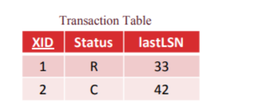
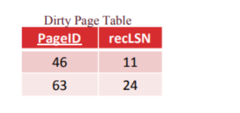
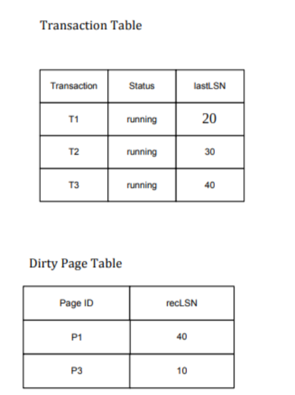
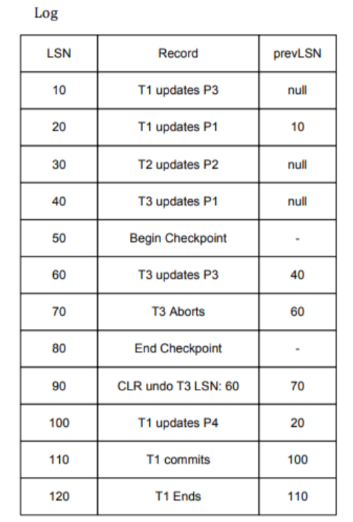
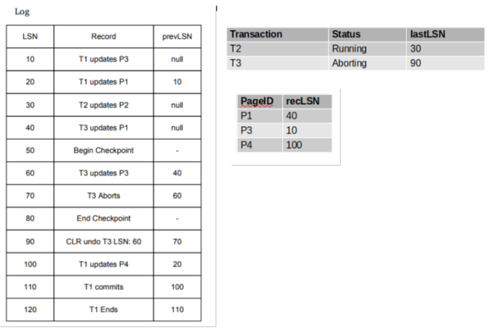

通过实现数据库的故障恢复机制可以

* 持久性. 当一个事务commit后, 需要保证它做出的改动不会丢失
* 原子性: 事务中的操作要么都执行要么都不执行

对于在数据库系统运行中容易出现的故障 :  ransaction Failure，Process Failure，System Failure以及Media Failure。其中Transaction Failure可能是主动回滚或强制Abort；Process Failure指的是由于各种原因导致的进程退出，进程内存内容会丢失；System Failure来源于操作系统或硬件故障；而Media Failure则是存储介质的不可恢复损坏。

在故障恢复中需要保持的两个特性:

* **Durability of Updates：已经Commit的事务的修改，故障恢复后仍然存在**
* **Failure Atomic：失败事务的所有修改都不可见**。

#  背景故事

## Buffer Pool管理策略

### Force / No Force

一般来说经过modify的数据页是在buffer pool中被修改, 直到被驱逐出buffer pool后才会被写入磁盘的. 但这样会导致如果数据库在事务提交后崩溃，一些页面可能没有被写入磁盘，因此从内存中丢失，因为内存是易失性的

Force policy可以保证事务的持久性. 规定当一个事务完成时, 在**事务提交之前**, 强制所有修改过的数据页到磁盘上. 这种策略可以保证事务的持久性

缺点: 性能问题, 需要很多不必要的写操作.

> 不这样做的话需要在恢复阶段redo一些操作

### Steal / No-Steal

一般来说在事务还没结束的时候, buffer pool是可以根据驱逐策略把事务修改过的一些page驱逐并写回磁盘的, 但这时若事务崩溃就会导致数据库处于奇怪的中间状态.

No-Steal策略可以保证事务的原子性, 规定我们必须把每个修改过的页面保留在内存中，直到事务完成。

> 不这样做的话需要在恢复阶段undo一些bad operations

### Steal, No-Force

为了性能本节课选择这种策略(即"放任不管"). 单这样根本无法保证原子性和持久性. 为了解决这个问题需要采取一些其他策略

## Write Ahead Logging(WAL)

一种使用Logging的故障恢复机制

A log is a sequence of log records that describe the operations that the database has done. 就像普通的数据页一样，日志页需要在内存中进行操作，但需要写到磁盘上进行永久存储。提前写入日志（WAL）就是规定何时我们必须把日志写到磁盘上。

### Update Log Record

每一个写操作(insert/delete/update)都要记录日志, 一条`update log`的格式:

```
<XID, pageID , o ffs e t , length , old data , new data>
```

其中的field:

* XID: 事务ID, 标注是哪个事务进行了这个操作
* pageId: 哪个Page被修改了
* offset: 具体被修改的的数据位置(一般单位是byte)
* length: 修改了多少数据
* old_data, new_data: 修改前后的数据
  * old_data用于undo
  * new_data用于redo

### Other Log Records

其它的一些操作也要记录日志:

* COMMIT: 表明一个事务已经开始了commit阶段
* ABORT: 表明一个事务开始abort阶段了
* END: 表名一个事务结束了
* CLR

### WAL Requirement

何时写入日志的规则:

* 日志必须在对应的data page写入磁盘之前写入磁盘. 这样才能实现原子性.

> 否则若再数据被写入磁盘之后数据库崩溃了, 那连发生了什么都不知道

* 当事务提交时，所有的日志记录都必须被写入磁盘。这样可以实现持久性

> 通过将所有的日志写入磁盘，我们可以准确地知道在修改的数据页被写入磁盘之前，数据库崩溃时我们需要重做哪些操作。

### WAL实现

为日志增加field

* `LSN`: Log Sequence Number, 每条日志记录都不同, 且是递增的, 用于知识操作的顺序
* `prevLSN`: 记录在同一个事务中的上一个操作.

在内存中记录`flushLSN`, 记录上一个被写入磁盘的日志记录的LSN. 

对每个page增加元信息`pageLSN`, 记录上一个修改当前page的操作的LSN

> 在一个page$i$可以被写入磁盘之前, 必须满足条件 $ pageLSN_i ≤ flushLSN $, 也就是说对当前页最新的操作的记录必须已经被写入磁盘.

## Abort a Transaction

这节讲的是How a database can abort a transaction that is in progress. 事务abort的情况:

* 死锁
* 用户决定
* 保证数据库一致性
* **系统崩溃**

Abort and CLR Log Records: 

在事务abort时向日志写一条abort记录, 之后从当前事务的日志中的最后一个操作开始撤销事务中的每个操作, 然后为每条被撤销的操作写一条CLR(补偿日志). A CLR (Compensation Log Record) is a new type of record signifying that we are undoing a specific operation. It is essentially the same thing as an UPDATE record (it stores the previous state and the new state), but it tells us that this write operation happened due to an abort.

## Recovery Data Structures

为了简化恢复过程还要在内存中维护两个表 -> 

* transaction table: 储存当前活跃的事务的信息, 其field:
  * XID: 事务ID
  * status: 事务的状态, 分为running, committing, aborting
  * lastLSN: 当前事务最近的一次操作的LSN



* dirty page table / DPT: 记录dirty page, 也就是被修改过但还没有写入磁盘的page的信息. field:
  * Page ID
  * recLSN: 第一个修改当前page的操作的LSN, "the first operation to dirty the page".



> 因为表是在内存里的, 当从崩溃中恢复时需要用日志来重建两张表

>* 在事务`T`可以提交之前, 必须满足 -> $flushLSN ≥ lastLSN_T$​, which说明当前事务的所有日志都已经入盘了
>* 对于在DPT中的page P, 一定有:
>  * $recLSN ≤ 内存中的pageLSN_P$
>  * $recLSN ＞磁盘中的pageLSN_P$
>
>这是显然的, 参考note 5-6页

---

# 恢复机制

## Undo Logging

并没有使用WAL, 对于buffer pool使用force and steal策略.

思想: undo the effects of all the transactions that have not yet been committed.

### 日志规则

建立四种记录: Start, Commit, Abort, Update(其中记录被修改的数据的**旧值**). 规则:

* 如果一个事务修改了一个数据元素，那么相应的更新日志记录必须在包含它的脏页被写入之前写入磁盘。这样在新值取代旧值之前, 旧值已经被永久地记录在磁盘上了

> 隐含 -> steal策略, the dirty pages written to the disk before a transaction commits

* 如果一个事务提交了, 那么被修改的页面必须在**提交记录本身被写入磁盘之前**被写入磁盘.因为如果我们在日志中看到了提交日志记录，那么我们就会认为该事务已经提交，在恢复过程中不会撤销它的修改。这里与WAL不同, 这里先写了数据再写了日志.

> 隐含 -> force策略

### Recovery过程

当系统崩溃后首先运行recovery manager, 从末尾开始扫描日志来检查事务是否结束, 对于遇到的日志:

* Commit / Abort: 标记事务T结束了
* Update T, X. v: 如果T没有结束, 向磁盘写入X=v, 否则忽略
* START T: 忽略 

## Redo Logging

对于buffer pool使用no force and no steal规则.

与undo logging类似, 但是恢复时是redo the actions of all the transcations that were committed instead.并且忽略所有没有提交的事务

### 日志规则

与undo logging类似, 但Update中记录更新后的值.

* 若事务修改了数据X, 那么update和commit记录都要在dirty page写入磁盘之前写入磁盘.(no-steal)

### Recovery过程

从日志开头读, 把所有的已经提交事务的updates重做一遍. 

## ARIES Recovery Algorithm

本质是一种Redo-Undo的WAL实现

分为三个阶段:

* Analysis Phase: 重建transaction table和DPT
* Redo Phase: 重新执行操作来确保持久性
* Undo Phase: undo崩溃期间事务的操作来保证原子性

### Analysis Phase

主要目的是确认后续Redo和Undo的操作范围, 通过Log修正Checkpoint中记录的Dirty Page集合信息，并用其中涉及最小的LSN位置作为下一步Redo的开始位置.

> [数据库故障恢复机制的前世今生 - 知乎 (zhihu.com)](https://zhuanlan.zhihu.com/p/54981906)里提到说由于生成Checkpoint时数据库还在正常提供服务（Fuzzy Checkpoint），其中记录的活跃事务及Dirty Page信息并不一定准确，因此需要Recovery阶段通过Log内容进行修正。

重建所谓的事务表与DPT. 需要扫描日志中的所有记录:

* 对于非`END`记录: 若事务不在事务表中, 把事务加入事务表, 否则把事务表的lastLSN更新为当前日志record的LSN
* 如果是`COMMIT`或`ABORT`记录: 修改事务表中事务的状态
* 如果是`UPDATE`: 如果page不在DPT总则把它加入, 并把其recLSN设置成当前记录的LSN
* 如果是`END`记录: 把事务从事务表中删除.

在analysis phase的结束阶段, 对于正在committing的事务我们直接向日志中写入END日志并把其从事务表中删除. 对于在崩溃时还在运行的事务都应该视为崩溃并向日志中写入abort.

#### checkpoint

一个优化是不需要扫描整个日志, 而是启用检查点机制. 检查点把事务表与DPT表的内容写到日志中, 之后重建时只需要从最后一个检查点开始即可.

检查点实际上向日志写了两条记录，一条是< BEGIN CHECKPOINT >记录，说明检查点何时开始，另一条是< END CHECKPOINT >记录，说明我们何时完成了把两张表的内容写入. 

写入日志的两张表所处的状态可以是< BEGIN CHECKPOINT >和< END CHECKPOINT >之间任何时间的表的状态。这意味着我们需要从< BEGIN CHECKPOINT >开始，因为我们不确定它之后的记录是否真的反映在被写入的两张表里。

#### example

现在有两张表:



日志:



从LSN60开始扫描

* 60: 更新T3的lastLSN到60. P3已经在DPT中了所以不需要修改
* 70: 把T3的状态修改成aborting并且更新其lastLSN


* 90: 是一个CLR, 修改T3的lastLSN即可
* 100: T1已经在事务表中了, 更新其lastLSN即可. P4不在DPT中, 所以需要加入并把recLSN设置为100.
* 110: 把T1的状态改成lastLSN
* 120: 从事务表中删除T1


### Redo Phase

从DPT中最小的recLSN开始, redo所有的`UPDATE`和`CLR`操作, 除非:

* page不在DPT中, 说明所有改动已经被写入磁盘了.
* recLSN > LSN: 说明我们现在所在的操作早已被写入磁盘了, 不然它才是recLSN
* pageLSN(disk) ≥ LSN. If the most recent update to the page that made it to disk occurred after the current operation, then we know the current operation must have made it to disk.

#### example


显然从LSN = 10的地方开始扫描记录:

* 10: update
* 20: P1的recLSN为40, 说明这个操作已经被写到磁盘里了, 不管它.
* 30: P2不在DPT里, 不管它
* 40: Update
* 50:不管它
* 60: update
* 70: 不管它
* 80: 不管它
* 90: CLR
* 100: Update
* 110: 不管它
* 120: 不管它

### Undo Phase

对所有未提交的活跃(包括running或aborting)事务的`Update`进行回滚(已经备婚滚, 即已经有对应CLR的Update不会滚).  从日志末尾开始扫描

在undo阶段每撤销一个update, 就往日志里写入一条相应的CLR记录. CLR中有一个特殊字段叫做`undoNextLSN`, 储存该事务的下一个要撤销的操作(你撤销的操作的prevLSN).  在撤销完毕后把事务的结束写入日志.

#### example



在analysis phase应该终止T2, 即在LSN=130的地方写下T2 abort, 其prevLSN为30

之后开始撤销T2和T3:

* T3最近一次操作在60, 但已经有对应的CLR了
* 下一次是40, 且没有对应的CLR. 我们要撤销它并写入对应的CLR记录. prevLSN为90, undoNExtLSn为空(后面没了). 最后给T3写入END
* T2的上一次操作是30. 其prevLSN为130(analysis phase写入的), undoNextLSN依然是空因为后面没操作了. 之后写入T2的END操作


