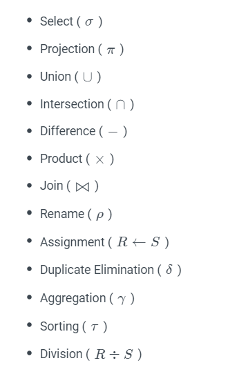
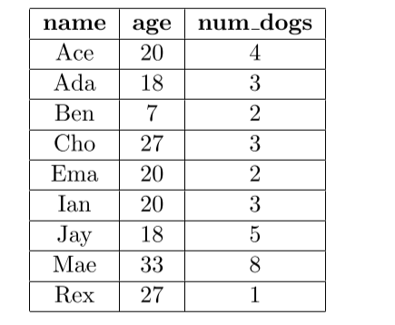
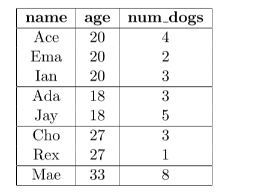
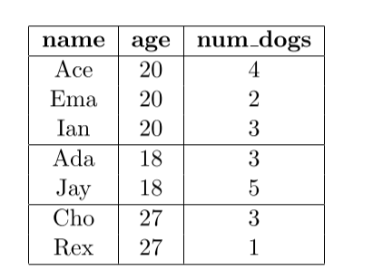
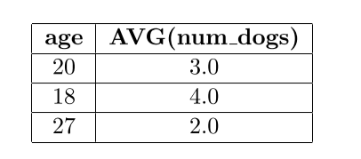
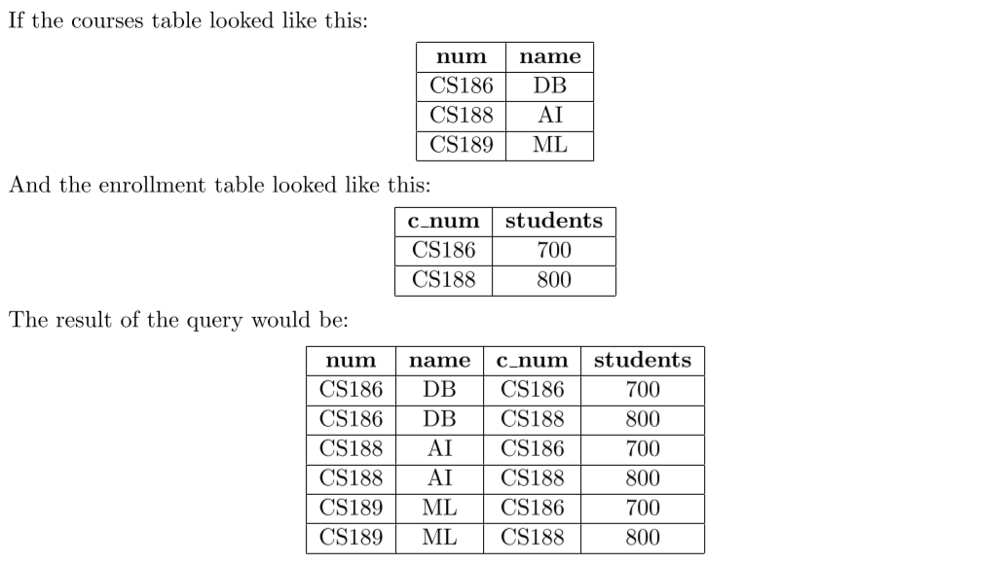
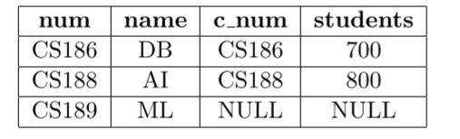
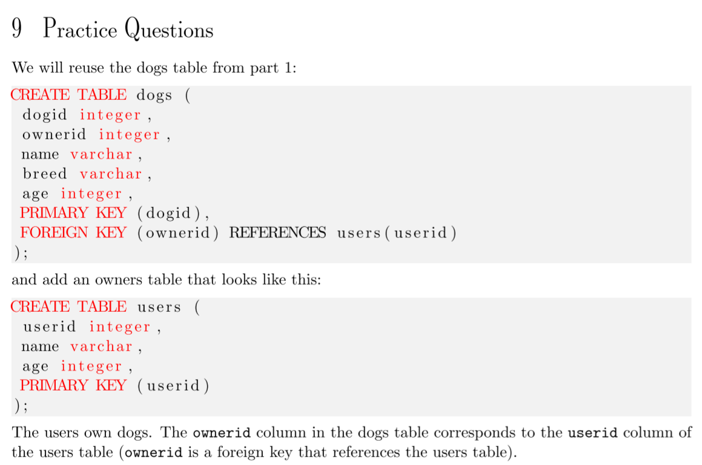

# DBMS(数据库系统)

## Abstraction

其抽象: 用统一的数据结构存储数据; 通过高级语言操作数据; 逻辑层和物理层分析, user只关心逻辑层, DBMS开发者才关心物理层的东西

## 数据模型

即对需要存储的数据进行建模, 常见的数据模型:

* Relational: 大部分属于此
* Key/Value
* Graph
* Document
* Column-family
* Array/Matrix

## 关系模型

### Relation & Tuple

每个关系都是一个无序集合, 其中的元素称为tuple, 由一组属性构成, 属性在路基上有内在联系

### Primary Keys

在一个Relation里唯一确定一个tuple

### Foreign Keys

唯一确定另一个relation中的一个tuple

### Data manipulation Languages(DML)

查询数据有两种方式

* Procedural(程序性的), 指定具体查询策略
* Non-Procedural, 只指定想要查询哪些数据, 不关心具体是怎么做的, 比如SQL

### 关系代数

关系代数是一种Relational Model的具体实现方式



# SOL Part 1 - Basic Queries

第一部分还是挺简单的, 主要讲了对单表的查询, 就调重点写吧:

单纯的`SELECT FROM`的顺序是不确定的, 理论上任何顺序都有可能.

**SQL的执行顺序**: 与Db内部有关, 但是结果等价于: 按照SQL里(除了SELECT以外的)部分的顺序执行, 最后执行SELECT.

SQL里NULL值的处理:

* 有NULL参与的表达式结果是NULL
* NULL is falsey, NULL是假的
* NULL可以被布尔运算符短路, 比如OR里只要有一个是对的, 那整体上就是对的, NULL就被忽略了

## Grouping And Aggregation

按照几个维度来介绍:

### 聚合列数据

常见的函数是SUM, AVG, MAX, MIN, COUNT, 输入是列的名字, 输出是单个值; 除了count(\*)所有的聚合函数都会忽略NULL, count(<column>)会返回column中所有非NULL值的数量(相等值也会重复计数), 而count(\*)则是返回当前表的行数.

```sql
SELECT AVG(num_dogs)
FROM Person
WHERE age >= 18;
```

### 数据分组

group by: 根据条件把数据分组, 之后就可以做一些聚合操作了

`HAVING`与`WHERE`一样也是用于对数据过滤的, 但是是发生在grouping之后的, 它过滤掉的是不符合规则的数据组

```sql
SELECT <columns> 
FROM <tbl> 
WHERE <predicate>
GROUP BY <columns>
HAVING <predicate>;
```

例子:

```sql
SELECT age, AVG(num_dogs)
FROM Person
WHERE age >= 18
GROUP BY age
HAVING COUNT(*) > 1;
```

> 之前提到的SQL执行顺序依然是有效的



首先执行到Group By之后得到的是这样的效果: (按年龄分组)



HAVING表示只需要保留**满足count(\*) > 1的组**, 因此去掉最后一组:



最后根据SELECT把所有的组变成一行, 这里也就是留下age和AVG(num_dogs).

最后的结果:



> group by可以指定两个列, 防止比如需要用到其它的列信息的情况

### A Word of Caution / 注意事项

* 每个查询语句必须保证每一列有数量相同的行数据, 例如下列查询是错误得的:

```sql
SELECT age, AVG(num_dogs)
FROM Person;
```

* 有GROUP BY语句的sql的SELECT只能SELECT分组的属性, 其它属性要用聚合函数. 比如下列语句不对:

```sql
SELECT age, num_dogs
FROM Person
GROUP BY age;
```

### 如何判断SQL的查询结果

* 看FROM选的哪张表
* 根据WHERE去掉用不到的行
* 把数据按照GROUP BY分组
* 根据HAVING去掉用不到的组
* 根据SELECT把每一组缩成一行


## Order By

可以指定好几列, 首先按照第一列排序, 之后是第二列, 以此类推...

默认是升序(ascending), 降序需要在列名之后显示指明关键词`DESC`

```sql
SELECT name, num_dogs
FROM Person
ORDER BY num_dogs, name DESC;
```

## LIMIT

即只看几条数据


# SQL Part 2 - Joins and Subqueries

把不同的表的数据给连接起来

## Cross Join

最简单的join, 相当于点积, 把左边的表的所有行与右边的表的所有行结合在一起.

使用的话就是把表名用`,`逗号隔开就行了

```sql
SELECT * 
FROM courses, enrollment;
```



可以用where来指定join condition, 其实相当于先join然后用where过滤了

```sql
SELECT * 
FROM courses, enrollment
WHERE num = c_num;
```


## Inner Join

Inner Join是在On字句中指定连接条件

```sql
SELECT *
FROM courses INNER JOIN enrollment
ON num = c_num;
```

课件上说Inner Join其实就是Cross Join的语法糖...把连接的条件独立到`On`字句里

## Outer Join

* left outer join: 确保所有左边表的行都会出现在结果中, 如果某一行没在右边的表中没有匹配则填充NULL

```sql
SELECT *
FROM courses LEFT OUTER JOIN enrollment
ON num = c_num;
```



* right outer join: 同理. 确保所有右边表的行都会出现在结果中

* full outer join: 确保两张表中所有的行都会出现在结果中

```sql
SELECT *
FROM courses FULL OUTER JOIN enrollment
ON num = c_num;
```

## 名字冲突

即连接时的两张表有名字一样的属性

* 可以用`tablename.column`的形式来区分

```sql
SELECT *
FROM courses INNER JOIN enrollment
ON courses.num = enrollment.num;
```

* `alias`, 也就是别名, 在`FROM`里用`AS`指定别名.

```sql
SELECT *
FROM courses AS c INNER JOIN enrollment AS e
ON c.num = e.num;
```

## Natural Join(自然连接)

自动把**同名列属性相等**的行连接在一起.

```sql
SELECT * 
FROM courses NATURAL JOIN enrollment;
```

> 实际很少使用

## Subqueries / 子查询

比如查询所有选课人数多于平均的课程

```sql
SELECT num
FROM enrollment
WHERE student >= (
	SELECT AVG(student)
    FROM enrollment;
);
```

这里的子查询只返回了一行, 如果返回多行这里就不合法了, 可能就要用`ALL`之类的运算符

## Correlated Subqueries / 相关的子查询

 即子查询查的是其它的表, 一般来说是每一行被插入到子查询中然后被子查询使用.

返回所有在两个表中都出现过的列:

```sql
SELECT *
FROM classes
WHERE EXISTS (
	SELECT *
    FROM enrollment
    WHERE classes.num = enrollment.num
);
```

`EXIST`即只要有行返回就是true

`ALL`需要前面接比较运算符, 比如`>= ALL(subqueries)`

`UNION`运算符将两个或多个[SELECT](http://www.yiibai.com/sql/sql-select.html)语句的结果集合并到一个结果集中。

## Subqueries in the From / 在FROM中使用子查询

相当于创建了一个暂时的子表:

```sql
SELECT *
FROM (
	SELECT num
    FROM classes
) as a
WHERE num = 'CS186'
```

## practice



```sql
// 1. 列出Josh Hug拥有的所有狗的名字
SELECT name
FROM dogs AS d Inner JOIN users AS u
ON d.ownid = u.userid
WHERE u.userid = "Josh Hug"

// 2. 
SELECT name
FROM dogs AS d, users AS u
WHERE d.ownid = u.userid AND u.userid = "Josh Hug"

// 3. 狗最多的人的名字和狗的数量, 只能返回一个结果
SELECT name, nums
FROM users AS u Inner Join
(
    SELECT userid, count(*) AS nums
	FROM dogs AS d Inner Join users AS u
	ON d.owner = u.userid
	GROUP BY userid
    ORDER BY count(*) DESC
    LIMIT 1
) AS tmp
ON u.userid = tmp.userid;

// 3.太麻烦了
SELECT user.name, COUNT(*)
FROM dogs AS d Inner JOIN users AS u
ON d.ownid = u.userid
GROUP BY userid, user.name
ORDER BY count(*) DESC
LIMIT 1;

// 4. 不需要只返回一个结果
SELECT user.name, COUNT(*)
FROM dogs AS d Inner JOIN users AS u
ON d.ownid = u.userid
GROUP BY userid, user.name
HAVING count(*) >= ALL(
	SELECT count(*)
    FROM dogs
    GROUP BY ownerid
)
```

这里提到了查询"最大值": 只要一条就ORDER BY然后limit 1; 可以返回多条就>= ALL


# Advanced SQL

* Aggregations + Group By
* String / Date / Time Operations
* Output Control + Redirection
* Nested Queries
* Common Table Expression
* Window Functions

示例:(enrolled -> 注册的, 招收)


## Aggregates

Functions that return a single value from a bag of tuples

有AVG(平均值), MIN, MAX, SUM(求和), COUNT(计数)

这种函数一般只用于`select`

```sql
select COUNT(login) as cnt from student where login like '%@cs'
```

```sql
select AVG(gpa), COUNT(sid) from student where login like '%@cs'
```

### DISTINCT Aggregate

COUNT, SUM和AVG支持`DISTINCT`关键字

```sql
select COUNT(DISTINCT login) from student where login like '%@cs'
```


> 意义不明的ppt

## GROUP BY

把tuple分成不同的自己, 并且对这些子集进行整合计算

```sql
select AVG(s.gpa), e.cid
from enrolled as e, student as s
where e.sid = s.sid
group by e.cid
```


### 规则

Non-aggregated values in SELECT output必须在GROUP BY里出现

## HAVING

与`group by`配合使用

Filters results based on aggregation computation

```sql
select AVG(s.gpa) as avg_gpa, e.cid
from enrolled as e, student as s
where e.sid = s.sid
group by e.cid
having AVG(s.gpa) > 3.9
```


## String Operations

不同的db对于大小写之类有不同的规定, 也有不同的函数...

* like: 字符串匹配, 其中`%`匹配任意子字符串(包括空串), `_`匹配任意一个字符

```sql
select * from enrolled as e where e.cid like '15-%'
```


## Date/Time Operations

不同DBMS中的定义和用法不一样

> 烦了烦了, 之后再说吧...