> 数据存储层, 相当于存储引擎吧, "面向磁盘"的DBMS体系结构

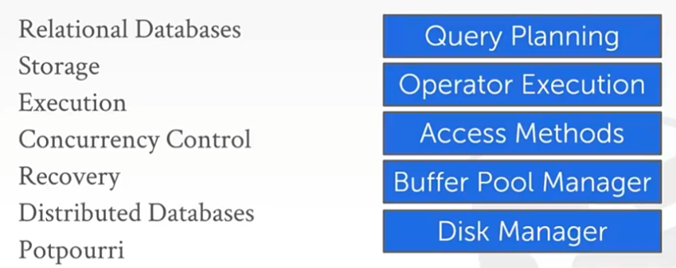

这里讲的是构建面向磁盘存储的数据库系统, 即数据是存在磁盘上的, 而不是`redis`那样数据放在内存里. 这时候需要一个disk manager, 负责把数据在非易失与易失的存储器之间移动

 # 计算机存储体系

把计算机的存储结果中间画一条线, 上面的是易失性存储, 下面是非易失性存储. 

* 易失性存储一般支持random access, 类似指哪打哪, 如根据内存地址直接访问
* 非易失性存储不支持, 比如想获得一个地方的数据需要读出整个块/页上的内容, 非易失性存储中比起随机读取不同位置上的内容, 读一段连续的块中的内容更有效率

数据库想做的事情就是把数据从非易失性的地方移动到易失性的地方. 

数据库的目标: 最小化从磁盘读取数据的影响, 给应用程序提供一种错觉, 即我们能提供足够的内存将整个数据库存入内存中

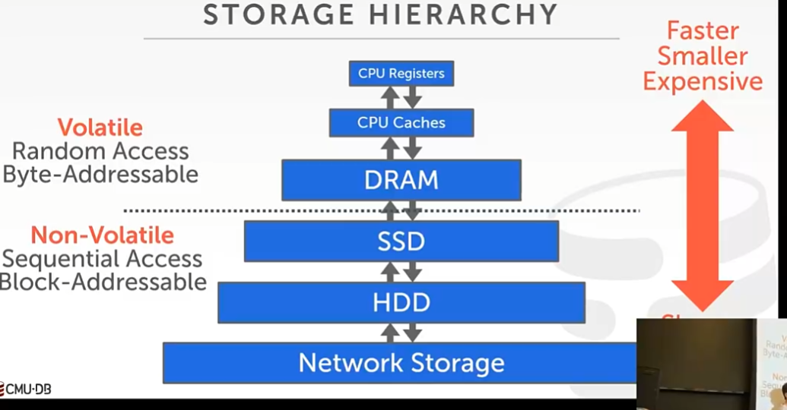

# 不使用 OS 自带的mmap

意思是说: 数据库决定把哪些数据块加载到内存中时不能使用OS的mmap机制. 

`mmap`: 提供虚拟内存机制, 软件访问虚拟内存中的东西, OS底层做内存和磁盘的加载过程.而且有多个写线程时也会有问题. 咱不用这个.

> `mmap`还有一些衍生的机制如`madvise`, `mlock`, `msync`, levelDB, elasticsearch等都用的这个

因为这个过程类似os的虚拟内存mmap过程

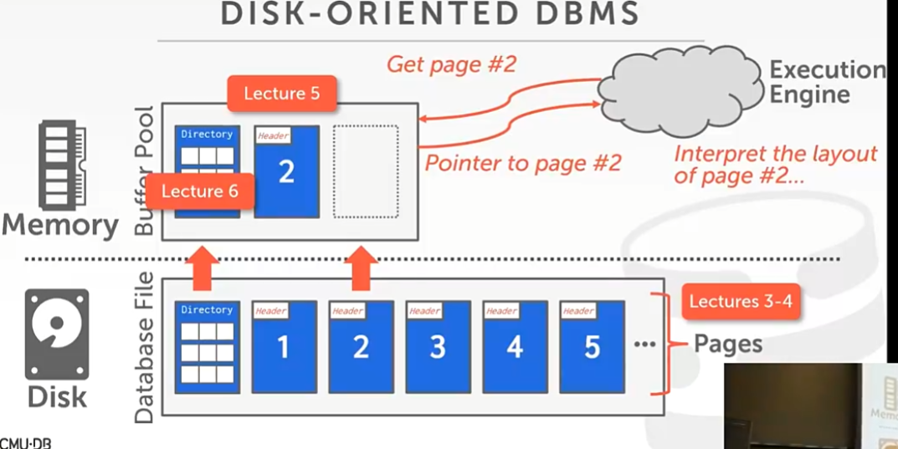

还有一些事情OS是没法做到的:

* 脏页的更新(不立即更新)
* 全表扫描时预取
* buffer pool替换策略
* 多线程调度

# 在文件中表示数据库

> 这一部分就是想回答 "How the DBMS represents the database in files on disk"

## File Storage / 文件的存储

DBMS把数据在OS的视角下其只是普通文件. 

> 有的DBMS实现了自己的文件系统, 但是其实不划算(可移植性低)

CS186里提到了Disk Managemetn层, 在文件/page层面做一些调度

## Database Pages

不同的pages:

* Hardware Page：硬盘的基本存储单位, 机械硬盘通常大小为 4KB, SSD更小, 可能就0.5个KB
* OS Page: 操作系统的基本存储单位, 
* 通常大小为 4KB
* **Database Page**：数据库自己读写数据的最小单位(512B-16KB), 之后提到的都是这个

DBMS把文件切分成pages进行管理, page是固定大小的一块数据, 有唯一的id, DBMS用一个indirection layer把page id与数据实际储存的物理位置关联起来


### DBMS管理 pages的方式

主要有:

* Heap File Organization
* Sequential/Sorted File Organization
* Hashing File Organization

#### Heap File Organization: 

heap file指一个无序的pages集合, 为了便于查找需要记录哪些pages已经被使用, 哪些没有被使用, 实现的方法:

* linked list(链表): pages管理模块维护一个header page, header page维护两个链表, 分别表示已经用过的和没有用过的page

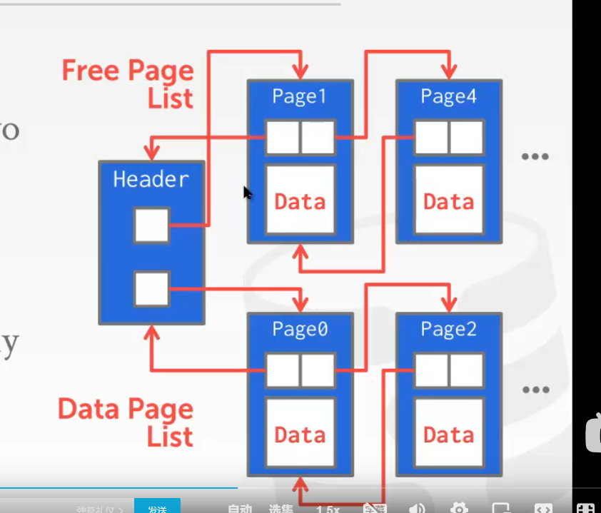

* page dircetory: 一些特殊的pages, 负责记录data pages的使用情况, DBMS需要保证directory pages和data pages同步

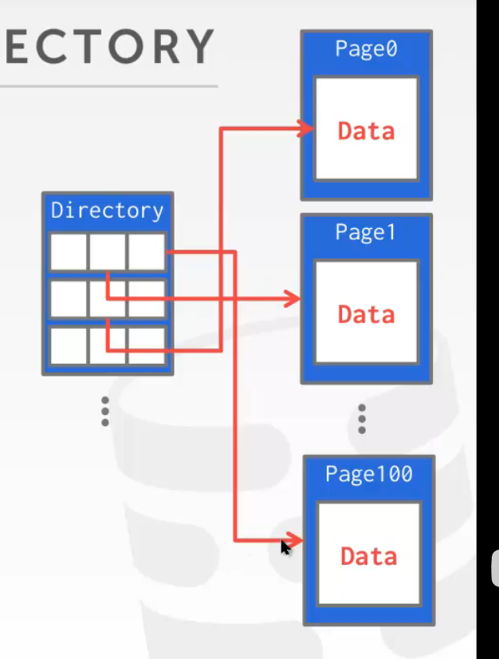

> TODO: 和CS186合并

## Page Layout / 每个Page的具体布局

page被分成两个部分: header和data, header中存放元数据, data中记录着真正存储的数据, 数据记录的形式主要有两种:

* Tuple-oriented: 记录数据本身
* Log-structured: 记录数据的操作日志

### Header

header中通常包括:

* Page size: Page有多大
* checksum: 校验和
* DBMS version: 数据库版本
* transaction visibility: 与事务跟并发相关
* compression information: 页的压缩信息

### Data: tuple-oriented

具体实现有一个"Straawman(稻草人) idea", 即在header中记录tuple的格式, 然后不断的往下append


缺点: 出现删除操作的话不好处理, 可能要从开头遍历寻找空位, 否则会出现空间浪费. 而且tuple难以处理变长数据记录(变长数据插入之前的空格不一定够)

后来又有了`slotted pages`, header中的slot array记录每个slot的信息, 比如大小, 位移等. slot array的顺序与具体data的顺序是颠倒/对称的

* 新增记录时在slot array中新增记录, slot array与data从page的两端向中间生长, 二者相遇时可以认为page满了 (也就是说slot是从前往后增加, Tuple具体数据是从后往前增加)
* 删除记录时把slot array中的记录删除, 然后把删除数据对应后面的数据向下移动来填补被删除数据的空位 

这样定位一条record只需要page_id + offset/slot作为所谓的record_id


当今大部分数DBMS都是用的这种结构的pages

### Data: log-structured

**最大的好处是把随机读写变成了顺序的读写**

按顺序存储日志信息: 每次有新操作就记录一下日志(具体的操作)


To read a record, the DBMS scans the log backwords and "recreates" the tuple to find what it needs

在查询场景下需要遍历page信息来生成数据得到返回结构.

回放是一般是从新往旧倒放的, 一直找到数据"诞生"的位置就停下, 然后开始重建

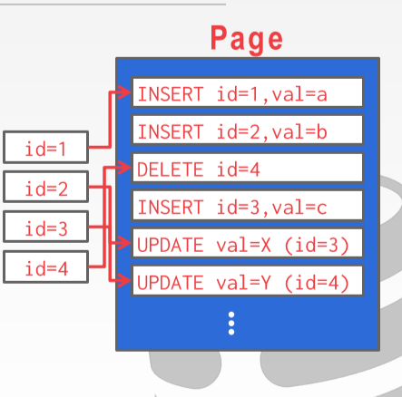

为了加快查询效率一般对日志在记录id上建立索引(比如记录所有与id=3有关的记录),以及会定期压缩日志(by removing unnecessary recoreds)

压缩:  思想是用最少的记录反映当前表的内容by removing unnecessary records

比如现在有一些日志.

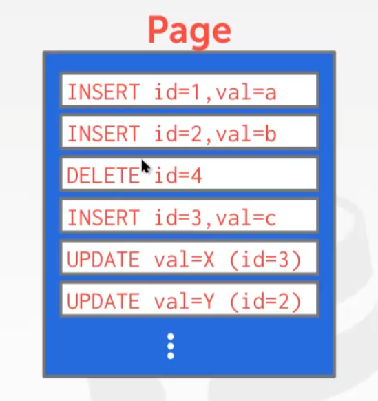

压缩之后的表:


> 这种日志形式一般用在kv上, 如HBase, levelDB, RocksDB都用了类似的机制
>
> RocksDB有分层机制/level Compaction, 把Log文件分开, 压缩时一层一层地合并再压缩
>
> 

## Tuple Layout / 一个元组的布局

即 Data部分(一个tuple)具体应该怎么存储, 显然一个tuple也应该分成header与data两部分, header中存储元信息(比如权限、并发控制, **Bitmap for null values**(列数据是否是null)等信息)

> tuple里不需要存表的具体结构

data中放具体的列值信息, 一般会按照建表时指定的顺序(不绝对)来存储.


# Tuple Storage / 数据的二进制表达

即如何解读字节中隐含的数据类型和数据本身. A tuple is essentially a sequence of bytes. It's the job of the DBMS to interrupt those bytes into attribute types and values. DBMS目录(catalogs)来存放schema information about tables that the system uses to figure out the tuple's layout.

## data representation

常见的数据类型与其实现:

* NTEGER/BIGINT/SMALLINT/TINYINT: C/C++ Representation(也就是直接用了native C/C++ types)
* FLOAT/REAL vs. NUMERIC/DECIMAL: IEEE-754 Standard / Fixed-point Decimals
* VARCHAR/VARBINARY/TEXT/BLOB: Header with length, followed by data bytes
* TIME/DATE/TIMESTAMP: 32/64-bit integer of (micro) seconds since Unix epoch

### 浮点数问题

其中`float`, `real`, `double`类型的数字如果按照IEEE-753标准存储, 是fixed-precision, 运算很快, 但是无法保证精确度要求很高的计算的正确性, 想要精确到任意精度的话需要用numeric/decimal类型存储, 底层是字符串, 跟Java的`bignumber`实现差不多

`PostgresSQL`中实现了数据格式numeric:

```c
typedef unsigned char NumericDigit;
typedef struct {
    int ndigits;
    int weight;
    int scale;
    int sign;
    NumericDigit* digits;
}
```

`MySQL`的numeric

```c
typedef int32 decimal_digit_t;
struct decimal_t {
    int intg, frac, len; // digits before or after point and length(byte) 
    bool sign; //positive or negative
    decimal_digit_t* buf; // digit storage, 指向字面量
}
```

### 大数据问题

tuple的大小显然不能超过一个page的大小, 为了存下比page大小大的值, 会新开一个页, 就是把大的值扔到里面. MySQL应该是大于等于 1/2 size of page(8k)就会溢出

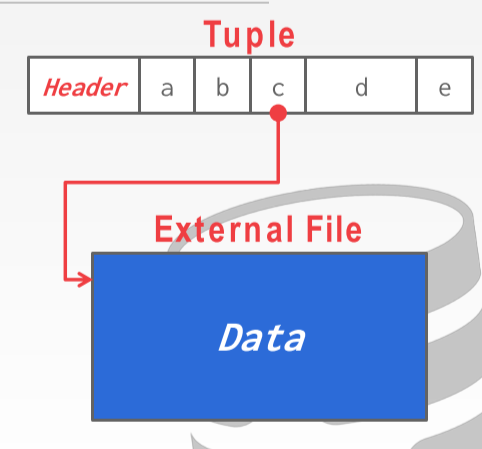

溢出页再不够就在后面再附着一个页. 链表.

不要存大数据, 会导致效率非常非常低, 可以用OSS / 外部文件地址来存

# System Catalogs

DBMS在它的internal catalogs里存meta-data about databases:

* Tables, columns, indexes, views
* User, permissions
* Internal statistics

大部分DBMS都把元数据作为一个表存起来. 这样它们也会被存成table、tuple. 可以尽量利用自己的资源

可以使用SQL查询语句来查询`INFORMATION_SCHEMA`数据库, 但一般DBMS会提供更便捷的消息.

比如MySQL:


查看一张表的schema:

* MySQL: `DESCRIBE Student;`
* PostgreSQL: `\d studnet;`
* SQLite: `.schema student`

# 数据库的应用场景

大概可以翻译成"数据库的应用场景"?, 可以用 操作复杂度与读写分布来描述, 大概类似一般计算任务分为cpu密集型与io密集型

* On-Line Transaction Process(OLTP): Fast operation that **only read/update a small amount of data** each time. 更偏向于写
* On-Line Analytical Processing(OLAP): Complex queries that **read a lot of data to compute aggregates**. 一个很复杂的SQL语句. 更倾向于读
* Hybrid Transaction + Analytical Processing(HTAP): OLTP + OLAP together on the same database instance. 兼顾两者

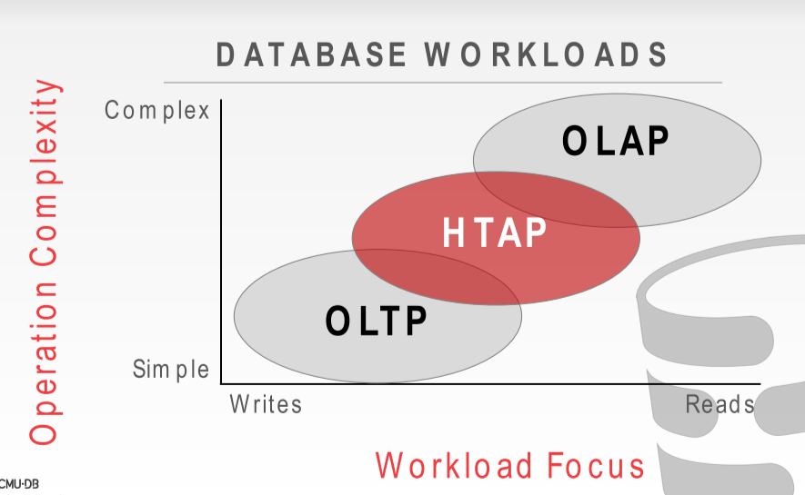

* OLTP example: 简单的读写语句，且每个语句都只操作数据库中的一小部分数据

```sql
SELECT P.*, R.*
  FROM pages AS P
 INNER JOIN revisions AS R
    ON P.latest = R.revID
 WHERE P.pageID = ?;
 
UPDATE useracct
   SET lastLogin = NOW(),
       hostname = ?
 WHERE userID = ?
 
 INSERT INTO revisions
 VALUES (?,?...,?)
```

* OLAP example: 复杂的aggregates大计算

```sql
// 登录用户中后缀为.gov的数量
SELECT COUNT(U.lastLogin)
       EXTRACT (month FROM U.lastLogin) AS month
  FROM useracct AS U
 WHERE U.hostname LIKE '%.gov'
 GROUP BY EXTRACT(month FROM U.lastLogin);
```

基于此对数据库进行规划:  平时业务里用一个小的数据库进行OLTP. 每隔一段时间进行ETL操作(提取、变换、加载), 扔到一个专门作分析的数据仓库里, 然后在里面跑分析的SQL.

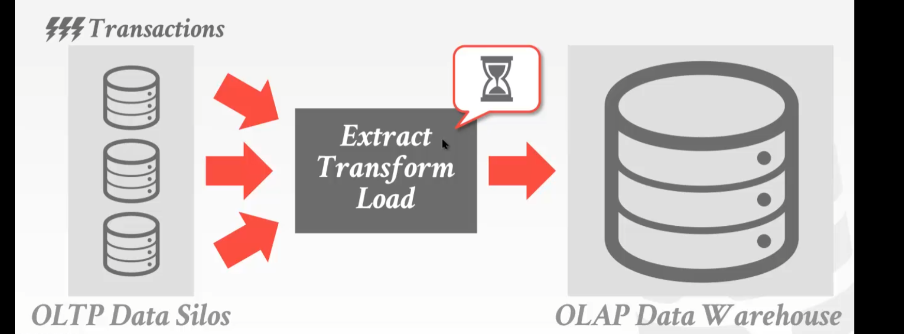

# Data Storage Models

The DBMS can store tuples in different ways that are better for either OLTP or OLAP workloads. 一个tuple的所有attributes并不需要都储存在同一个page中, 他们的时机存储方式可以根据数据库应用场景进行优化, 如OLTP和OLAP.

常见的Data Storage Models:

* 行存储: **N-ary Storage Models(NSM)**, 一个tuple保存一组属性
* 列存储: Decomposition Storage Model(DSM)

## NSM(行存储)

把一个tuple的所有attributes在page中连续存储, 这种存储方式非常适合OLTP场景


这样还可以针对一些常用的attributes建立index, 查询语句通过Index找到相应的tuples, 返回查询结果(我们都知道index也是一颗B+树2333)

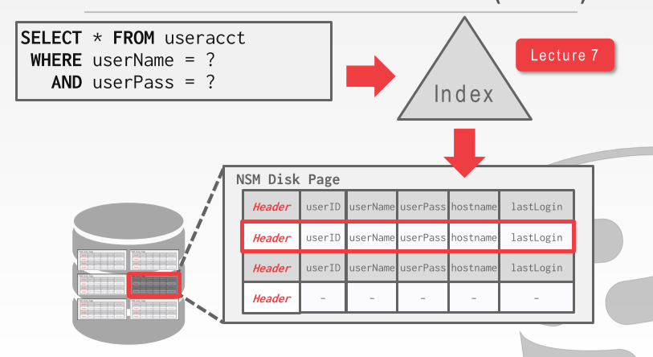

> 优点:
>
> * Fast inserts, updates, and deletes.
> * Good for queries that need the entire tuple
>
> 缺点:
>
> * 不适合需要检索表内大部分tuples, 或者只需要一小部分attributes的查询

## DSM(列储存)

把单个attribute连续的存储在一个page中, 这样比如你开一个Page可能会返现满page的userID2333.


这样可以通过只读一列的数据来优雅处理OLAP浪费查询I/O的问题:

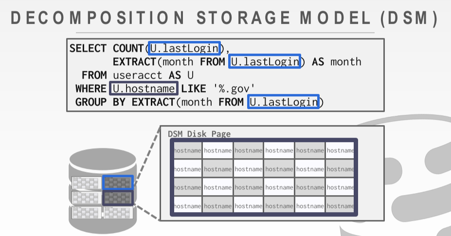

> 追踪每个tuple的不同attributes的方案:
>
> * Fixed-length Offsets: 每个attribute是定长的, 这样完全可以通过偏移量来跟踪特定的数据
> * Embedded Tuple ids: 在每个attribute前面加上tupleID
>
> 

优点:

* 大量减少I/O操作
* 对于数据查询和压缩有利

缺点:

* 只涉及少量tuple、多数attributes的点查询很低效.
* 对于很长的表, 可能需要元组切分, 查询时需要面对分裂/合并操作


