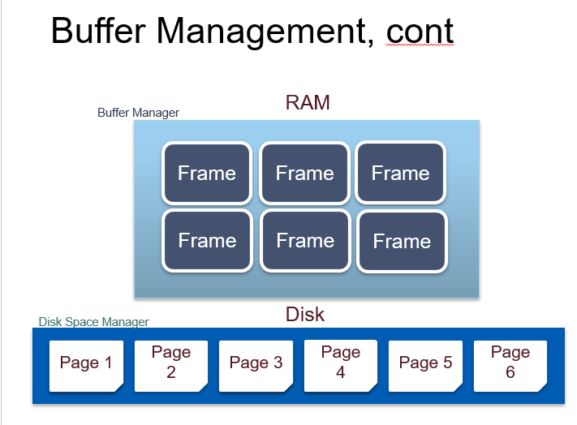
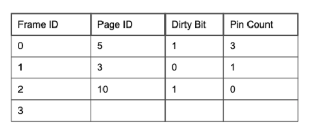
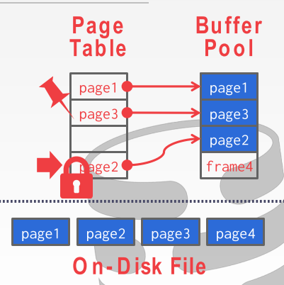
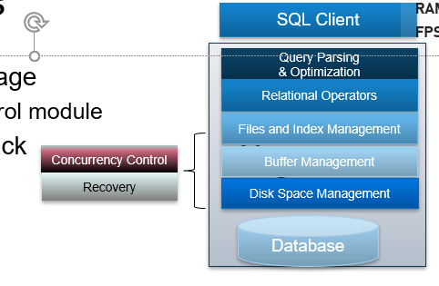
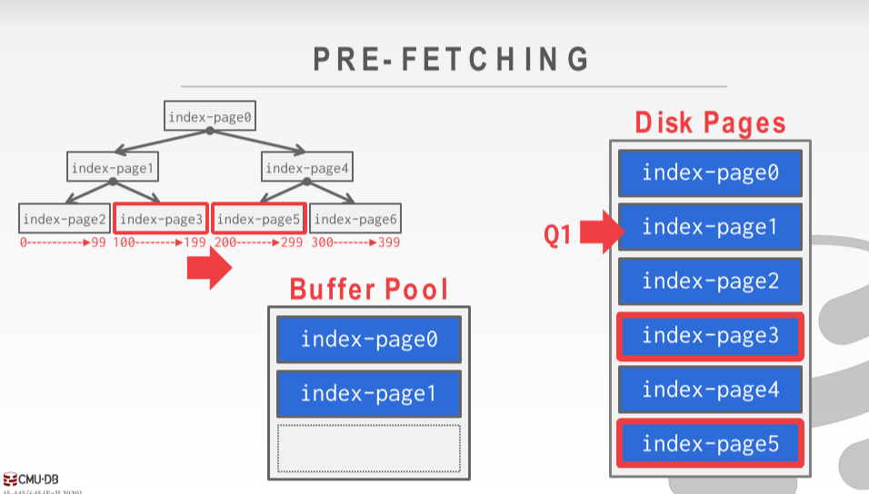
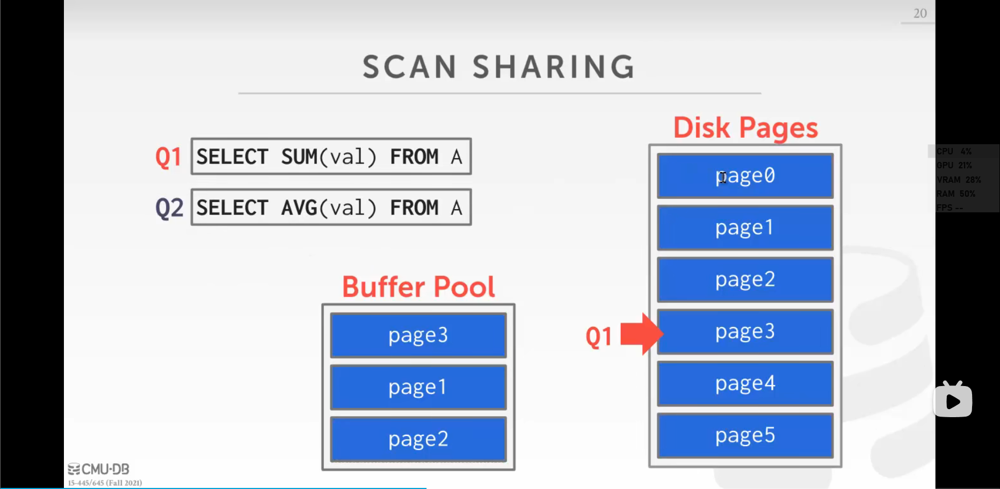
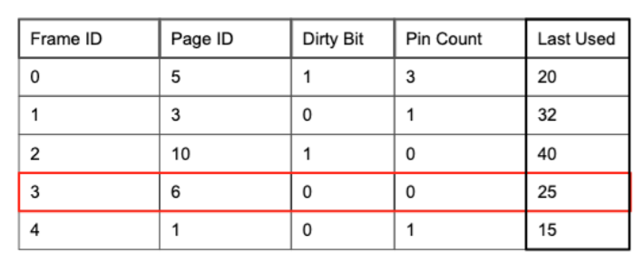

## Buffer Pool Manager

### 基础

 DBMS初始化时(boot time)会申请一块区域称为buffer pool, 里面分为很多的frame(与disk的page对应, 一个frame大小相当于一个page). 当DBMS 请求一个page, 它首先就会被复制到frames上

---

### 元信息

DBMS还会维护一个page table, 负责记录buffer pool相关的元信息, 包括每个page在内存中的位置、page的元信息:

* Frame Id: frame的唯一标识id, 每个id对应一个内存里的位置
* Page Id: 当前frame里是哪个page
* dirty bit: 这个page是否被写过. 1表示这个page被写过且没有被同步到磁盘上, 0表示它现在与磁盘是同步的
* pin count/reference count: 当前页正在被几个进程访问.

pin count可以防止替换掉正在被使用的page...

### Handling Page Requesting

当被请求的page在Page table中时, `Pin count++`, 然后buffer pool返回对应frame的内存地址

当被请求的page不在Page table中且buffer pool还有剩余空间时, DBMS会申请一个latch(锁), 表名当前页被占用, 然后从disk中读取相关的page到buffer pool, 释放latch.

> latch其实就是一种锁, 但是db的术语里特质lock和latch是不同的东西. latch指的是在数据库内部实现时内部数据结构使用的锁, 而不是外部用户并发读加的那种逻辑锁(大概)

buffer pool已满时会使用替换策略. 如果被替换的page的dirty bit被设置过, 还需要把数据回写到磁盘上来保证持久化. 

请求Page的线程对Page的操作完成后需要通知buffer manager把`Pin count--`

对单独page的并发访问和系统崩溃后的恢复由其它模块完成.

## 一些Buffer Pool优化策略

### Multiple Buffer Pools

The DBMS does not always have a signle buffer pool for the entire system, 可能在**不同的维度上**维护多个buffer pools:

* 多个buffer pool实例
  * 每个database分配一个buffer pool
  * 每种page类型分配一个buffer pool

多个buffer pool时如何确定访问的page具体在哪个buffer pool里:

* 可以在record id里内嵌一个object id, 然后维护object id 到buffer pool的映射. 这样的话record id就成为了`<objectId, pageId, slotId>`
* Hashing, 可以通过hash page id的方式来决定映射关系, 把由相同hash value的tuple分配到同一个buffer pool

在多线程模式下可以降低锁的竞争.

### Pre-fetching

就是通过当前的查询来加载未来可能用得到的page, 防止page fault的代价.

 具体方案:

* Sequential Scans(顺序扫描数据库时): 加载物理上连续存储的下一个page
* Index Scans(即按照B+树的顺序从根节点查找到叶子结点, 然后水平遍历有关的叶子节点时): 同一级的叶子节点不是连续的, 但是也会被缓存.

### Scan Sharing

主要用在多个查询存在数据共用的情况.即查询可以直接使用其它查询的中间过程值.

假设一个查询A想扫描一个表然后另一个查询B已经在这么做了, 这时候可以把两个查询attach起来, 让他们两个一起继续扫描, 共同结束后再扫描A跳过/没扫描的地方

Q1已经扫描到page 3时Q2来了, 这时候我们让Q2跟着Q1继续跑, 跑完了之后让Q2再去扫描之前没有扫描的表.

### Buffer Pool Bypass

当遇到大数据量的 Sequential Scan 时，如果将所需 pages 顺序存入 Buffer Pool，将造成后者的污染，因为这些 pages 通常只使用一次，而它们的进入将导致一些可能在未来更需要的 pages 被移除。因此一些 DBMS 做了相应的优化，在这种查询出现时，为它单独分配一块局部内存，将其对 Buffer Pool 的影响隔离。

### OS Page Cache

Most disk operations go through the OS API, 操作系统会对相关的东西进行缓存, 这样会相当于缓存了两次.

大多数DBMS(除了Postgres)会使用direct io来告诉os不要缓存这些数据, 省去从os缓冲区复制进db的代价, 但是postgreSQL没有使用direct io, 利用os的缓存减伤访问disk的次数

## Buffer Replacement Policies / 置换算法

即当buffer pool空间不足需要移除page时该移除哪些page. 跟os的调度算法是一致的.

Goals:

* Correctness: 数据要同步
* Accuracy: 移除不常用的pages
* Speed: 决策要迅速, 因为每次移除pages都需要申请latch, 决策时间太久会导致并发度下降
* Meta-data overhead: 决策锁使用的元信息的量最好别太大

### LRU / 最久未使用

维护每个page上一次被访问的时间戳, 每次移除时间戳最早的pin count = 0的page.

使用时可以在原数据表上增加last use的时间戳:

#### 改进: Clock / 时钟置换

> 算是LRU的一种近似策略, 不需要维护时间戳

不保存时间戳, 而是为每个page保存一个reference bit, 同时额外维护一个Clock Hand表示所谓的"时钟指针", 初始化为第一个pin count为0的frame

* 每当page被访问时, reference bit被设置成1
* 每当需要移除page时从Clock Hand开始按顺序轮询每个pin count为0的page的reference bit. 
  * 若该bit为1则重置为0然后clock hand继续走, 若该bit为0则移除该page并把clock hand指向下一个page.

考虑到回写磁盘的代价也很大 ,还可以考虑优先逐出没有被修改过的页面. 增加一个标志位m，修改过标记为1，没有修改过则标记为0. 根据两个标记位的情况综合考虑.

#### 缺点: Sequential Flooding

问题 / 缺点: Sequential Flooding, 即偶尔我需要读很多的pages, 但是这些pages基本上只会用一次, 但是会把很多更有用的pages挤出缓冲区, 就会导致buffer pool变得很混乱.

LRU和CLock都会受Sequential Flooding影响

#### LRU-K

保存每个pages最后k次的访问时间戳, 普通的LRU就是LRU-1

实现: 维护一个缓存队列, 用于记录所有缓存数据被访问的历史, 当有page的访问次数达到k次时把数据放入缓存队列, 当需要淘汰数据时淘汰第k次访问时间举当今时间最大的数据

具体:

1. 数据第一次被访问，加入到访问**历史队列**
2. 如果数据在访问**历史队列**里后没有达到 K 次访问，则按照一定规则 (FIFO，LRU) 淘汰(自己就走了)
3. 当访问**历史队列**中的数据访问次数达到 K 次后，将数据索引从**历史队列**删除，将数据移到**缓存队列**中，并缓存此数据，**缓存队列**重新按照时间排序
4. **缓存队列**中被再次访问后，重新排序
5. 需要淘汰数据时，淘汰**缓存队列**中排在末尾的数据，即淘汰” 倒数第 K 次访问离现在最久” 的数据

LRU-2使用比较合适, `k`高了会导致适应性差

### MRU / 最近最常使用

与LRU相反. 可以记录pin count改变的时间, 选择最近的来置换.

这个算法乍一看是反直觉的, 但是在一些场景下可能很适用, 比如工作集大小大于缓冲区大小...

## Dirty Page

脏页就是被写过的页

只有脏页是需要写回磁盘的(其它页直接drop就行了), 写回的代价很大, DBMS在移除pages时也应该考虑这一点. 

还有一种方式是Background writing, 一个后台进程定期扫描page table, 发现dirty page就写回disk, 这样在page替换发生时就不用考虑dirty page的问题了

## Other Memory Pools

除了存储 tuples 和 indexes，DBMS 还需要 Memory Pools 来存储其它数据，如：

- Sorting + Join Buffers
- Query Caches
- Maintenance Buffers
- Log Buffers
- Dictionary Caches

