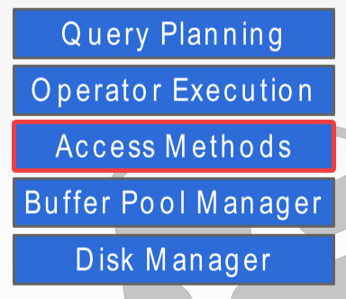
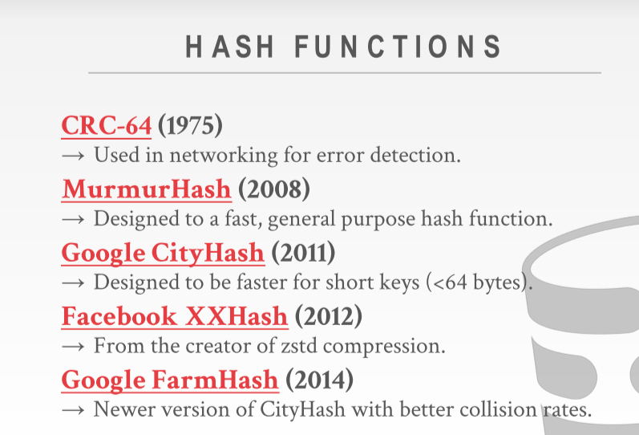
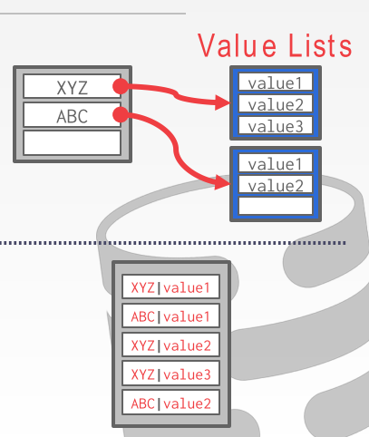
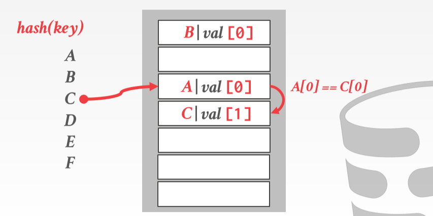
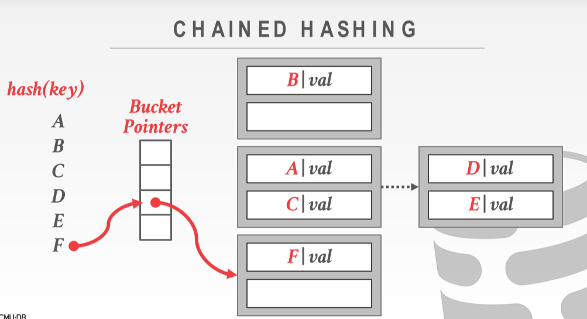
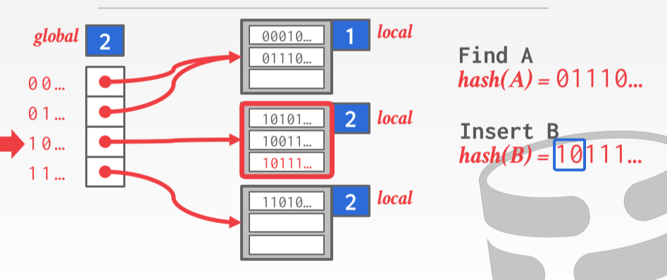
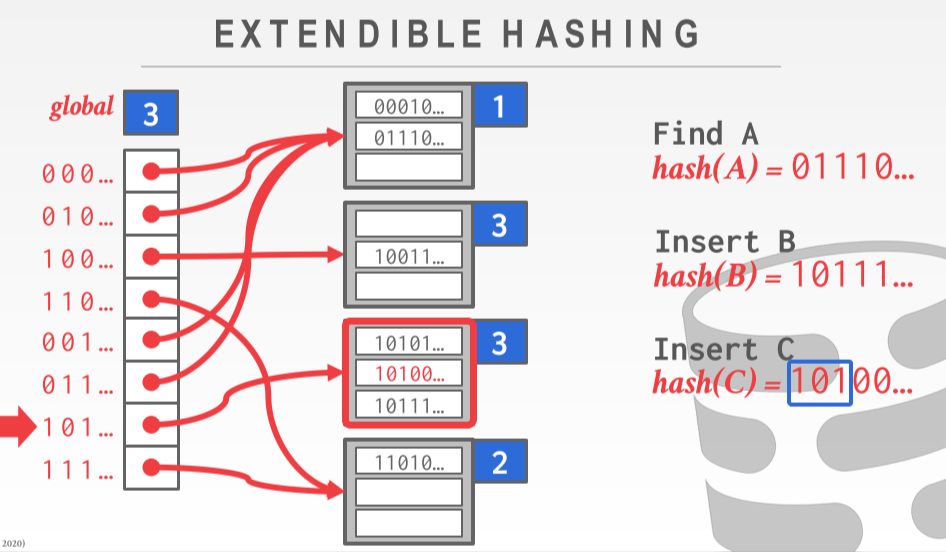
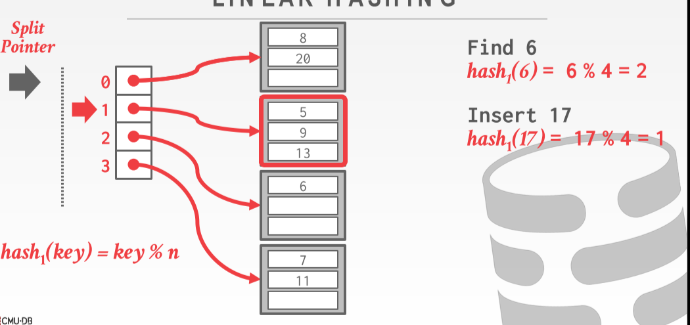

这节课开始讲的内容是Access Methods部分的内容, 主要是如何从Pages读取数据 ,对DBMS来说重要的数据结构就是哈希表和树

常见使用场景:

* Internal Meta-data

* Core Data Storage

* Temporary Data Structures

* Table Indexes

话说redis本身不就是一个哈希表吗2333.

## Hash Tables

空间复杂度: O(n)

时间复杂度: 平均O(1), 最差O(n)(全冲突)

主要组成: Hash Functions + Hash Scheme(处理碰撞)

## hash function

For any input key, return an integer representation of any key

与加密的哈希函数是不一样的, 加密的哈希函数是难以反过程计算的, 而且开销很多

常见的hash functions:

## static hashing scheme

静态哈希结构, 表的大小时固定的, 不支持扩容

### Linear Prone Hashing: 

* 线性探测哈希/开放地址哈希. 一个很大的数组来存各种哈希槽, 发生碰撞时把内容存到下一个可用的槽中
  * Tombstone/movement: 即删除元素时会出问题, 可以留一个"墓碑"(指示你向下找)/把元素上移
  * 重复的键的问题: db是可能出现重复的key,即单个key对应多个value. 解决方案:
    * Separate Linked List
    * Redundant Keys

### Robin Hood hashing

基于开放地址哈希的改进版,基本思路是"劫富济贫", 如果发现单元格被其他键值对占用，那么就需要比较这俩个键距离其原本位置的距离。距离较远的键值对留下，距离较近的被迫后移。

### Cuckoo hashing

杜鹃鸟

建立多个散列表, 使用不同的哈希函数. 在插入时检查每个表并选择任何有空闲插槽的表插入。如果没有表有空闲插槽，则从其中一个中删除该元素，然后将这个元素重新散列以找到适合它的新位置。

防止无限循环: 循环起来时用新的散列函数重置整个散列表 

### 静态哈希结构缺陷

要求使用者能够预判所存数据的总量，否则每次数量超过范围时都需要重建 Hash Table。

动态哈希结构就可以resize themselves on demand.

## Dynamic hash tables

支持动态按需扩容缩容

### Chained Hashing

每个key对应一个链表, 每个节点是一个bucket(可以发多个元素).bucket满了就在后面再挂一个bucket

要处理并发性: 在桶上设置一个latch

Java中的实现则是做了简化, 每个bucket相当于只存放一个元素. 问题在于元素很多事链表会很长, 所以进行的优化(压缩成红黑树)

### Extendible Hashing

基本思路是一边扩容，一边 rehash. 

哈希函数得到二进制, 根据全局标志位决定看hash值的二进制前几位, 根据这个位数去决定扔到哪个桶里;

> PS: 这里的桶代表第一位是0, 前两位是10, 11...

一旦桶满了就让全局标志位++, 然后各个桶再rehash(桶的数量要变多

### Linear Hashing

> 感觉不是很重要....

维护一个指针，指向下一个将被拆分的 bucket，每当任意一个 bucket 溢出（标准自定，如利用率到达阈值等）时，将指针指向的 bucket 拆分。

初始指针指向0号桶

现在17应该被插入第二个桶, 但是已经满了,又不想挂新的桶. 那么对指针指向的桶(0号)进行分裂, 对分割点指向的桶所包含的key采用新的hash函数进行分割(原来是a % n, 改成a % 2n). 17也放在新的桶里

> 之前所有的"填满"不一定是完全满, 可以是比如到了75%之类的...