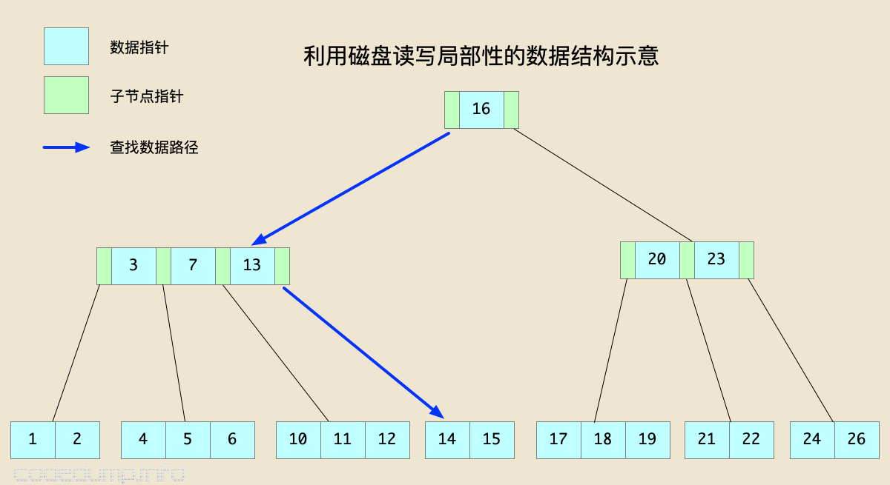
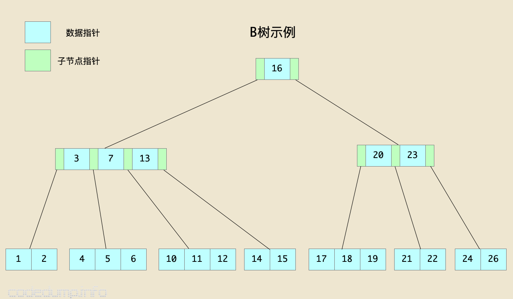
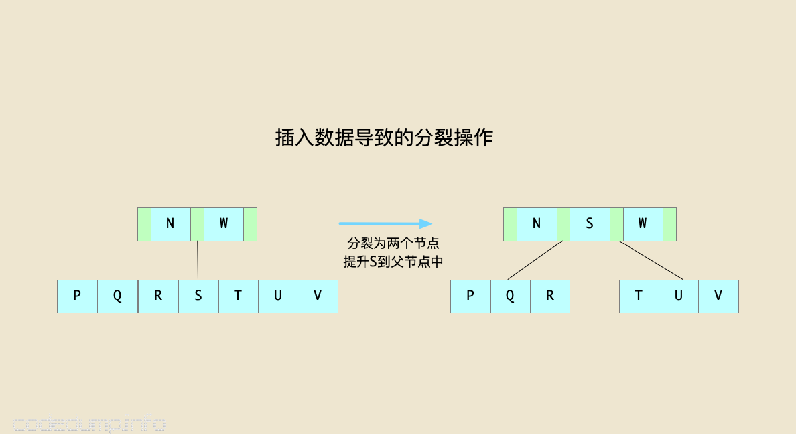
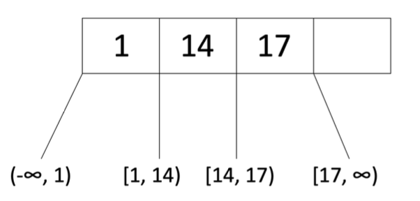
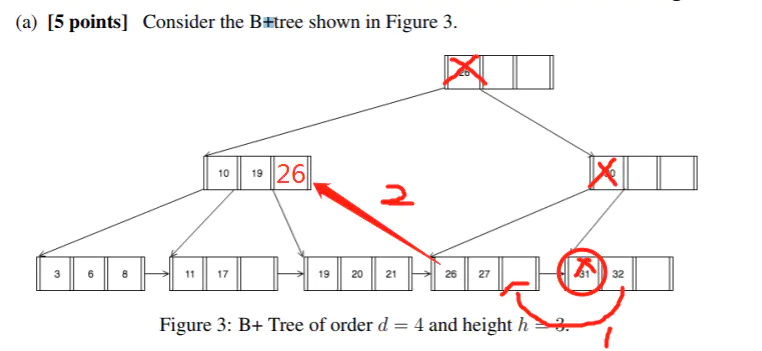
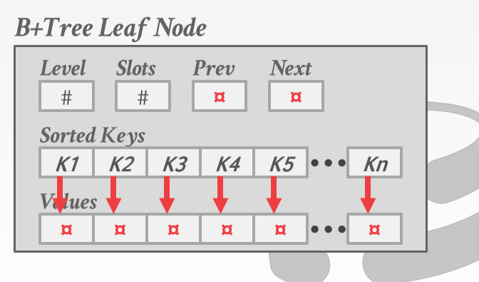
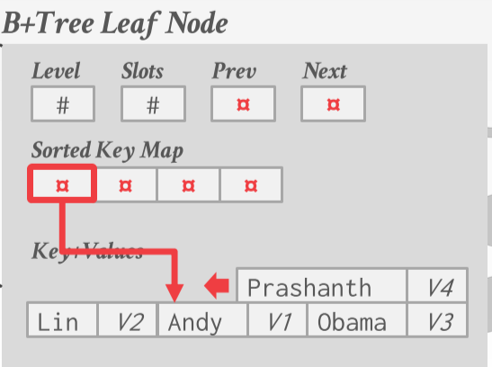
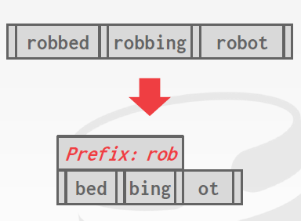
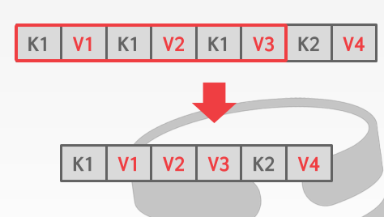
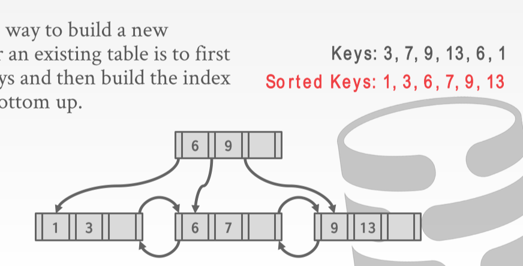

Heap File应该提供的API: 

* 根据Record id(record所在页面的id和在该页面上的位置)访问record
* 顺序访问所有的record

# Table Index

索引的本质就是从数据库中的完整的表中抽取出部分字段（attribute）构建成的小表，是大表的一个副本, 而且这个副本被构建出来的时候一般都是已经排好序的，我们使用这个副本就可以完成高效的数据访问.

DBMS需要保证索引与实际数据是逻辑同步的.

建立索引会增加存储, 维护(同步)的开销, 但可能加快执行速度, 需要权衡

对数据结构的要求: 基于持久磁盘的数据结构, 存储在磁盘中时IO很高效

## 索引的类别

### clustered index(聚簇索引)

一般就是按照主键id建立索引, 有些DBMS对每个table都添加聚簇索引, 没有主键时会自动生成主键. 有的DBMS不支持聚簇索引

不使用聚簇索引的话主键索引的KV中的V一般会是对应tuple的页号与slot号

### Compound Index(联合索引)

就是对多个column建立索引.

# B+树

注意树里存的是`key-value`, 这里的图里只标了`key`, `value`被省略了



> 使用B+树而非红黑树的原因: 读写磁盘最好要满足"局部性原理", 当一个数据被用到时其附近的数据页通常会马上被使用. 因此应该把逻辑上相邻的数据在物理上也尽量存储在一起. 而B+树每个节点能容纳更多的数据, 从而降低树的高度.

## B-Tree Family

B树, B可能指Balanced. 

B-Tree 与 B+ Tree 最主要的区别就是 B+ Tree 的所有 key 都存储在 leaf nodes，而 B-Tree 的 key 会存在所有节点中。

B树的节点分为:

* 内部节点: 存储了数据以及指向其子节点的指针
* 叶子节点: 只存数据, 没有子节点

B树的"度"决定每个节点最多有多少数据. 以后记为`t`

B树的属性:

* 每个节点的键值以递增顺序排列, 即`node.keys[i] <= node.keys[i + 1]`
* 同一节点中相邻的$K_1$和$K_2$之间的子树的所有节点都在$K_1$和$K_2$之间
* 内部节点中指向子节点的指针数量是存储数据节点数+1, 也就是说一个包含 x 个关键字的结点有 x+1个孩子
* 所有**叶子节点的高度一致**
* 内部节点与叶子节点的键值数量都在`[t-1, 2t-1]`之间. 
  * 不满足该条件时做重平衡操作. 小于`t-1`时借用或合并数据, 数据量大于`2t-1`时分裂节点. 



### B树操作

### 插入

首先把数据插入到叶子节点, 如果节点变满(即节点数据量变为`2t`)则把它分裂为两个数据量为`t-1`的节点, 然后把中间的节点提升到父节点中. 如果父节点又满了则沿着树一直向上执行操作



```
向B树中插入数据：
  找到插入数据所在的最合适节点(叶子节点)
  如果该节点的数据量已满：
    进行分裂操作
    插入数据
  否则：
    插入数据
```

### 删除

首先沿着树向下寻找要删除的节点

## B+ Tree的性质

一种自平衡树, 有序存储数据; 搜索(search), 顺序查找(sequential access), 插入(insertions)和删除(deletions)操作的复杂度都是O(log n). 

> B+树对于在磁盘上读写整夜文件是有优势的. 比如可以控制一个节点为一个页的大小, 统一理论与物理实现. 也可以一个节点是好几个页

* 定义`d`为B+树的order（阶数？）, 每一个节点必须有$d \leq x \leq 2d$​ 个条目(entry), 叶子节点除外
  * 另一种定义方法是`m-way`的B+树, 每个节点储存的`kv`的数量是`[M/2-1, M-1]` 

* 在每两个entry之间有指向子节点的指针, 每个节点最多有2d+1个指针, 称为B+树的fanout
* "左小右大", entry左边的孩子中的最大值要比entry小, 右边孩子要比entry大.



* 叶子节点之间是双向链表, 便于顺序遍历
* 所有的叶子节点的高度相同
* 只有叶子节点包含记录或指向记录的指针, 内部节点不包含实际的记录, 只有用于搜索的辅助数据.


## B+树操作

[B树和B+树的插入、删除图文详解 - 知乎 (zhihu.com)](https://zhuanlan.zhihu.com/p/142576140)

### 查找

按照大小关系从根节点一直往下走

对于联合索引, 可以按照靠左的顺序使用索引, 如<a, b, c>上建立索引是可以在使用a和b的查询中起作用的.

### 插入

首先插入的数据是一定要插入到叶子节点中的......

* 按照大小关系找到需要插入的叶子节点`L`
* 如果`L`的元素溢出了:
  * 把`L`分裂成`L1`和`L2`, `L1`中有`d`个entries, `L2`中有`d+1`个entries
  * 若`L`是叶子节点, 把`L2`的第一个entry复制到原来`L`的父节点中. 若`L`不是叶子节点, 把`L2`的第一个entry移动到到原来`L`的父节点中. 这样做是因为叶子节点的数据不能损失, 而内部节点中的数据是无所谓的
  * 调整指针

* 如果父节点又溢出了, 递归处理父节点

### 删除

CS186表示直接删除就行了, 因为实际应用中插入远比删除要多(逃)

理论上如果当前叶子节点依然至少处于半满状态则操作结束(可能要更新父节点的值), 否则要首先从兄弟节点那里拆借entries, 若失败则与兄弟节点合并, 合并后还要递归删除父节点中的entry

如果父节点没了需要再次合并



很多数据库有延迟合并操作, 因为可能后面还会插入新数据.

[B+树看这一篇就够了（B+树查找、插入、删除全上） - 知乎 (zhihu.com)](https://zhuanlan.zhihu.com/p/149287061)

### Bulk Loading

是CS186中提到的操作并在Lab中要求实现, 主要用于创建一颗B+树时. 步骤:

* 按照B+树使用的index来对数据进行排序
* 开始填充叶子节点, 直到指定的填充因子(fill factor)
* 增加从父节点指向叶子节点的指针. 若父节点溢出了, 对其进行分裂:
  * 分裂成`d`与`d+1`两个节点
  * 把右节点的第一个entry提升到父节点
* 调整指针


## B+树节点的形式

简单的说就是一个kv数组. 数组内部是按照`k`的大小排序, 内部节点的`v`存储的是指向子节点的指针, 叶子节点的v是我们想要得到的信息

聚簇索引中的v就是数据库data page 

叶子节点的数据是key-value, value一般是主键id. 每一个`entry`下又分为很多的k-v对

除此之外B+树还要存相邻兄弟节点的地址以及其它的一些元信息:

(prev和next是上下节点的指针)




## Duplicate Keys

即处理重复的"主键"(建立索引用到的键)的方法:

* 在Key后面再加上一个id
* 允许相同的key在叶子节点溢出 


# B+ Tree Design Choices

## 节点大小

disk的读取速度越慢, B+树的节点就越大越好, 每读一次尽量的把越多的数据读入内存

HDD:1MB

SSD: 10KB

In-Memory: 512B

需要经常进行全表遍历的话设置的尽量大一点, 需要经常点查询的话小一点

MySQL是16K, 与文件页大小一样


## 延迟合并

节点合并的阈值, 因为merge操作引起的修改很大, 应该延迟merge, 或者直接用一个其它进程来周期性地重建table index

MySQL是以具体node大小来确定合并的阈值, 需要比较精细的管理

## 可变长度的键

变长数据的处理手段:

* Pointers: 改为存一个指向数据的指针
* Variable Length Nodes: 让B+树的每个节点都变成变长节点, 但是会增加管理的难度.
* padding: 所有的数据都是max length. 如果Key是变长的，我们也可以再向Key中补入空的字节，直到让Key的长度达到我们所设计的fixed-size
* key map/indirection: 内嵌一个指针数组, 类似数据库文件组织中的`slot`, 存储指向对应KV的指针.



## intra-node search

即在节点内部搜索:

* Linear Scan 线性爆搜

* Binary Search 二分, 因为节点内部Key是有序的

* Interpolation：通过 keys 的分布统计信息来估计大概位置进行检索

# Optimizations(B+树优化)

## prefix compression(前缀压缩)

在同一个叶子节点中的key可能有相同的前缀, 可以提取出来然后存的时候可以只存不一样的地方



## deduplication

键冗余时值存一个键



## Bulk Insert(批量插入)

一个一个插是低效的(可能刚分裂完下一个数据又需要合并)

先把要插入的数排好序, 然后直接做一个B+树的重建

具体实现时可以先排序最底层, 然后一层一层地向上做索引



## Pointer Swizzling

Nodes 使用 page id 来存储其它 nodes 的引用，如果 page 已经在 buffer pool 中，我们可以直接存储其它 page 在 buffer pool 中的内存地址作为引用，从而提高访问效率

## Suffix Truncation

中间节点作"转发"时可能没必要存完整的key, 只存一些前缀就够了


# 索引的使用

## 隐式索引

大多数DBMS会为主键/有unique关键字的属性创建索引

## 部分索引

可以只对表的一部分元组建立索引

```SQL
CREATE INDEX idx_foo ON foo (a, b) WHERE c = "WUTang";
```

## 覆盖索引

如果查询所需的所有属性都存在于索引中，则DBMS甚至不用去获取元组本身即可得到查询结果。

```SQL
CREATE INDEX idx_foo ON foo (a, b);

SELECT b FROM foo
 WHERE a = 123;
```

## index include columns

在索引中有意加入别的属性。这样处理时，叶子节点包含c，但内部节点都只保存了a和b，可以大幅度减少索引的大小。

```SQL
CREATE INDEX idx_foo
          ON foo (a, b)
     INCLUDE (c);
```

## Functional / Expression Indexes

索引中的键不一定必须是属性中的原始值，也可以是通过计算得到的值

```SQL
CREATE INDEX idx_user_login 
          ON users (EXTRACT(dow FROM login));
```

> EXTRACT() 函数用于返回日期/时间的单独部分，比如年、月、日、小时、分钟等等。
>
> ```
> EXTRACT(unit FROM date)
> ```
>
> *date* 参数是合法的日期表达式。*unit* 参数可是单位
>
> [MySQL EXTRACT() 函数 (w3school.com.cn)](https://www.w3school.com.cn/sql/func_extract.asp)

