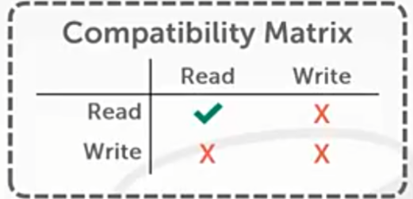
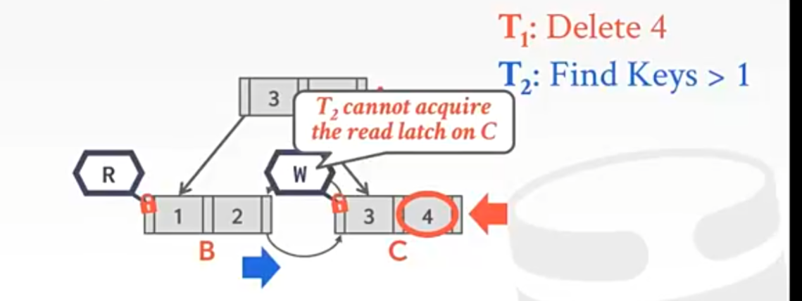

[CMU 15-445 22 Index Concurrency Control - 知乎 (zhihu.com)](https://www.zhihu.com/zvideo/1416342592099880960)

"索引如何并发"

多个线程并发对索引数据进行操作时如何达成线程安全.

Redis不考虑, 它是单线程的. 因此其性能高. 

## 并发控制

* 逻辑正确性: 就是逻辑上正确, 读取刚刚插入的5依然是5 -> 事务与并发控制
* 物理正确性: 多线程共享的对象被并发访问时, 其内部的数据结构保持稳定

 ## latch

> 这门课里Lock指的是数据库事务的逻辑上的锁. Latch是指线程级别的数据库内部使用到的锁. 用于线程对数据的占用时保护内部的数据结构.

latch有读模式和写模式之分, 又叫"读锁"和"写锁", 即分别在读与写时加的锁. 

* 读锁可以阻止其他人对当前节点进行修改、合并、删除
* 写锁可以阻止除我以外的其他人对当前节点进行访问和修改

显然读锁之间可以兼容 / 共存, 即读锁可以加在已经有读锁的数据上, 但写锁只能加在没有任何锁的数据上.




## Latch的实现方式

* 操作系统提供的Blocking OS Mutex(互斥锁)
  * 实现简单, OS支持
  * 没有扩展性, 每次锁定/解锁调用约25ns(?)
  * 数据加锁时其它请求锁的线程陷入内核态休眠
  * 比如C++的`std::mutex`

```c++
std::mutex m;
m.lock();
m.unlock();
```

* TAS(自旋锁): 
  * 实现简单, 自旋等待释放锁
  * 现代CPU的单条指令
  * 需要使用原子变量

```c++
std::atomic_flag latch;

while (latch.test_and_set(...)) {
    // ...
    // 优化: 一段时间没有得到锁可以直接返回
}
// 与std::mutex机制相同(?)
```

* 读写锁
  * 就是那种读写锁的模式, 使用一个`read/write queues`来避免饿死. 用队列记录当前读锁和写锁有哪些线程持有, 有哪些线程在等待. 为了避免一直有读锁来导致等待的写锁饿死会让新来的等待读锁的线程排队, 优先供给写锁
  * 如果数据结构不会涉及太多的写入操作, 但这些写入时非常重要的, 那应该赋予写线程更高的优先级

[如何理解互斥锁、条件锁、读写锁以及自旋锁？ - 知乎 (zhihu.com)](https://www.zhihu.com/question/66733477/answer/1267625567)

## 在HashTable上使用latch

实现方法与latch的粒度有关:

* Page latches: HashTable肯定也是分成了不同的Page的. 对Page加锁. 这样需要的latch少, 但是会降低并行性
* slot latches: 对每个slot加锁, 锁的粒度更小, 有更好的并行性, 但是请求锁的代价更好

哈希表需要resize时: 给整个表加上全局latch, 防止在resize的时候其它线程对数据结构进行操作. 

所有线程都是从上到下按照同一方向扫描哈希表的slot, 换而言之是有顺序的, 所以不会发生死锁的问题. 

`Java`的`concurrenthashmap`也是这么实现的.

`Go`的`Sync.map`则是读写分离, 维护一张大的只读的哈希表, 可以无锁的并发读, 小的哈希表来写, 定时merge进大表.

哈希表实现无锁插入: CAS, compare and swap

## 在B+树上使用latch

[B+树并发协议 - 知乎 (zhihu.com)](https://zhuanlan.zhihu.com/p/24800198)

> 首先这里锁的粒度是node而不是node里的slot
>
> 其次从上到下遍历B+树也不会引起死锁, 因为大家整体上还是沿着一个方向的

需要关注的地方

* 两个线程在同一时间修改同一个节点的数据
* 一个线程正在遍历B+树, 另一个线程对B+树节点进行了合并或拆分, 导致节点位置移动. 

解决方案: latch crabbing / coupling, 一种允许多个线程在同一时间访问B+树

原理:

* 每次访问节点都在当前节点上加锁, 读/写均是
* 在跳到孩子节点之前要获得孩子节点的锁
* 到达孩子节点后对其中的内容进行检测, 如果检测结果是**安全**的, 释放父节点的锁

"安全"的定义:  在此次更新节点中不需要拆分或与其他节点合并

因此在更新树的过程中需要用一个类似栈的数据结构来保存父节点的锁.

如果只是读的话只需要重复进行“获取子节点的读锁，之后再释放父节点的读锁”这样的操作就行了.

### 例子

需要借助例子要帮助理解


### 性能优化 - 乐观锁

每次更新操作都需要在root节点加**写锁**, which是具有独占性的, 不利于数据结构实现高并发性. 

之前的加锁策略是悲观的假设: 大部分操作都可能会引起整体数据结构的改动

> 乐观的假设: 大部分操作不会对根节点与中间节点的数据结构有修改. 
>
> 这是合理的, 真是的B+树节点有成百上千条数据, 哪有那么容易到临界值

基于这样的假设, 在更新B+树时, 到达根节点之前使用读锁, 只在叶子节点使用写锁. 

* 如果最后发现叶子节点不安全, 则释放所有当前持有的锁, 并回到根节点重新开始. 重新开始候对于所有节点改为请求写锁.

### Leaf Node Scans

比如获取所有`key < 4`的节点, 首先要找到`key = 4`的节点, 然后需要水平扫描遍历左兄弟

如果两个线程对着扫描且其中涉及到写锁, 就可能产生死锁. B+树的并发控制的锁是不支持死锁检测的, 唯一方法就是timeout后都杀掉然后重复.



## 延迟更新

叶子节点溢出时延迟更新父节点, 这样就不需要重新拿着write latch一路往下遍历了.

用全局的表记录要更改的部分然后让下一个得到write latch的线程更新父节点