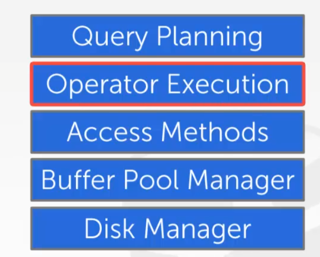
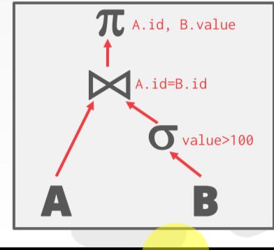
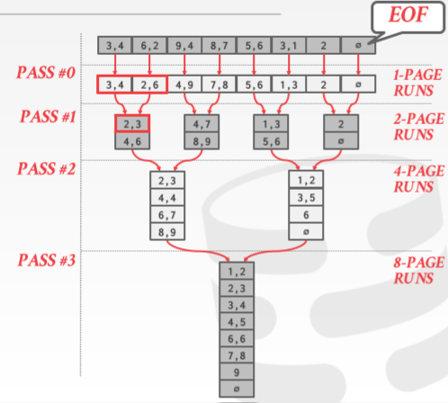
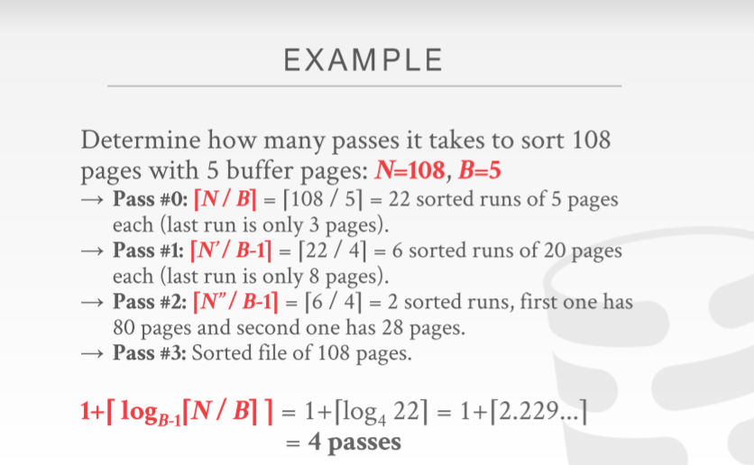
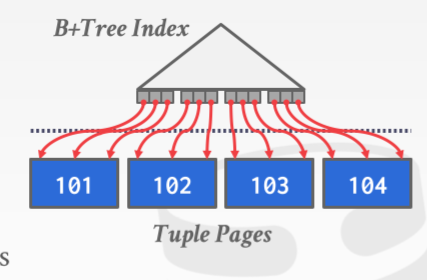
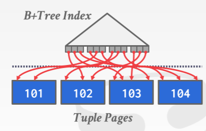
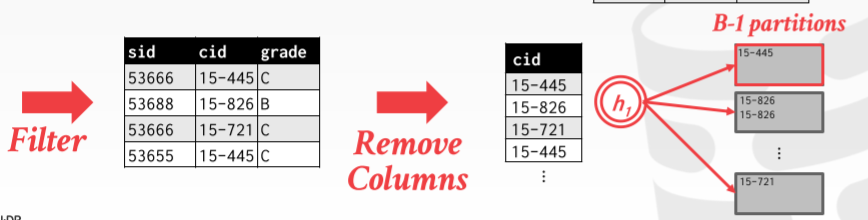
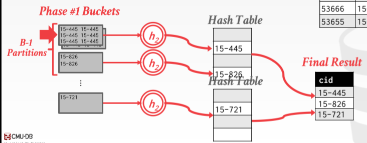

从这一节课开始研究`Operator Exceution`, 查询引擎从SQL语句生成查询计划, 用Access method来访问数据.

所谓的查询计划: 一个树形结构/dag, 叶子节点时对表的扫描/访问, 然后沿着路径往上走 

 算子的中间结果不一定能全放在内存里, 可能还是得把中间结果要存在磁盘上, 然后依赖buffer pool进行调度.

> 设计算法时要假定: 内存放不下所有的数据,  需要在磁盘上进行排序, 所以要尽可能的利用sequential IO. 传统的O()复杂度反而是次要的因素.
>
> 

## External Merge Sort / 外部归并排序

排序的应用: 

* 在关系模型中tuple其实是无序的, 但查询时可以使用`order by`、`DISTINCT`(在有序的情况下去重更容易, 让相邻的值挨在一起), `GROUP BY`(同理, 对于有序的结果更容易进行聚合操作). B+树建树的时候也需要先对相关的叶子节点进行预排序. 总之排序在数据库系统内部实现中是很重要的

快速排序是随机IO, 对于磁盘是不合适的.

分治的思想:

* 把想要排序的数据集分成更小的数据块, 称为runs. 
* 分别对run分别排序
* 合并得到更大的排好序的runs

---

### 二路归并排序

这里把每一步得到的有序集合称为"runs".

二路归并排序: 即节点两两merge形成新的节点. 每次(按照runs中的顺序)读入两个Page进行合并操作, 再用一个Page的空间来存储merge的结果. 当用于merge的Page用完后读取run中的下一个Page进入内存. 输出满了之后也写入磁盘中.

> * IO cost: 每个Page在每个阶段都会被读入一次内存之后"写回"磁盘(两次cost), 所以设N为总的Page数, 有$log_2N$次Merge与1次对每个Page排序, 最后的IO cost为$2N(1 + log_2N)$
> * buffer pool只需要3个槽就行了, 多了可以使用预取策略, 让计算与IO时间重叠, 即在内存中对上一个Page排序时提前把下一个Page的数据传到内存中.

### B-1路Merge算法

Buffer pool中可用B个slot. 

首先对单独的数据进行排序的时候可以一次加载B个Page进来并一起排好序.把数据划分为N/B个有序的runs, 每一个runs读入内存中进行排序

之后在Merge过程中用B-1个Page一次对N/B个有序的run进行B-1 Merge操作. 需要有一个Page作为Output

例子:

> 第一阶段: 每次读入5个Page来排序, 最后就得到了22个sorted runs
>
> 第二阶段: 进行B-1路归并. 每次读入B-1个Page进行操作, 得到一个sorted run. 这样一共有22/B-1 = 6组新的sorted runs(每次选择B-1组合并成一组)
>
> 剩下的阶段相当于重复第二阶段
>
> * IO cost: $2N * (1 + [log_{B-1}(N/B)])$​

### Using B+ Tree for Sorting

就是说如果已经建立了对应的B+树索引, 因为B+树叶子结点是排好序的, 可以直接使用B+树节点顺序

用非聚类索引是bad idea, 需要很多IO cost

## 聚合操作

`Group By`,  `distinct`, Collapse(折叠) multiple tuples into a single scalar value.

实现手段: 哈希/排序. 

### 哈希

如果 不要求有序那么哈希的开销更低

>  隐含的假设: 每个partition都能够被放入memory中

* 阶段1 partition(分区). 用感兴趣的cloumn构建哈希表, 确保相同的值落在同一个哈希桶里, 最后将哈希表以哈希桶为分区落盘.

> 这里每个桶可能有哈希碰撞, 数据也没有去重.

* 阶段2 rehash. 把硬盘中每个哈希桶的数据以页为单位读入内存, 作二次哈希, 彻底去重并把阶段1中碰撞的值区分出来, 把结果放入最终的哈希表中. 若一个桶满了就把它写入磁盘. 
* 若聚集操作还需要计算一些统计量(如AVG)则这个阶段还需要额外记录一些动态变化的临时结果.

设Buffer Pool可用B个Page. 阶段1可以用一个Page读数据 , B-1个Page写B-1个partition的数据,每个 partition 的数据应当小于 B 个 pages, 因此能够聚合的 table 最大为$B \times (B-1)$

通常一个大小为 N pages 的 table 需要大约 $\sqrt{N}$ 个 buffer pages
