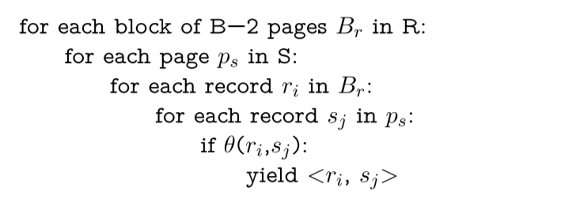
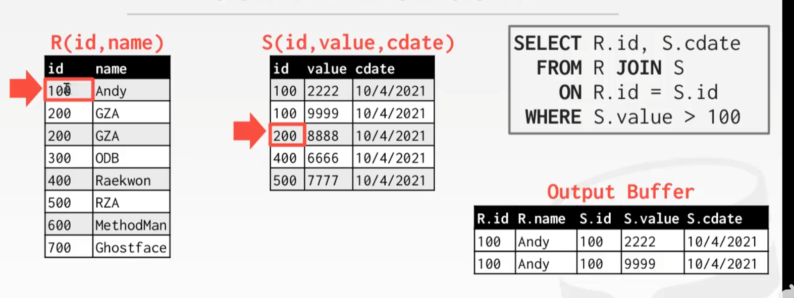

> Join一般是查询计划中最耗时的

为什么需要join: 要把不同的数据存在不同的表里面, 关系表的设计有范式的要求, 避免数据重复

join算法不需要考虑写入磁盘的代价, 因为一般join的输出会被直接用作上层算子的输入

## 提前物化

Join可以输出完整的连接后的数据(提前物化), 也可以不真实连接两行, 只输出要连接的两行的id, 之后再回表

---

提前物化, 生成结果


不生成结果, 记录要连接的表的id/地址之类. 一般对于列存储的数据库, 因为要访问Tuple的各个字段可能产生较大的IO, 因此可以只记录Record ID, 最后根据连接结果来不起各个字段的值


## Nested Join算法

### Simple Nested Loop Join(SNLJ)

现在buffer pool中有B个pages, 需要在条件theta下连接表R与S, 所谓的simple nested loop join即两层for循环遍历:读取R中的每个tuple, 对于它扫描S中每一个tuple并判断是否满足条件.


一般把左边的表叫做Outer, 右边的叫Inner.

Cost: 假设左边表有M个Pages, m个tuples, 右边的表有N个Pages, n个tuples, 对于左边每个tuple, 都要扫描整个S表, 因此其IO过程为:

* 读取R中的一个Page
* 对于其中的每一个tuple/record, 读取S中的**每个**Page, 遍历其中的Record并判断条件是否满足.

最后的花费即 $M+mN$​​, 因此要尽量地把**小的表**放在左边

> "小的表", 指的是文件页少而非行数少, 可能行数很多但是列数少

**这个算法只需要Buffer Pool中三个Slot, 分别放R, S中的当前Page和Output**. 因此缓存池用不上. Buffer Pool每次遍历只会缓存最后的几个Page, 靠前的Page早就被驱逐出去了, 重新遍历时又要走磁盘IO.

显然这个算法的问题在于没有必要读那么多遍的inner表(重复读).

### Block Nested Loop Join

>  之前算法的改进: 可以每次以块为单位连接两张表的数据, 让内存中的R与S两部分首先作全匹配, 即对于当前内存中的R page和S page, 首先遍历R中的所有tuple, 对于每一个tuple遍历S中的每一个tuple, 若满足条件则连接. **之后更换S page直到遍历完S.** 
>
>  这样R中每个Page对应需要把S表遍历一遍, 而非tuple, 因此IO Cost降到了$M+MN$
>
>  如果Buffer Pool中有冗余可以每次读入多个Page, 进一步降低需要遍历S表的次数

如果设Buffer Pool有B块slot, 其中让B-2放outer,一块放inner, 一块作为output.

Join的流程:



Cost: Outer表R需要读一次, inner表S需要读$M/(B-2)$次, 最后的Cost为$M+(M/(B-2))N$次

> 这里与上面的去吧就是**相当于是把所有的多余的buffer pool的slot全部给R表用, 尽可能地降低了S表的遍历次数,** 而且就算你缓存了S表, 之后的页还是会驱逐掉之前缓存的页, 没什么意义

若B>M+2(即整个R表都可以放入内存中), 则S表也只需要遍历一次, 只需要M+N次IO

### Index Nested Loop Join

> 每次遍历inner table的原因是在join的列上没有索引, 如果在相关属性上建立索引就能避免遍历的情况, 直接使用索引定位到需要的位置


IO cost为$M+ mC$, C为查询索引的磁盘IO.

### Nested Loop Join Summary

过程: 

* 把小的表(Page数小, 不是tuple少)放在左边作为outer table
* 尽可能多的在buffer pool中缓存outer table的页
* 可以在inner table上建立索引来加快连接速度


## Sort-Merge Join

更加适用于**两个表都有序/有索引, 或join之后还要排序的情况**.

首先对两个要join的表进行排序, 然后作一轮merge(双指针). 

```java
sort R, S on join keys
// 双指针合并
令i = R的第一个tuple, j = S的第一个tuple
while (i and j) {
	if (i > j) j++;
    if (i < j) i++;
    else if (i and j match) {
        emit(i, j);
        j++; // 这里有问题, 可能i的下一个会和当前j匹配, 这时候要回退j
        // 这里CS186给出的方案是: 把j当前的位置设置成mark, j++直到i与j不匹配, 
        // 这时把j回退到之前的mark然后i++
        // mark = j;
        // while (i and j match) {
        //     emit(i, j);
        //     j++;
        // }
        // j = mark, i++;
        // 相当于是i和j分别都++
    }
}
```



IO Cost: 

* 对R排序: $2N(1 + log_{B-1}N/B)$
* 对S排序: $2M(1 + log_{B-1}M/B)$
* merge:  $(M + N)$, 两个表各读一遍. 在两个表所有id都相同的情况下会退化成$MN$

### An important Refinement

试图合并排序与最后merge的过程. 在最后一次merge的过程中顺便进行join. 步骤:

* 分别对R、S进行排序, 直到外部归并排序的倒数第二步
* 计算R与S剩余的runs数量并相加, 在内存中为每个runs申请一块Page. 
  * 如果空间是够的, combine the last sorting phase with the merge join
    * 得到R中的排序好的sorted runs
    * 得到S中的排序好的sorted runs
    * 进行merge
  * 如果空间不够, 首先对S进行排序, 这样S相当于只有一个run, 这时再把S和R放在一起判断
  * 如果还是不够(runs(R) >= B - 1、runs(S) >= B - 1), 就没办法了

> ???好迷啊
>
> 要不看看数据库系统概念
>
> 书上也没写...先不管它了罢

## Hash Join

哈希表是善于处理查询操作的. 对外表R构建**以连接列为键**的哈希表, 把哈希表放入内存, 遍历内表R的每个tuple, 若对应的列值在哈希表中对应R中的列则输出.

这个就叫做**Naive Hash Join**

哈希表中的value也是有提前物化或延迟物化的抉择的

```C++
build hashtable h for R
for tuple s in S
	if (h(s) in h) emit
```


在知道表的大小的情况下可以选用静态不扩容的哈希表

### 布隆过滤器优化

用来减少对哈希表的无效查询

> **布隆过滤器**（英语：Bloom Filter）是 1970 年由布隆提出的。它实际上是一个很长的二进制向量和一系列随机映射函数。主要用于判断一个元素是否在一个集合中。
>
> BloomFilter 是由一个固定大小的二进制向量或者位图（bitmap）和一系列映射函数组成的。在初始状态时，对于长度为 m 的位数组，它的所有位都被置为0, 当有变量被加入集合时，通过 K 个映射函数将这个变量映射成位图中的 K 个点，把它们置为 1（假定有两个变量都通过 3 个映射函数）。查询某个变量的时候我们只要看看这些点是不是都是 1 就可以大概率知道集合中有没有它了.  如果都是 1，则被查询变量很**可能存在**, 可能存在也可能是发生了哈希碰撞.
>
> 
>
> 特性: 
>
> * **一个元素如果判断结果为存在的时候元素不一定存在，但是判断结果为不存在的时候则一定不存在**。(假阳性)
> * **布隆过滤器可以添加元素，但是不能删除元素**。因为删掉元素会导致误判率增加。
>
> ref: [布隆过滤器，这一篇给你讲的明明白白-阿里云开发者社区 (aliyun.com)](https://developer.aliyun.com/article/773205)

因此可以在哈希表之前首先添加一个布隆过滤器, 只有在布隆过滤器中找到查询结果时才去查询哈希表


### Grace Hash Join

哈希表太大了可能没法放进内存中. 这时候buffer pool可能会随机驱逐页面, 这不好, 我们要控制它.

对R表与S表分别用相同的哈希函数构建哈希表, 都存在硬盘里, join时,

* 若两个桶都大于B-2: 进一步分割, 比如用另一个不同的哈希函数做rehash(15-445叫**recursive partitioning**)
* 若有一个桶小于B-2:把更小的那个哈希表加载到内存里去, 然后遍历另一个大的.

> 这里15-445是另一套表述, 把两个桶读入内存后执行nest loop join


若哈希表对应的一个桶依然太大: 把它当做一个哈希表, 用二号哈希函数再哈希一遍, 再次分割, 直到块足够小

对应另一个哈希表也要做多次哈希:


IO Cost: 3(M+N), 构建哈希表需要读两个表, 构建以后把哈希表写回磁盘, 2(M+N), 作Join时再分别把两个哈希表读了一次.

> 这里假设了哈希表与原表差不多大...

问题: 对于大量键碰撞的情况不敏感. 因此不适用与比如很多键值重复的情况.


## Join总结


Hash Join的性能一般会比Sort Merge Join性能要好（数据有索引或者本身有序除外）