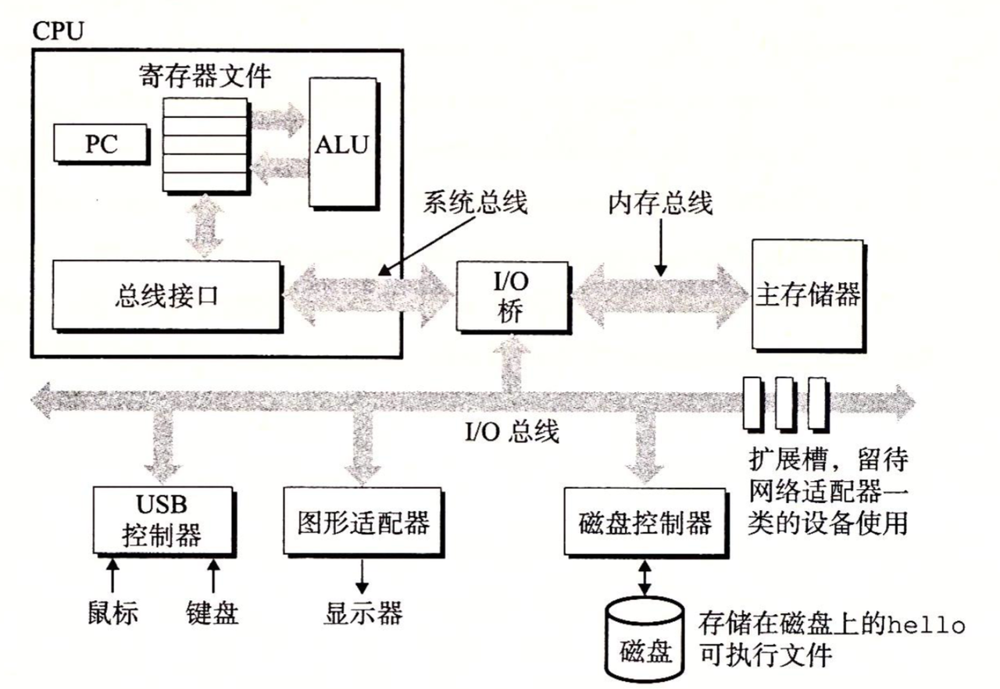
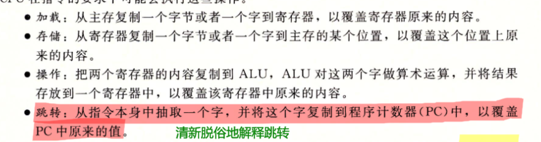
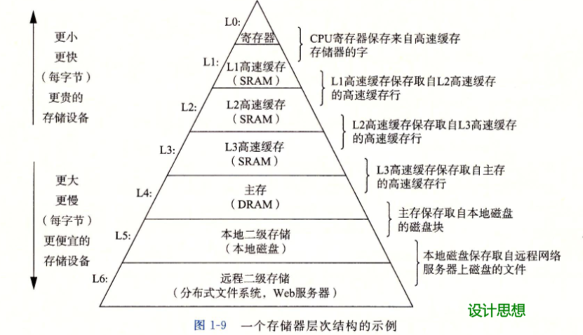
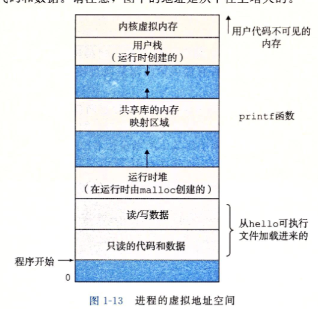
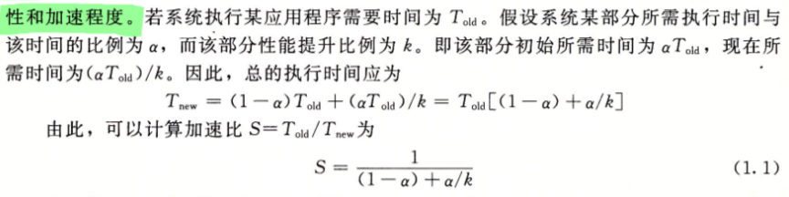
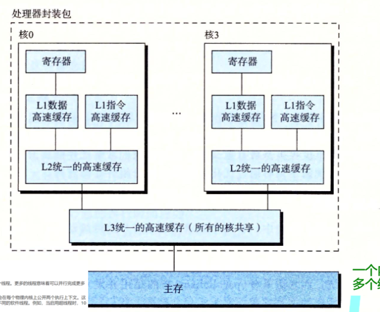

第1章 计算机系统漫游

### 1.1信息就是位+上下文

就是说信息/文件都是一位一位0101组成的,有各种编码方式如ASCII,Unicode等等, 然后具体的意义是由读取这些数据对象的上下文决定的,比如在不同的上下文中一个同样的字节序列可能表示一个整数/浮点数/字符串//机器指令.

### 1.2程序被其他程序翻译成不同的格式(编译)

就是编译的过程, `gcc` 有四个过程:

- 预处理
  - 修改源程序,比如 `#include` 可以把相关头文件内容插入进来

- 得到 `.i` 文件

- 编译阶段
  - 把 `.i` 文本文件翻译成文本文件 `.s` (汇编)

- 汇编阶段
  - 汇编器(as)把 `.s` 文件翻译成机器语言指令 `.o` (机器指令是二进制编码的)

- 链接阶段
  - 链接器 `ld` 合并 `.o` 得到 **可执行目标文件** 比如 `printf` 函数存在于一个叫 `printf.o` 的单独的文件里,这时候就要把它合并进来

gcc -Og -S mstore.c

能得到汇编

 gcc -Og -c mstore.c

可以得到目标文件

其中 `-Og` 是指定-Og优化, 就是告诉编译器生成符合原始C代码整体结构的机器代码.

### 1.4系统的硬件组成

老生常谈了

- 总线 -> 携带信息字节并在各个部件间传播, 传送的字节块一般是定长的,叫字( `word`), 长度是32位(4个字节)/64位(8个字节). 这就是机器字长.但机器字长应该的定义是 **一次整数运算所能处理的二进制数据的位数** ,但是一般设计的时候就把总线字节快的大小设置成这个数

- I/O设备 -> 每个io设备都有驱动,负责在I/O设备和I/O总线之间传递信息

- 主存
  - 本质上还是个临时存储设备,在cpu执行程序时用来存放程序和数据, 

- 物理上是一组DRAM芯片, 逻辑上就是一个 **线性的字节数组** 

- CPU -> 是解释/执行存储在主存中指令的引擎
  - 核心是PC(程序计数器), 指向主存中某条机器语言指令.(里面就是这条指令的地址)

- 寄存器都是单个 **字长** 的. CPU里核心就是主存,寄存器和 `ALU` 

### 1.5缓存

处理器芯片上有L1高速缓存, 处理器再通过一条特殊总线连接一个L2缓存.

存储器层次结构:

设计思想:上一层存储器作为第一层存储器的高速缓存.

### 1.7操作系统管理硬件

OS的基本功能:

- 防止硬件被失控的应用程序滥用

- 向应用程序提供简单一致的机制来控制复杂且大不相同的低级硬件设备.

实现:

- 文件对I/O设备抽象

- 虚拟内存对主存和磁盘I/O抽象

- 进程对处理器,主存和I/O设备抽象

##### 进程

OS对正在运行的程序的抽象

上下文切换

进程转换由操作系统内核管理, 进程可以通过系统调用指令把控制权转给内核

##### 线程

一个进程有多个线程,线程运行在进程的上下文中,共享同样的代码和全局数据,端处理器可用时多线程可以使程序运行得更快.

##### 虚拟内存

基本思想: 把一个进程虚拟内存的内容存储在磁盘上,主存作为磁盘的高速缓存

- 程序代码和数据: 是按照可执行目标文件的内容初始化的

- 堆: `malloc` 和 `free` 操作的空间

- 共享库: 放比如C标准库和数学库这种刚想哭的代码和数据

- 栈: 函数调用用的

- 内核虚拟内存: 为内核保留, 应用程序要调用内核里的东西来实现各种操作

##### 文件

一切皆文件,如磁盘,键盘,显示器,网络,由Unix I/O系统函数调用读写文件

意义就是应用程序可以统一操作各种I/O设备.

### 1.9重要主题

这部分介绍的是"几个贯穿计算机系统所有方面的重要概念"

- Amdahl定律(阿姆达尔)

对系统的某个部分加速对整体性能的影响取决于该部分的重要程度和加速程度.

所以要想显著加速整个系统必须提升全系统中相当大的部分的速度

- 并发和并行
  - 并行有三个层次

- 线程级并发
  - 单处理器: 书上绝妙的比如"就像是一个杂耍艺人保持多个球在空中飞舞一样"

- 多处理器系统: OS内核还是单独的,是把多个CPU集成到一个集成电路芯片上.

- 超线程: 允许一个CPU同时执行多个线程, 
  - 一般来说要实现这个需要多个CPU,这个技术则是只复制CPU中必要的部分(比如PC,其它寄存器啊), 一些部分是公用的(比如ALU).

- 常规处理器要20000个时钟周期来做线程转换`,超线程的处理器可以在单个周期基础上决定要执行那个线程

- 指令级并行: 处理器可以同时执行多条指令.一条指令要执行20个周期,但是实际执行只要2-4个周期,因为"流水线", 执行指令可以划分成不同的步骤,这些阶段可以并行地操作,处理不同指令的不同部分.

- 单指令多数据并行: 允许一条指令产生多个可以并行执行的操作(比如浮点数加法?)

- 抽象
  - 计算机科学中最为重要的概念之一

> 文件是对IO设备的抽象, 虚拟内存是对程序存储器的抽象, 进程时对一个正在运行的程序的抽象, 虚拟机是对整个计算机的抽象