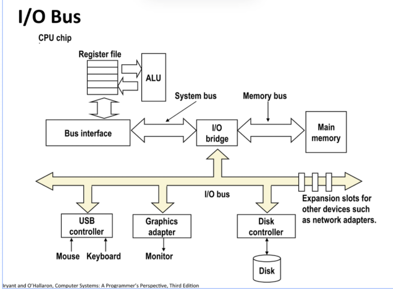
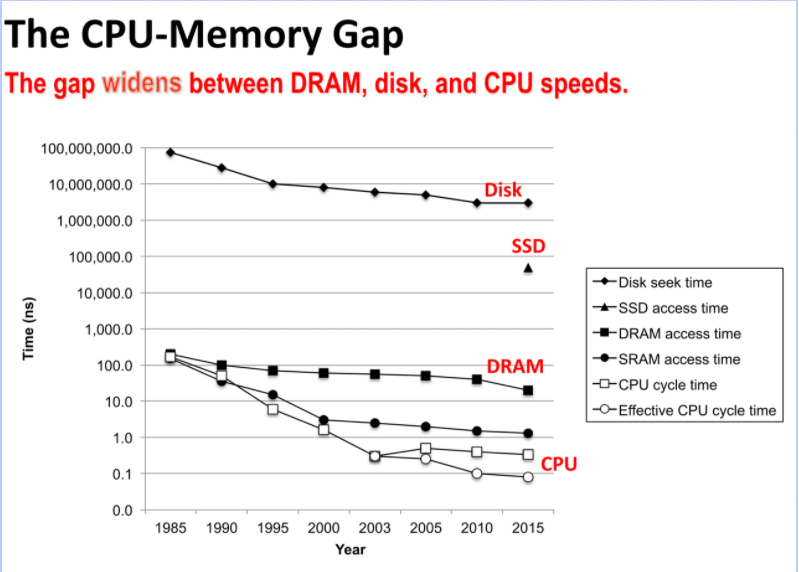
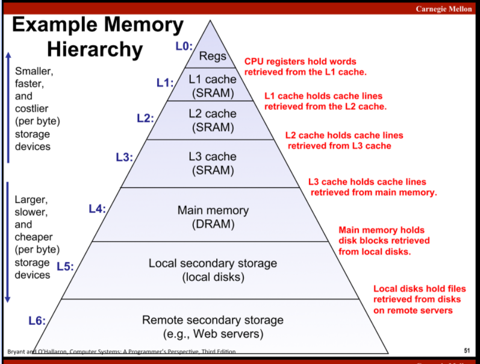
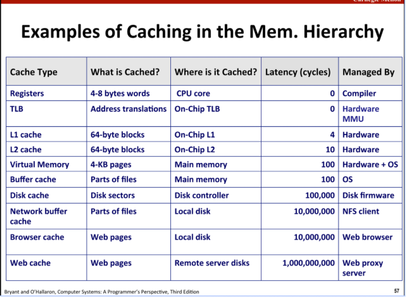
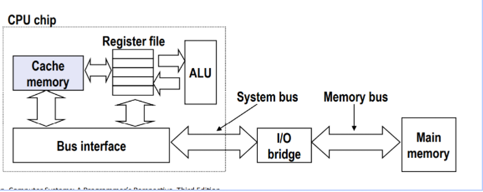
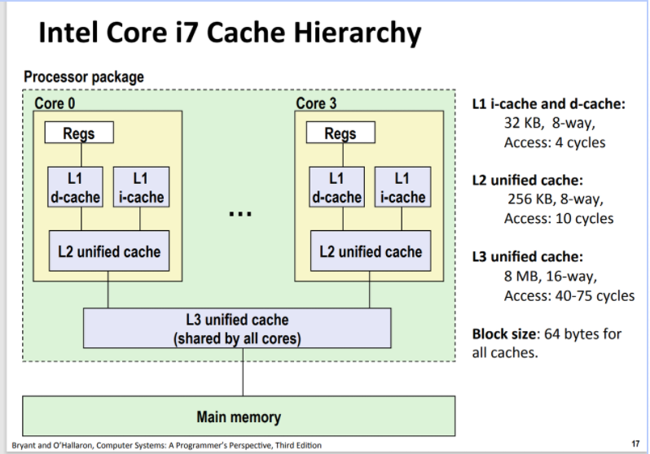
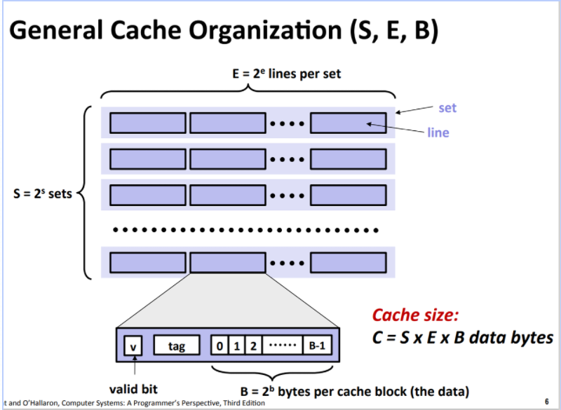
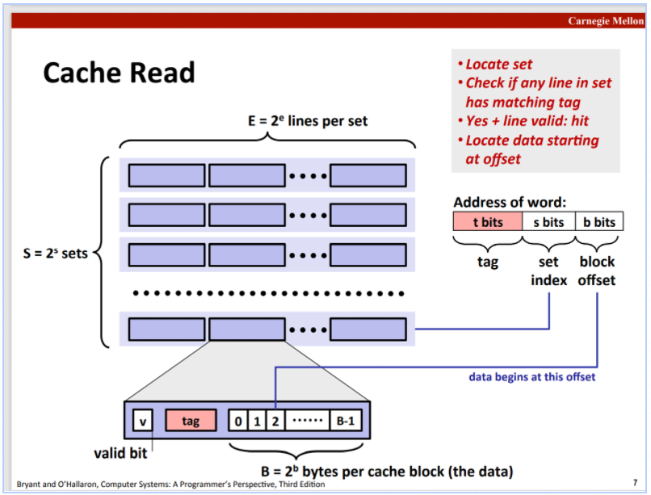

# 第6章 存储器体系结构

# Memory hierarchy

其实没有多少新的内容......权当复习了.

## SRAM与DRAM

ram即random access memory. 一般被打包成芯片, 每个存储单元叫做cell, 一般分为sram和dram

sram比较可靠 ,读取速度比较快, 一般被用作高速缓存, dram需要刷新, 一般用作主存

ram是易失性存储器, 断点就没了, 非易失性存储器叫rom, 一开始是read-only的,只能在生产是编码, 后来出现了可编程的rom, prom, 现代意义上的rom是闪存, 但也是可以擦掉然后重写的,固态硬盘用的这个.

## Disk

- 旋转硬盘: 屁屁踢上有器结构, 它还分为逻辑区域和实际区域, 是转的, 很慢
- 固态硬盘(SSD), 更快,里面是闪存, 用多了会报废.

从硬盘里读取数据时, CPU向硬盘发出指令后就干别的去了, Disk controller把需要的内容送到Main memory之后通过中断的方式告诉cpu好了





这是随着时代发展不同介质的access time的变化情况, 可以看到SRAM和DRAM之间差了一个数量级, 然后ram和disk之间更是有巨大的鸿沟. 这里也看出来cache的必要性

## 局部性原理 

局部性原理是cache的理论基础, Programma tend to use data and instructions with addresses near or equal to those they have used recently

主要分两类:

- 时间局部性: 之前用过的东西在之后的时间里可能还会用到
- 空间局部性: 现在用到的东西附近的东西将来也可能被用到

## 缓存

因此在我们的存储器体系结构中, 把从上到下第k层作为第k+1层的缓存, 如果需要经常访问第`k`层, 就可以把访问到的内容放到第`k+1`层暂存. 缓存类似书包, 让你每次缺东西不需要回家拿.



屁屁踢上有一个简要的缓存图示, 还有未命中情况的讨论, 包括了cold miss, capacity miss和conflict miss

缓存的实例:



其中buffer cache是比如你打开一个文件然后关闭它, os可能会把文件内容先缓存在内存里.

# 高速缓存

具体位置在这里



也就是传说中的L1缓存, 除此之外还有跟它相连的L2缓存, 以及多核处理器中常见的多核共享的L3缓存. 具体是SRAM, 其行为由硬件控制




## 结构



缓存被分为S = 2^s组, 每个组有E = 2^e行, 每一行有一个`valit bit`用来标注本行是否有效(比如从来没用过的一行这一位就是0, 用过的就是1,防止初始的值干扰啥的吧). `tag`是便于搜索的. 剩下的B位就是数据位, 用来存放数据.

我看第九章的时候突然觉得这个"tag"就是来摆烂的, 因为地址不想那么长所以只用地址的后半部分来进行索引, 等找到之后按照`tag`来判断是不是我们需要的地址...

E = 1时叫"直接缓存映射", 否则叫"E路相连高速缓存".......

### Cache Read

CPU现在给了cache一个地址想得到对应的值. 首先要把地址按照cache的参数进行划分.



中间的`s`位是用来判断组的, 通过这个值得到对应的地址上的数应该在哪一组. 之后在对应的组里, 通过前`t`位与之前提到的`tag`位进行比较来寻找对应的数字. 如果找到了具有相同tag的行(当然valid bit必须是1)就可以宣告命中了(没找到就是miss), 找到之后通过后面的`b`位得到偏移量.

### Cache writes

分情况讨论:

- 要写入的地址命中了:
	- 先写入内存, 然后把缓存一级一级更新一下. 显然是代价很高的
	- "写回", 把改变写入缓存, 然后就不管了, 等缓存中对应的行要被覆盖是在把值写回内存. 这种情况下一般需要一个额外的位来标注是否修改过, 没修改过就不用写回. 这个方法相当于延迟了写入内存的时间, 但是只能延迟不能避免. 其实人生的痛苦也是这样的, 越拖延反而会越痛苦, 所以加油加油加油!
- 未命中
	- 可以直接写入内存
	- 把对应地址加载到缓存中, 然后把新的值写入缓存

## 衡量cache表现的指标

- 未命中率. 一般L1的未命中率在3-10%之间
- 命中后access time. 一般L1是4个周期L2是10个周期
- 未命中惩罚: 假如某地址未命中, 之前在cache中搜索的时间就浪费掉了, 还要加上去内存中读取数据的时间


## 写"对缓存友好"的代码

### 局部变量

局部变量大概率是放在寄存器里的(什么情况放寄存器里什么情况放栈里第三章讲了),重复利用可以增加程序时间局部性, 还很快, 反正就是很好

### 重新排列循环

可以提高空间局部性

比如计算矩阵乘法:

```c
for(i = 0; i < n; i++){
    for(j = 0; j < n; j++){
        sum = 0;
        for(k = 0; k < n; k++){
            sum += a[i][k] + b[k][j];
        }
        c[i][j] = sum;
    }
}
```

`a`数组是按照行的顺序遍历的, 是对缓存友好的, 有利于缓存周围的元素, `b`是按列遍历的, 不利于缓存.

但是如果这样写:

```c
for(int k = 0; k < n; k++){
        for(int i = 0; i < n; i++){
            r = a[i][k];
            for(int j = 0; j < n; j++){
                c[i][j] += r * b[k][j];
            }
        }
    }
```

这样`c`和`b`就都是按照行遍历的,都是对缓存友好的.

### 分块

分块来提高时间局部性

还是说求矩阵乘法

```c
for(int i = 0; i < n; i++){
    for(int j = 0; j <n ;j++){
        for(int k = 0; k < n; k++){
            c[i * n + j] += a[i * n + k] * b[k * n + j];
        }
    }
}
```

同样的道理是`a`按行遍历`b`按列遍历

分块是这么处理:

```c
for(int i = 0; i < n; i += B){
    for(int j = 0; j <n ;j += B){
        for(int k = 0; k < n; k += B){
            for(int i1 = i; i1 < i + B; i1++){
                for(int j1 = j; j1 < j + B; j1++){
                    for(int k1 = k; k1 < k + B; k++){
                        c[i1 * n + j1] += a[i1 * n + k1] * b[k1 * n + j1];
                    }
                }
            }
        }
    }
}
```

就是把大矩阵分成小矩阵计算, 好处是小矩阵元素少, 容易被缓存容下. 比如原来的大数组, `b`按列遍历时可能遍历到后面的列时前面的列已经被移出缓存了, 但是小矩阵下就不容易发生这种情况, 可以把每个元素的未命中率降到最低