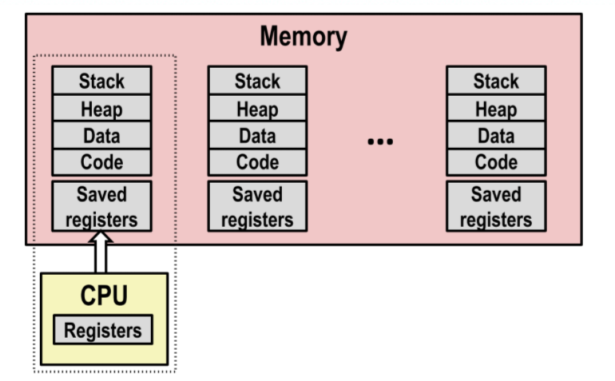

第8章 异常控制流

之前的内容都是应用程序如何与硬件打交道, 这一章开始是应用程序如何与os打交道.

现代系统通过使控制流发生突变来对这些情况做出反应。一般而言，我们把这些突变称为**异常控制流**（Exceptional Control Flow，ECF).

"控制流": cpureads and executes a sequence of instructions, one at a time,  打破这种"流向"的只有类似`jumps`, 分支,过程调用, 不足以对系统状态做出反应. 

## 8.1 异常

异常就是控制流中的突变, 是一种底层的异常控制流机制.


处理器中把不同的位和信号叫做"状态", 状态变化称为"事件", 当侦测到有事件发生时处理器会去查一张叫"异常表"的跳转表, 进行间接过程调用, 到一个专门处理这类事件的操作系统子程序(异常处理程序). 异常处理程序完成处理后根据事件类型决定下一步任务:

- 把控制返回给I_curr, 即发生异常时执行的指令
- 返回给I_next, 即当前指令的下一条指令
- 终止被中断的程序 

### 8.1.1 异常处理

os初始化一张称为"异常表"的跳转表, 异常表的起始地址放在一个叫做**异常表基址寄存器**（exception table base register）的特殊 CPU 寄存器里。


处理器检测到发生事件后确定相应的异常好`k`, 然后触发异常, 跳转到对应的地方执行

异常和过程调用类似, 但是是运行在内核模式下的.

### 8.1.2 异常的类别


- 中断是外部io设备发出的, 所以是异步的(处理器干别的的时候io设备发出中断, 而不是由指令产生), 其它异常都是指令执行的结果, 所以是同步的. 例子: 

	- Timer interrupt, 没过几毫秒就会有一个外部的timer触发一次中断, 内核用这种机制来从用户程序中拿回控制权
	- 外部设备发出的I/O中断.

- 陷阱是"有意的"(intentional), 目的是在用户程序和内核之间提供一个像过程一样的接口，叫做**系统调用**。用户态程序想向内核请求服务`n`时调用`syscall n`指令产生陷阱, 处理程序解析参数, 调用适当的内核程序. 回到"next instruction"

- 故障则是有可能修复的错误情况, 故障发生时处理程序来修复, 若能修复就返回当前指令, 否则返回到内核的abort

	, 它会终止引起故障的程序
	
	- 比如缺页, 浮点异常

- 终止是不可恢复的知名错误, 通常是硬件错误, 直接返回到`abort`, 比如非法指令, "奇偶校验错误", 


### 8.1.3 系统调用

Each x86-64 system call has a unique ID number


系统调用与调用函数是类似的, 但系统调用由Kernel来执行, 优先级不同.

### 8.1.4 实例

缺页:


段错误:

多个流一起执行就叫并发.一个进程执行它的控制流的一部分的每一时间段叫做**时间片**

并发流可以在同一个处理器上运行, **并行流** 特指多个流分别在不同的处理器核上执行.

## 8.2 进程

定义: "A process is an instance of a running program"

进程给程序提供的抽象:

- 逻辑控制流: 每个程序都好像独占cpu, 由内核的上下文切换机制实现
- 私有地址空间: 每个程序好像都独占内存, 由虚拟内存机制提供

### 8.2.1 逻辑控制流

每个进程都有他自己的控制流, 他们轮流使用处理器, 然后被抢占(暂时挂起), 对于每个进程来说他们都是看上去在独占处理器, 只是有些指令在执行时间cpu会停顿一会.

### 8.2.2 并发流

多个流一起执行就叫并发.一个进程执行它的控制流的一部分的每一时间段叫做**时间片**

并发流可以在同一个处理器上运行, **并行流** 特指多个流分别在不同的处理器核上执行.

### 8.2.3 私有地址空间

进程给程序提供假象, 它独占使用系统地址空间.


### 8.2.4 用户模式和内核模式

有一个专门的寄存器来描述这件事, 如果被设置了就说明当前进程在内核模式中, 可以执行指令集中的任何指令，并且可以访问系统中的任何内存位置. 用户模式则不能执行特权指令, 也不允许直接引用地址空间中内核区的代码和数据.

进程从用户模式变为内核模式的唯一方法是通过诸如中断、故障或者陷入系统调用这样的异常。

Liunx是可以给你读内核态的数据内容的, 在`/proc`下, 比如cpu类型`/proc/cpuinfo`, 还有`/sys`下有关于系统总线和设备的额外的底层信息.

### 8.2.5 上下文切换

内核可以抢占当前进程, 重新开始一个先前被抢占了的进程, 这种决策叫做调度, 由内核中的**调度器**（scheduler）处理. 他就通过上下文切换来转移到新的进程, 上下文切换:

- 把当前的寄存器的值保存在内存中




- 安排下一个进程的执行


- 从内存中加载寄存器的值, 进行上下文切换


kernel来管理各个进程, the kernel is not a separate process, but rather runs as part of some existing process


## 8.3 系统调用错误处理

大意是, unix系统调用遇到错误时会返回`-1`, 然后设置全局变量`errno`来表示什么出错了, 所以常见的检查错误的方法:

```c
if((pid = fork()) < 0){
    fprintf(stderr, "fork error: %s\n", strerror(errno))
    exit(0);
}
```

但本书后面用这种"错误处理包装函数" : 

```c
void unix_error(char* msg) {
    fprintf(stderr, "%s: %s\n", msg, strerror(errno));
    exit(0);
}


pid_t Fork() {
    pid_t pid;


    if((pid = fork()) < 0)
        unix_error("Fork error");
    return  pid;
}
```

之后就可以直接

```c
pid = Fork();
```

## 8.4 进程控制

即一些重要的c程序可以使用的系统调用

顺口溜:

- Fork: one call, two returns.
- Exit: one call, on return.
- Execve: one call, on return.

### 8.4.1 获取进程pid

每个进程有唯一的正数进程pid,`getpid`得到调用进程的pid, getppid返回其父进程的pid

```c
#include <sys/types.h>
#include <unistd.h>

pid_t getpid(void);
pid_t getppid(void);

// 返回：调用者或其父进程的 PID。
```

 `pid_t`就是`int`, 在`type.h`中.

### 8.4.2 创建和终止进程

可以认为进程的状态分为

- 运行: 在CPU上运行或者等待被执行
- 停止: 进程的执行被挂起, 且不会被调度, 直到收到`SIGCONT`信号.
- 终止: 进程永远的停止了, 原因:
	- 收到一个信号, 信号的默认行为时终止进程
	- 从主函数返回
	- 调用exit函数

```c
#include <sys/types.h>
#include <unistd.h>
#include <stdlib.h>

void exit(int status);
// 该函数不返回。

pid_t fork(void);
// 返回：子进程返回 0(因为子进程的pid一定不会是0)，父进程返回子进程的 PID，如果出错，则为 -1。
```

子进程得到与父进程用户级虚拟地址空间相同(但是独立)的一份副本, 包括了代码和数据段, 堆,共享库和用户栈., 以及与父进程任何打开文件描述符相同的副本. 区别则在于他们有不同的pid. 另外父进程和子进程并发执行, 不能对不同进程中指令的交替做任何假设. 

示例:

```c
int main(){
    pid_t pid;
    int x = 1;


    pid = Fork();
    if (pid == 0) { /* Child */
        printf("child : x=%d\n", ++x);
        exit(0);
    }
    
    /* Parent */
    printf("parent: x=%d\n", --x);
    exit(0);
}
```


### 8.4.3 回收子进程

进程终止后会等待其父线程来回收它不回收会消费内存资源), 这段时间已终止的子进程被叫做"zombie". 回收之后内核把子进程的退出状态传递给父进程,然后抛弃已终止的进程. 如果父线程已经终止了, 内核会安排`init`进程来"收养""孤儿进程".`init`的pid=1, 不会终止, 是所有进程的祖先.

`waitpid`: 等待其子进程终止或停止.

```c
#include <sys/types.h>
#include <sys/wait.h>

pid_t waitpid(pid_t pid, int *statusp, int options);

// 返回：如果成功，则为子进程的 PID，如果 WNOHANG，则为 0，如果其他错误，则为 -1。
```

`pid`: pid>0就是等待一个单独的子进程, `pid=-1`就是等待所有的子线程.

`options`: 可以设置为`WNOHANG`, `WUNTRACED`, `WCONTINUED`或它们的组合

- **WNOHANG：**如果等待集合中的任何子进程都还没有终止，那么就立即返回（返回值为 0）。默认的行为是挂起调用进程，直到有子进程终止。在等待子进程终止的同时，如果还想做些有用的工作，这个选项会有用。
- **WUNTRACED：**挂起调用进程的执行，直到等待集合中的一个进程变成已终止或者被停止，返回的 PID 为导致返回的已终止或被停止子进程的 PID。默认的行为是只返回已终止的子进程。当你想要检査已终止和被停止的子进程时，这个选项会有用。
- **WCONTINUED：**挂起调用进程的执行，直到等待集合中一个正在运行的进程终止或等待集合中一个被停止的进程收到 SIGCONT 信号重新开始执行。（8.5 节会解释这些信号。）


`statusp`: waitpid会在status(statusp指向的值)中放导致返回的子进程的状态信息, wait.h定义了解释status的宏.

( 你记在这里也没用, 还不如用到的时候再查 ) 

( 用到了, 233333 )


如果调用进程没有子进程，那么 waitpid 返回 -1，并且设置 errno 为 ECHILD。如果 waitpid 函数被一个信号中断，那么它返回 -1，并设置 errno 为 EINTR。

简化版: `wait`

```c
#include <sys/types.h>
#include <sys/wait.h>

pid_t wait(int *statusp);
// 返回：如果成功，则为子进程的 PID，如果出错，则为 -1。
```

等价于**waitpid(-1, &status, 0)**

### 8.4.4 让进程休眠

`sleep`能让进程挂起一段时间.

如果请求的时间量已经到了，sleep 返回 0，否则返回还剩下的要休眠的秒数。后一种情况是可能的，如果因为 sleep 函数被一个信号中断而过早地返回。

`pause`: "但愿长醉不复醒", 休眠直到该进程收到一个信号

### 8.4.5 加载并运行程序

`execve`: 在当前进程的上下文中加载并运行一个程序. `filename`即文件名, `argv`是参数列表, `envp`是环境变量列表.

```c
#include <unistd.h>
int execve(const char *filename, const char *argv[],
           const char *envp[]);

// 如果成功，则不返回，如果错误，则返回 -1。
```

`argv`和`envp`的形式:

argv应该指向一个null结尾的指针数组, 每个指针指向一个参数字符串, argv[0]应该是可执行目标文件的名字.


环境变量也是一个指向null结尾的指针数组, 每个指针指向一个环境变量字符串, 每个串形如`namae=value`. 新程序的主函数的形式:

```c
int main(int argc, char **argv, char **envp);
```

其栈帧


环境数组有专门的操作api, `getenv`在数组里找形如"name=value", 找到了就返回指向的指针, 否则返回NULL, 

```c
#include <stdlib.h>
char *getenv(const char *name);

// 返回：若存在则为指向 name 的指针，若无匹配的，则为 NULL。
```

还有`setenv`和`unsetenv`, 用到再查.

## 8.5 shell

一个简单的小实现, 目的是理解输入命令时发生了什么, 以及

### 8.5.1 shell程序


Linux有一些守护进程, [什么是守护进程？ - 知乎 (zhihu.com)](https://www.zhihu.com/question/38609004), 一般以`d`结尾, 比如httpd, 之后有shell, "a shell is an application program thar runs programs on behalf of the user"

### 8.5.2 简单的实现

命令后面加`&`表示可以在后台执行, shell可以去执行其它的任务.

```c
#include "csapp.h"


#define MAXARGS 128
void eval(char* cmdline);
int parseline(char* buf, char** argv);
int builtin_command(char** argv);


int main(){
    char cmdline[MAXLINE];


    while(1){
        printf("> ");
        Fgets(cmdline, MAXLINE, stdin);
        if(feof(stdin)) exit(0);


        eval(cmdline);
    }
}


void eval(char* cmdline){
    char* argv[MAXARGS];
    char buf[MAXLINE];
    int bg; // 标记任务应该在后台做还是前台做
    pid_t pid;


    strcpy(buf, cmdline);
    bg = parseline(buf, argv);
    if(argv[0] == NULL) return; // 忽略空行


    if(!builtin_command(argv)) {
        // 不是内置类型
        if((pid = Fork()) == 0) {
            // 开一个子进程执行argv[0]
            if(execve(argv[0], argv, environ) < 0) {
                printf("%s: Command not found.\n", argv[0]);
                exit(0);
            }
        }
        // 父进程等后台工作完成
        if(!bg) {
            int status;
            if(waitpid(pid, &status, 0) < 0) unix_error("waitfg: waitpid error");
        }else{
            // 打印后台工作的pid和命令
            printf("%d %s", pid, cmdline);
        }
        return;
    }
}


int builtin_command(char** argv) {
    if(!strcmp(argv[0], "quit")) exit(0);
    if(!strcmp(argv[0], "&")) return 1;
    return 0;
}


/*parseline - 解析命令,通过命令构造参数数组, 返回是否在后台执行*/
int parseline(char* buf, char** argv){
    char* delim; /* 指向第一个空格分隔符 */
    int argc; /* Number of args */
    int bg; /* background job */


    buf[strlen(buf) - 1] = ' '; /* 把\n换成空格 */
    while(*buf && (*buf == ' ')) buf++; /* 忽略开头 */


    /* 构建参数列表 
        strchr -> 字符第一次出现的位置
    */
    argc = 0;
    while((delim = strchr(buf, ' '))) {
        argv[argc++] = '\0';
        *delim = '\0';
        buf = delim + 1;
        while(*buf && (*buf == ' ')) buf++;
    }
    argv[argc] = NULL;
    if(argc == 0) return 1;


    if((bg = (*argv[argc - 1] == '&')) != 0) argv[--argc] = NULL;
    return bg;
}
```

### 8.5.3 存在的问题


简单来说就是后台进程没有释放.

解决: 当子进程结束时内核会通过一种叫"信号"的进制打断进程来提醒我们.

## 8.6 信号

是异步的.

A signal is a small message that notifies a process that an event of some type has occurred in the system

由内核或其它进程发出, 

每种信号有一个整数id来标识, 发信号时也一般只注明id.

常见的信号:

- SIGINT:ctrl+c, 默认行为为终止,
- SIGKILL: 默认行为为终止,杀死程序, 这个信号不可以忽略或者覆盖
- SIGSEGV: 默认行为为终止,段故障(无效的内存引用)
- SIGALRM: 默认行为为终止,定时器信号
- SIGCHLD: 默认行为为忽略, 表示子进程停止或终止了


**冷知识: ctrl+\是SIGQUIT, 在shell lab里用到了** 

### 8.5.1 信号术语

- 发送信号: 内核通过更新

	目的进程上下文中的某个状态

	来发送信号给目的进程, 原因: 

	- 内核检测到系统事件, 如除以0或者子进程终止
	- 其它进程调用了`kill`函数, 要求内核发信息给目的进程


- 接受信号: A distination process receives a signal when iut is forced by the kernel to react in some way to the delivery of the signal.
	- "react": 进程可以忽略信号, 可以终止进程(with optional core dump), 可以通过调用一个叫"信号处理程序"的用户级函数来捕获这个信号.
	- A signal is pending if sent but not yet received.There can be at most one pending signal if any particular type. If a process has a pending signal of type k, then subsequent signals of type k that are sent to that process are discarded.
	- 信号还可以be blocked
	- 内核会维护每个进程的pending位向量(待处理信号)和blocked位向量(被阻塞的信号, 也叫信号掩码).
		- Kernel sets bit k in **pending** when a sign of type k is delivered
		- Kernel clears bit k in **pending** when a signal of type k is received
		- Block: 表示哪些信号会被阻塞, 设置要阻塞的信号.

### 8.5 2 发送信号

- 进程组

每个进程属于一个进程组, 由一个正整数ID标识, 一般父进程和子进程同属一个进程组.

可以通过`getpgrp`得到当前进程的进程组ID, 可以通过`setpgid`来改变自己或其它进程的进程组.


```c
#include <unistd.h>

pid_t getpgrp(pid_t pid);
int setpgid(pid_t pid, pid_t pgid); // 把pid进程的进程组改为gpid
// pid为0表示当前进程的pid
// pgid为0表示把pid指定的进程的pid作为进程组pid
```

试验一下:

```c
pid_t child, group;
child = Fork();
if(child == 0){
    group = getpgid(0);
    child = getpid();
    printf("child process:%d %d\n", child, group);
} else {
    group = getpgid(0);
    child = getpid();
    printf("father process:%d %d\n", child, group);
}
```


子进程的进程组和父进程是一致的.

修改

```c
pid_t child, group;
child = Fork();
if(child == 0){
    group = getpgid(0);
    child = getpid();
    printf("child process:%d %d\n", child, group);
    setpgid(0, 0);
    child = getpid();
    group = getpgid(0);
    printf("child process after modified:%d %d\n", child, group);
} else {
    group = getpgid(0);
    child = getpid();
    printf("father process:%d %d\n", child, group);
}
return 0;
```


- /bin/kill

> /bin/kill -9 pid

pid为负则发送给进程组pid的每个进程. 通过正负来区分pid是进程还是进程组


- 键盘


ctrl+c会发送SIGINT(终止)给shell的前台进程组, ctrl+z是SIGTSTP(终止直到SIGCONT, 相当于暂停)

- kill函数

```c
#include <sys/types.h>
#include <signal.h>

int kill(pid_t pid, int sig);
// 发送信号sig给pid, pid为0则发送给自己, pid为负则发给进程组
```

### 8.5.3 接收信号

时机: kernel is returning from an exception handler and is ready to pass control to process p.


Kernel会计算 pnb = pending & (~blocked), 如果为0则把控制权返回给进程`p`的下一条指令, 否则就选择pnb中的非0位, 然后强迫进程p接收, 全接受后再把控制权交还给进程p的逻辑控制流.

> 这里要纠正一个误区就是block不会影响pending, 也就是说某一种信号被block了, 但是如果继续给进程发送这个信号其pending依然会被设置, 假设有朝一日block被取消那么进程就会根据pending的值来处理这个信号......我学后面信号处理的时候被这件事情困扰了很久 

### 8.5.4 信号处理

每种信号都有自己的默认行为

- 进程终止
- 进程终止直到被SIGCONT信号重启
- 进程忽略信号

可以通过`signal`函数修改信号的默认行为

```
handler_t* signal(int signum, handler_t* handler)
```

Handler可能的取值:

- 你自己的信号处理函数的地址
- SIG_IGN:忽略信号`signum`
- SIG_DFL:保留默认行为

例子: bomb lab的ctrl+c的效果的实现


`sigint_handler`是与主程序并行的一个逻辑流, 但与主程序共享全局数据


handler会被其它handler打断


### 8.5.5 blocking and unblocking signals

- 隐式blocking: kernel blocks any pending signals of type currently being handled
- 显式blocking: `sigprocmask`
- Support functions:
	- `sigemptyset`:  创建空集合
	- `sigfillset` : 把所有的信号id加到集合中
	- `sigaddset` : 把某信号加到集合中
	- `sigdelset` : 从集合中删除信号id

```c
#include <signal.h>

int sigprocmask(int how, const sigset_t* set, sigset_t* oldaset);
int sigemptyset(sigset_t* set);
int siggfillset(sigset_t* set);
int sigaddset(sigset_t* set, int signum);
int sigdelset(sigset_t* set, int signum);
```

`how`的取值:

- SIG_BLOCK: 把set中的信号加到block中
- SIG_UNBLOCK: 从block中删除set中的信号
- SIG_SETMASK:block = set

如果`oldset`非空那block位向量之前的值存在oldset里

例子: 临时阻塞SIGINT信号: 

```c
#include <signal.h>
sigset_t mask, prev_mask;
int main() {
    sigemptyset(&mask);
    sigaddset(&mask, SIGINT);
    sigprocmask(SIG_BLOCK, &mask, &prev_mask);
    // code that will not be interrupted by SIGINT
    sigprocmask(SIG_SETMASK, &prev_mask, NULL);
}
```

### 8.5.6 编写安全的信号处理程序


G2: <errno.h> 头文件中有一个 errno 宏，它就用来存储错误代码，当系统调用或者函数调用发生错误时，就会将错误代码写入到 errno 中，再次读取 errno 就可以知道发生了什么错误。

G4: 一般用一个全局变量标志来记录是否收到信号, 主程序周期性地读这个标志, 响应信号,然后清除标志. `sig_atomic_t`的读和写都会是原子性的, 不会被中断.

```c
volatile sig_atomic_t flag;
```

可以通过`man 7 signal-safety`看117个异步安全的函数


常见的像`printf`, `sprintf`, `malloc`, `exit`都不是线程安全的.

`csapp.c`里有以sio开头的实现了线程安全的函数......

重要的一点是"信号是不排队的", 比如现在进程正在执行信号`k`的处理函数, 那么再次发送过来的信号`k`会被丢弃

一个简单的例子(csapp 537页), 父进程创建很多子进程, 通过一个SIGHLD处理程序回收子进程, 做一些清理工作. 创建三个子进程的话, 第一个结束的进程发送SIGCHLD信号给父进程后被接收, 第二个子进程发的信号会被标记pending, 第三个子进程发送的信号会被直接抛弃!然后第三个进程就变成了僵尸进程.

```c
void handler1(int sig) {
    int olderrno = errno;
    pid_t pid;
    if((waitpid(-1, NULL, 0)) < 0) Sio_error("waitpid error");
    count--;
    Sio_puts("Handler reaped child");
    Sio_putl((long)pid);
    Sio_puts('\n');c
    sleep(1);
    errno = olderrno;
}
```

改进: 用一个处理函数等待所有子进程终止. 如果有僵死进程是可以在下面的`while`里被解决的.

```c
void handler2(int sig) {
    int olderrno = errno;
    pid_t pid;
    while((pid = wait(NULL)) > 0) {
        count--;
        Sio_puts("Handler reaped child");
        Sio_putl((long)pid);
        Sio_puts(" \n");
    }
    errno = olderrno;
}
```

### 8.5.7 同步流以避免并发错误

一个简单的示例程序

```c
void handler(int sig) {
    int olderrno = errno;
    sigset_t mask_all, prev_all;
    pid_t pid;


    sigfillset(&mask_all);
    while ((pid = waitpid(-1, NULL, 0)) > 0) {
        sigprocmask(SIG_BLOCK, &mask_all, &prev_all);
        deletejob(pid);
        sigprocmask(SIG_SETMASK, &prev_all, NULL);
    }
    if(errno != ECHILD) sio_error("waitpid error");
    errno = olderrno;
}


int main(int argc, char** argv) {
    int pdi;
    sigset_t mask_all, prev_all;


    sigfillset(&mask_all);
    signal(SIGCHLD, handler);
    initjobs(); /* 初始化job列表 */


    while(1) {
        if((pid = fork()) == 0) {
            /* 子进程 */
            execve("/bin/ls", argv, NULL);
        }
        sigprocmask(SIG_BLOCK, &mask_all, &prev_all);
        addjob(pid);
        sigprocmask(SIG_SETMASK, &prev_All, NULL);
    }
    exit(0);
}
```

可能的问题: 父进程的`fork`返回之前子进程就结束了, 然后子进程发送SIG_CHLD信号, handler执行`deletejob`, 然后父进程再开始执行,父进程调用`addjob`, 导致`addjob`在`deletejob`之后执行了.......

这里相当于`addjob`和`deletejob`之间进行竞争, 但`addjob`必须在`deletejob`之前执行, 否则就出现了错误.

接触竞争的手段: 用`sigprocmask`来同步进程, 在调用fork之前阻塞`SIG_CHLD`, 不给`handler`执行的机会. 调用`addjob`之后取消阻塞.

```c
void handler(int sig) {
    int olderrno = errno;
    sigset_t mask_all, prev_all;
    pid_t pid;


    sigfillset(&mask_all);
    while ((pid = waitpid(-1, NULL, 0)) > 0) {
        sigprocmask(SIG_BLOCK, &mask_all, &prev_all);
        deletejob(pid);
        sigprocmask(SIG_SETMASK, &prev_all, NULL);
    }
    if(errno != ECHILD) sio_error("waitpid error");
    errno = olderrno;
}


int main(int argc, char** argv) {
    int pdi;
    sigset_t mask_all, mask_one, prev_one;


    sigfillset(&mask_all);
    sigemptyset(&mask_one);
    sigaddset(&mask_one, SIGCHLD);
    signal(SIGCHLD, handler);
    initjobs(); /* 初始化job列表 */


    while(1) {
        sigprocmask(SIG_BLOCK, &mask_one, &prev_one);
        /* perv_one记录没有阻塞SIGCHLD时的set */
        if((pid = fork()) == 0) {
            /* 子进程 */
            sigprocmask(SIG_SETMASK, &prev_one, NULL);
            execve("/bin/ls", argv, NULL);
        }
        /* 这里就不用记录了 */
        sigprocmask(SIG_BLOCK, &mask_all, NULL);
        addjob(pid);
        sigprocmask(SIG_SETMASK, &prev_one, NULL);
    }
    exit(0);
}
```

### 8.5.8 显式地等待信号

像shell那样显式地等待前台进程结束, 之后在继续执行父进程, 小例子

```c
volatile sig_atomic_t pid;

void sigchld_handler(int s) {
    int olderrno = errno;
    pid = waitpid(-1, NULL, 0);
    errno = olderrno;
}

void sigint_handler(int s) {
}

int main(int argc, char** argv) {
    sigset_t mask, prev;
    signal(SIGCHLD, sigchld_handler);
    signal(SIGINT, sigint_handler);
    sigemptyset(&mask);
    sigaddset(&mask, SIGCHLD);

    while(1) {
        sigprocmask(SIG_BLOCK, &mask, &prev);
        if(fork() == 0) exit(0);
        pid = 0;
        /* 取消阻塞SIGCHLD */
        sigprocmask(SIG_SETMASK, &prev, NULL);
        while(!pid)
            ;
        printf(".");
    }
    exit(0);
}
```

逻辑是: `handler`中等待子进程返回并改变全局变量`pid`的值,`main`函数中通过一个`while`循环来等待`pid`变化......显然 空转的`while`很消耗处理器资源, 这里有一个更好用的接口 : `sigsuspend` : 它的作用是用`mask`代替当前的阻塞集合, 然后挂起当前进程, 知道收到一个信号, 其行为是运行处理程序或终止当前进程, 如果信号要终止当前进程就终止, 如果是要调用`handler`, 就去调用`handler`(这时候主进程依然没有动), 等handler执行完之后`sigsuspend`返回.

```c
#include <signal.h>

int sigsuspend(const sigset_t* mask);
```

用在这里时, 因为一开始我们为了避免竞争阻塞了SIGCHLD, 在进入while之前要取消阻塞, 在`sigsubspend`这里就可以取消阻塞SIGCHLD, 每次收到信号才会唤醒进程, 如果是SIGCHLD就会设置`pid`的值以至于跳出循环, 如果是想SIGINT就会继续循环, 下一次依然会执行`sigsubspend`

```c
volatile sig_atomic_t pid;
void sigchld_handler(int s) {
    int olderrno = errno;
    pid = waitpid(-1, NULL, 0);
    errno = olderrno;
}

void sigint_handler(int s) {

}

int main(int argc, char** argv) {
    sigset_t mask, prev;
    signal(SIGCHLD, sigchld_handler);
    signal(SIGINT, sigint_handler);
    sigemptyset(&mask);
    sigaddset(&mask, SIGCHLD);


    while(1) {
        sigprocmask(SIG_BLOCK, &mask, &prev);
        if(fork() == 0) exit(0);
        
        pid = 0;
        while(!pid) {
            sigsuspend(&prev);
        }
        printf(".");
    }
    exit(0);
}
```