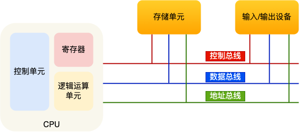

## 冯诺依曼架构

* 输入输出: 交互
* CPU: 包括处理单元(运算)和控制单元(逻辑控制), 解析指令. 一次能计算的数据称为位宽(32位64位). 还有各种寄存器(通用寄存器, 程序计数器(pc), 指令寄存器(存指令本身))
* 存储器: 内存, 存储程序指令和数据. 最小的存储大为是byte

存储单元和输入输出设备要与中央处理器打交道需要总线

总线也分为:

* 地址总线: 用于指定要操作的内存地址
* 数据总线: 用于读写内存数据
* 控制总线: 用于发送和接受信号, 比如中断、设备复位等信息, CPU进项的响应

CPU首先通过控制单元操作地址总线来指定内存的地址, 然后通过数据总线来传输数据.

> 这里应该结合CSAPP的内容
>
> 解释名词"指令周期" -> CPU去的指令, 指令译码, 执行, 数据回写. 流水线就是让不同的指令周期重叠.
>
> CPU的频率:每秒时钟周期次数. 在一个时钟周期内CPU仅能完成最基本的动作. 一般一条指令需要一个或若干个时钟周期来完成. 程序的CPU执行时间可以估计成CPU时钟周期树 * 时钟周期时间.

## CPU与指令集架构

指令集架构(ISA)是包括了指令集、特权机、寄存器、执行模式、安全扩展、性能加速扩展等诸多方面的

### 指令集

CPU运行OS或其它应用程序时, 本质上就是在执行他们被编译后锁包含的指令, 常见的指令有类似:

* 数据搬移指令(mov), 
* 寄存器计算指令(add, sub), 
* 内存读写指令, 
* 跳转指令, 
* 过程调用指令,
* 特权指令等.

### 特权集

* EL0: 就是用户态
* EL1: 就是内核态, kernel运行在这里
* EL2: 在虚拟化场景下需要, 虚拟机监控器(Hypesrivisor)运行在此特权集下
* EL3: 和安全特性TrustZone相关, 负责普通世界和安全世界的切换(?)

从EL0(用户态)切换到了EL1(内核态)的情况:

* 应用程序调用了OS的**系统调用** (同步)
* 应用程序执行的指令触发了**异常**(如缺页异常), 需要kernel来处理 (同步)
* CPU收到来自外设的**中断 ** (异步)

具体切换是由CPU与kernel一起完成的, CPU首先要保存当前执行状态到寄存器, 主要有:

* 触发异常的指令地址, 会有一个异常链接寄存器
* 异常原因, 会有一个异常症状寄存器
* 栈指针
* 其它的状态, 例如CPU的相关状态, 引发却也异常的地址等

kernel在**异常向量表**中为不同的异常配置不同的处理函数, 发生特权集切换时CPU会读取向量基地址寄存器的内容来获得异常向量表, 之后执行相应的异常处理函数. 一般处理函数里会保存应用程序的上下文(通用寄存器等),然后进行处理, 处理完以后回复应用程序的上下文, 然后执行`eret`(异常返回)指令来回恢复CPU自动保存的EL0状态(包括PC, SP啥的)并切换回EL0.

### 寄存器

EL1下有两个**页表基地址寄存器**, 负责翻译虚拟地址空间中不同的地址段

## 物理内存与CPU缓存

CPU使用物理内存的方式: 把物理内存看作一个大数组, 通过总线向物理内存发送读写请求,其中包括了目标地址(和写入值), 物理内存收到请求后进行读写, 如果是读就把结果发送回去.

引入缓存: CPU运算速度和内存访问速度不匹配, 希望降低访存的开销.

### 缓存结构

CPU缓存由缓存行组成, 缓存行是吧物理内存读到缓存中的最小单位(一般是64kb). 每个缓存行包括:

* 一个有效位, 标记当前行是否有效
* 一个标记地址(用于标识对应的具体物理地址, 是具体用于搜索匹配的)
* 其它状态信息.

为了使用缓存, 在逻辑上把物理地址分为Tag, Set(也称index)和offset. 2的后两者次方一般称为"组"和"路".

> 看csapp的笔记
>
> 用set来判断是哪一组, 之后在对应的组里通过tag来进行寻找. 同一组中支持的最多tag数称为路, 比如有4路, 那么可以称为4路组相连, 对应的tag为2^4.   
>
> tag=1时称为直接相连映射
>
> 
>
> 一般来说”缓存大小“只计算有效的字节数，不包括有效位及标记位的大小。 现在有缓存32KB， 缓存行大小为64字节， 256路， 2路组缓存， 物理地址长度为44位， 求物理地址0x2fbbc030开始的4个字节的物理内存数据。划分物理地址， Set应该有8位（2……8=256）， offset应该是log2{32KB/256 * 2 * 64B} = 6, 剩下的是tag.
>
> 访问缓存的时候首先要根据Set来定位, 之后对比Tag并判断valid位, 最后根据offset去访问.     

### 缓存一致性

这里还有一个CPU缓存一致性的问题, 一般来说在数据发生更改后不会马上写回内存(并一级一级地更新下层缓存), 而是首先标记它为脏, 等它被逐出缓存时再写回. 单核是没问题的, 但多核都会有自己的L1L2, 可能会产生读到的数据不一致的问题. 为了解决这个有了MESI协议.

MESI 协议其实是 4 个状态单词的开头字母缩写，分别用来标记Cache中行的属性. 分别是：

- *Modified*，已修改
- *Exclusive*，独占
- *Shared*，共享
- *Invalidated*，已失效

修改"共享"的数据时要先广播到其它的核的cache上去, 告知他们数据改变了                                                                                                                                                                                                                                                                                                                                                                                                                                                                                                                                                                                                                                                                                                                                                                                                                                                                                                                                                                                                                                                                                                                                                                                                                                                                                                                                                                                                                                                                                                                                                                                                                                                                                                                                                                                                                                                                                                                                                                                                                         

## 设备与中断

这一节的目的是介绍CPU和设备之间的交互方式

### 内存映射输入输出 / MMIO

把输入输出设备和物理内存放到同一个地址空间, CPU通过这些地址来访问和操作设备, 包括读写设备中的内存数据和寄存器.

> 这一点就解决了CPU如何获得设备输入的问题

### 轮询和中断

要解决的是CPU如何才能知道有输入事件发生了.

* 方案一: 轮询, 让CPU不断的通过MMIO来查看是否有输入(比如会有状态寄存器来指示是否产生输入). 会让CPU长时间处于等待输入的状态, 浪费
* 方案二: 中断. OS为不同设备的中断配置不同的中断处理函数(与异常类似), 函数获得设备的输入.

> 实际上有的地方把中断叫做外中断, 异常叫做内中断. 
>
> 异常和中断的区别: 异常由cpu指令引起(同步), 中断由外部设备引起(异步)
>

还有一个奇怪的东西叫"软中断", 指的是不打断CPU正在执行的任务, 而是以内核线程的方式来执行中断处理.