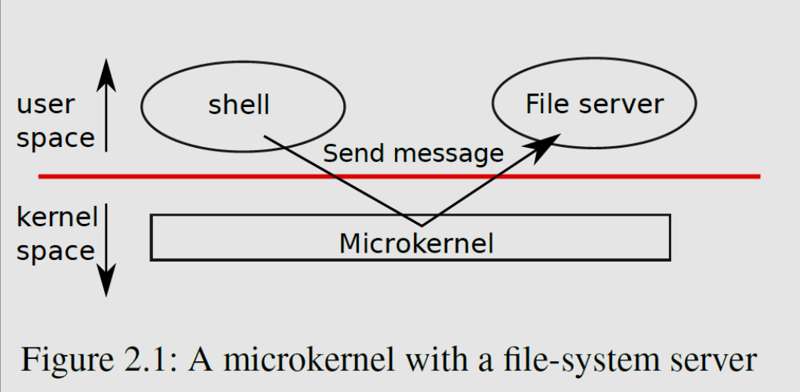
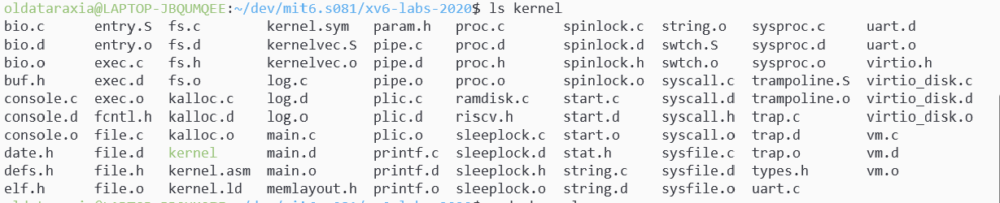
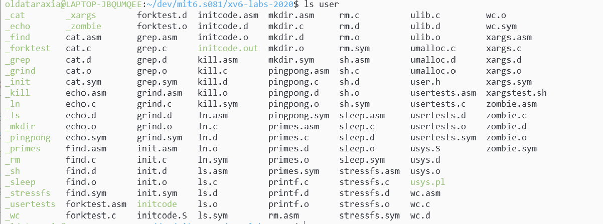
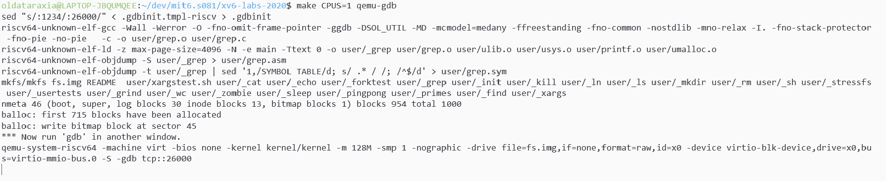

主要内容:

* Isolation: 隔离性
* Kernel和User mode
* System calls: 系统调用, 让用户态应用程序使用内核服务
* XV6的实现与Quem科普

## 隔离性

我理解有两点: 

* 进程之间要隔离, 不能相互干扰
* 应用和硬件之间要隔离, 不能让应用直接去操控硬件.

Unix的接口在设计时就实现了资源的强隔离性:

* 如`fork`使应用程序不比直接与CPU交互, 而是与"进程"交互. kernel负责不同进程在CPU上的切换, 某种程度上进程"抽象"了CPU.

* `exec`抽象了内存, 应用程序不需要直接访问物理内存, kernel提供了内存隔离并控制内存, 在应用与硬件资源之间提供一个中间层.

* `files`抽象了磁盘, 应用不能直接读写磁盘本身, 而是通过files, kernel负责把文件与磁盘中具体的块对应.

## 防御性

OS需要能应对恶意程序,防止程序恶意参数引起崩溃、防止应用程序打破隔离, 保证安全性需要硬件支持, 硬件支持包括:

* User/Kernel mode(RISC-V里叫Supervisor mode)
* page table / 虚拟内存

## 实现隔离性与防御性

要实现隔离性与防御性, 操作系统必须要保证应用程序不能修改os的数据结构和指令, 应用程序不能访问其它进程的内存.

CPU从硬件层面为隔离性提供支持, 比如risc-v有三种CPU可以执行指令的模式:

* 机器模式: 这个模式下有最高的特权 ,一般用于配置计算器
* 管理模式: 就是后面的kernel mode, 内核态
* 用户模式: 就是user mode. 用户态

### 用户态/内核态

为了支持user/kernel mode，处理器会有两种操作模式，第一种是user mode，第二种是kernel mode。当运行在kernel mode时，CPU可以运行特定权限的指令（privileged instructions）；当运行在user mode时，CPU只能运行普通权限的指令（unprivileged instructions）。

* 普通权限指令: add, sub这种
* 特殊权限指令: 主要是一些**直接操纵硬件的指令和设置保护的指令**, 例如设置page table寄存器, 关闭时钟中断等.

risc-v有ecall指令, 把CPU从用户模式切换到管理模式.

---

从EL0(用户态)切换到了EL1(内核态)的情况:

* 应用程序调用了OS的系统调用, 系统调用会触发中断
* 应用程序执行的指令触发了异常(如缺页异常), 需要kernel来处理
* CPU收到来自外设的中断

前两种是同步的, 第三种是异步的.

具体从用户态到内核态的切换是由CPU与kernel一起完成的, CPU保存当前执行状态到寄存器, 主要有:

* 触发异常的指令地址
* 异常原因, 会有一个异常症状寄存器
* 栈指针

kernel在**异常向量表**中为不同的异常配置不同的处理函数, 一般处理函数里会保存应用程序的上下文(通用寄存器等),然后进行处理, 处理完以后回复应用程序的上下文, 然后执行`eret`(异常返回)指令来回复CPU自动保存的EL0状态(包括PC, SP啥的)并切换回EL0.

> RISC-V有三种模式...还有一种machine mode, CPU在这种模式下启动.

### 控制权转移给内核

RISC-V中有个东西叫`ECALL`, ECALL接收一个数字参数，当一个用户程序想要将程序执行的控制权转移到内核，它只需要执行ECALL指令，并传入一个数字。这里的数字参数**代表了应用程序想要调用的System Call**。

ECALL会跳转到内核中一个特定，由内核控制的位置. 

XV6中`ECALL`是系统调用唯一的接入点,   比如执行`fork`时, 它并不是直接调用操作系统中对应的`fork`函数，而是调用ECALL指令，并将fork对应的数字作为参数传给ECALL。之后再通过ECALL跳转到内核。同理在用户态调用`write`的本质也是调用了`ECALL`, 之后把控制权给内核态里的真正`write`函数. 

用户空间和内核空间是一个硬性的界限, **用户是不能直接调用内核里的fork的**

### 虚拟内存

每个进程有自己独立的地址空间, 通过page table进行分配, 每一个进程只能访问出现在自己page table中的物理内存. page table把进程的虚拟地址映射到RISC-V实际操作的物理地址.

操作系统统一管理设置page table来保证每个进程的物理内存不重合, 这样就实现了内存的强隔离性.

虚拟地址从0开始, 网上一次是指令、全局变量、栈、堆、xv6指针使用了64位中的低38位, 最大的地址是$2^{38}-1$

进程最重要的内核状态:

* 页表
* 内核堆栈
* 运行状态, 进程是否已经被分配/准备运行/等待IO/退出

每个进程有两个堆栈: 用户堆栈与内核堆栈, 进程在user space中时只有用户堆栈, 进程进入内核时会使用内核堆栈

### 总结

结合两种机制: 每个程序都有自己的内存空间, 通过系统调用与kernel交互, 使用kernel提供的各项服务

## 内核的组织

* 宏内核: 整个OS代码都运行在kernel mode中, 所有的系统调用都以管理模式运行. 
  * 扩展性差, os内部出问题很严重, 而且os内部不同部分之间的接口通常很复杂(比如xv6)
  * 集中在一起使得各部分易于合作, 可以共享page cache
  * 不需要考虑操作系统的哪一部分不需要完整的硬件特权(整个os kernel都在内核态中运行)
* 微内核: 在kernel mode中运行尽可能少的代码, 内核只有几个非常少的模块, 大部分模块运行在内核之外, 作为普通的用户程序来运行. 
  * 内核通常只支持一些低级的功能, 例如IPC, page table；以及分时复用CPU, 访问硬件
  * 不同的模块(比如文件系统和内核里的系统调用函数)通过IPC(进程间通信机制)交互
  * mode之间反复跳转会带来性能损耗, 不同模块隔离难以共享

> 这里的例子中文件系统是作为用户级线程来运行的. 
>
> 我怎么感觉有点类似分布式 vs 单体架构, 只是IPC代替了RPC

Linux, XV6是宏内核设计, Minix等很多嵌入式系统是微内核

## XV6结构

内核文件都在kernel文件夹内, 其中的所有文件都会被编译成一个叫kernel的二进制文件, 文件会被运行在kernel mode中

其源代码按照模块化的概念被划分为多个文件, 模块间的接口定义在`kernel/def.h`中:

| **文件**             | **描述**                                    |
| -------------------- | ------------------------------------------- |
| ***bio.c\***         | 文件系统的磁盘块缓存                        |
| ***console.c\***     | 连接到用户的键盘和屏幕                      |
| ***entry.S\***       | 首次启动指令                                |
| ***exec.c\***        | `exec()`系统调用                            |
| ***file.c\***        | 文件描述符支持                              |
| ***fs.c\***          | 文件系统                                    |
| ***kalloc.c\***      | 物理页面分配器                              |
| ***kernelvec.S\***   | 处理来自内核的陷入指令以及计时器中断        |
| ***log.c\***         | 文件系统日志记录以及崩溃修复                |
| ***main.c\***        | 在启动过程中控制其他模块初始化              |
| ***pipe.c\***        | 管道                                        |
| ***plic.c\***        | RISC-V中断控制器                            |
| ***printf.c\***      | 格式化输出到控制台                          |
| ***proc.c\***        | 进程和调度                                  |
| ***sleeplock.c\***   | Locks that yield the CPU                    |
| ***spinlock.c\***    | Locks that don’t yield the CPU.             |
| ***start.c\***       | 早期机器模式启动代码                        |
| ***string.c\***      | 字符串和字节数组库                          |
| ***swtch.c\***       | 线程切换                                    |
| ***syscall.c\***     | Dispatch system calls to handling function. |
| ***sysfile.c\***     | 文件相关的系统调用                          |
| ***sysproc.c\***     | 进程相关的系统调用                          |
| ***trampoline.S\***  | 用于在用户和内核之间切换的汇编代码          |
| ***trap.c\***        | 对陷入指令和中断进行处理并返回的C代码       |
| ***uart.c\***        | 串口控制台设备驱动程序                      |
| ***virtio_disk.c\*** | 磁盘设备驱动程序                            |
| ***vm.c\***          | 管理页表和地址空间                          |

user下是运行在user mode中的程序:

mkfs会创建一个空的文件镜像, 与文件系统有关吧大概

---

编译的过程:

`Makefile`会读取一个`.c`文件, 然后调用gcc生成`.s`汇编文件, 之后通过汇编解释器生成`.o`文件, 汇编语言的二进制格式, 最后把所有的`.o`通过Loader连接在一起生成可运行的内核文件. 除此之外还会生成`kernel.asm`,其中包含了内核的完整汇编语言, 可以通过其来debug

## QEMU

一个大型的开源c程序, 仿真了RISC-V处理器, 内部每一个CPU核做的事情:

* 读取4/8字节的RISC-V指令
* 解析RISC-V指令, 找到对应的操作码, 在软件中执行相关的指令

其主循环会维护寄存器的状态.

QEMU会通过多线程实现并行处理, 并行地模拟多个核, 

> QEMU表现的就像一个真正的计算机一样。当你想到QEMU时，你不应该认为它是一个C程序，你应该把它想成是下图，一个真正的主板。

## XV6启动过程

首先在根目录下`make qemu-gdb`, 相当于启动了qemu中的gdb server, 会卡住等待gdb client来连接它

另开一个shell进行调试, 输入`gdb-multiarch`, 就进入`gdb`的命令了

关于`user`下的程序, 所有程序的符号表都在`/user/_name`下, 比如载入`ls`的符号表需要在gdb里`file user/_ls`:

在`main`打断点

这时候输入`continue`就可以连接qemu了

具体xv6启动是会首先运行一个存储与ROM中的bootloader程序`kernel.ld`把xv6内核加载到内存中, 然后在machine mode选从`entry`开始运行xv6. bootloader会把xv6 kernel加载到0x80000000的物理地址中. 在`entry`中会设置初始stack, `stack0`让xv6执行`kernel/start.c`, `start`函数在`machine`模式下做一些配置后通过RISC-V提供的`mret`指令切换到kernel mode, pc指到`kernel/main.c`, `main`对一些设备和子系统进行初始化, 然后调用`kernel/proc.c`中定义的`userinit`来创建第一个用户进程. 总之就是很复杂, 等用到的时候再说吧.