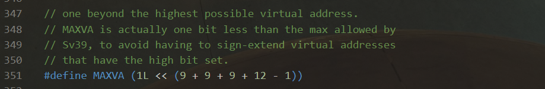
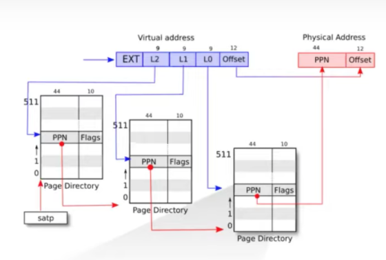
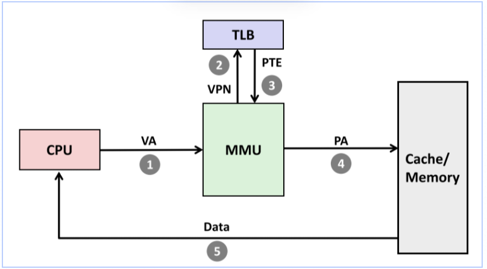
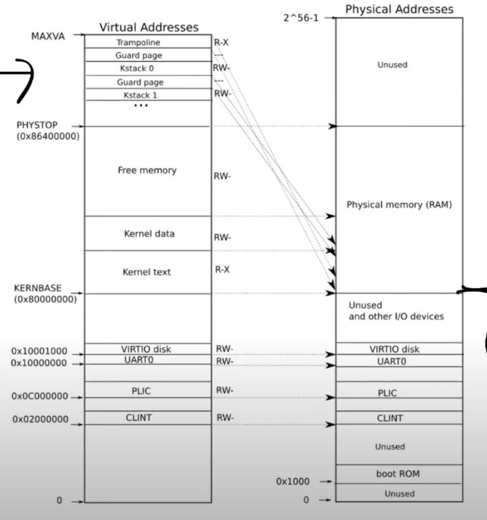

* 地址空间
* 页表
* XV6中的实现

## 进程概述

进程的抽象给程序提供了一个错觉, 即它有自己的专有机器, 有自己的私有内存系统与CPU.

XV6采用页表来为每个进程提供自己的地址空间, xv6为每个进程维护一个单独的页表, 定义该进程的地址空间: 从虚拟地址0开始首先是指令, 之后是全局变量, 栈区, 堆区(用于malloc).

risc-v的指针是64位宽, 在页表中查找虚拟地址时只用低39位, xv6又只使用其中的38位, 所以最大地址空间为$2^{38}-1=0x3fffffffff$. 地址空间的顶部xv6为`traampoline`和映射进程切换到内核的`trapframe`分别保留了一个页面

除此之外xv6还需要为每个进程维护很多状态信息, 把它们存在一个`proc`结构体中, 定义在`kernel/proc.h`. 其中比如`p->state`表示进程的状态(已分配, 就绪态, 运行态, 阻塞态, 退出). `p->pagetable`以risc-v的格式保存进程的页表

每个进程其实有两个栈区, 用户栈区(平时用, 来放比如局部变量, 函数返回地址等)就是一般所说的"栈". 当进程因为系统调用或中断进入内核时, 内核代码在进程的内核堆栈上执行. 进程通过`risc-v`的`ecall`指令进行系统调用, 这个指令提升硬件的特权级别并把pc设置为内核定义的入口点. 入口点的代码切换到内核站, 执行实现系统调用的内核指令, 完成后切换为用户栈, 并通过调用`sret`指令返回用户空间. 这个指令降低硬件特权级别并在系统调用指令结束后恢复执行用户指令

## Page Table

MMU通过查阅Page Table把虚拟内存转成物理内存.

每个进程都会有自己的Page Table. Page Table位于内存中.

RISC-V会有一个SATP寄存器指向这个位置.

> 注意一般页表是存在内存里, 但MMU是硬件层面实现的
>
> 有些cache是根据物理地址索引的，有些cache是根据虚拟地址索引的，由虚拟地址索引的cache位于MMU之前，由物理地址索引的cache位于MMU之后。

### 地址分配

> 前置: risc-v的地址翻译是针对一个Page为粒度进行的. 其中一个Page有4KB/4096B.

risc-v的虚拟地址有39位, 其中27位为index, 12位为offset(正好可以容纳4096个数). 其中index知识位于哪个Page, offset指示Page中哪个值.

物理地址有56位, 其中44位指示物理Page, 12位offset

### 多级页表

RISC-V是三级页表, 27bit的index分成3个9bit. 最高9位用来到最高一级页表进行查询, 得到一个44bit的PPN / Physical Page Number. 这个PPN加上12bit的0就是对应第二级页表的物理地址. 之后同理

> 是的, risc-v要求页表的地址要与物理Page对齐

优点: 不需要为没有用到的index准备对应的更低一级的页表.

### PTE中的标记位

PTE指页表中的一项查到的记录. 其低10位是标记位

* Valid 是否是合法的记录. 比如没有用到的地址空间对应的PTE就是不合法的. 访问inValid的空间时硬件会返回一个Page Fault
* Readable / Writeable: 是否可以读写当前Page
* Executable: 是否可以从这个Page执行指令
* User: 当前Page是否可以被运行在用户空间的进程访问

## TLB

翻译地址需要三次访存, 代价太高. TLB就是对对应PTE的缓存.

TLB是CPU核中的一块高速缓存. 每个核都会有自己的MMU和TLB

在切换上下文之后os需要来清楚TLB中的内容. RIcs-v中对应的指令时`sfence_vma`

除此之外CSAPP里还提到过每次访存都要结合L1高速缓存等

## Kernel Page Table

> 内核的虚拟地址空间 - 物理内存与IO设备

risc-v中os启动时会从地址0x80000000开始运行. 物理地址大于它时会走向DRAM芯片. 低于这个值时会走向不同的IO设备:

* 0x10090000: 以太网
* 0x1000: boot ROM的物理地址. 主板通电后首先运行存储在boot ROM中的代码, 完成后会跳转到0x80000000
* PLIC: 中断控制器
* CLINT(Core Local Interruptor): 中断的一部分
* UART0: 与Console和显示器交互
* VIRTIO disk: 与磁盘进行交互

XV6的虚拟地址空间: 启动时会按照这种形式来设置虚拟地址空间

kernel stack下面有一个Guard Page并没有被映射到物理内存中, 这样它对应的PTE的Valid标志位就没有被设置, 如果栈溢出了就会溢出到Guard Page部分. 但是访问这个部分会导致触发一个Page fault. 这样就保证了安全, 且Guard Page没有映射到任何物理内存, 避免了浪费.

权限:

* Kernel Text: 可以读, 可以从这个地址段执行指令, 但是不能向Kernel text写数据
* Kernel Data: 可以读写, 毕竟是存数据的

### knminit

  